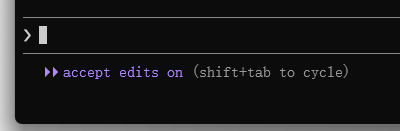
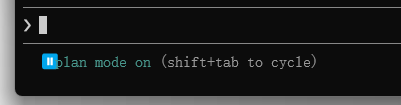
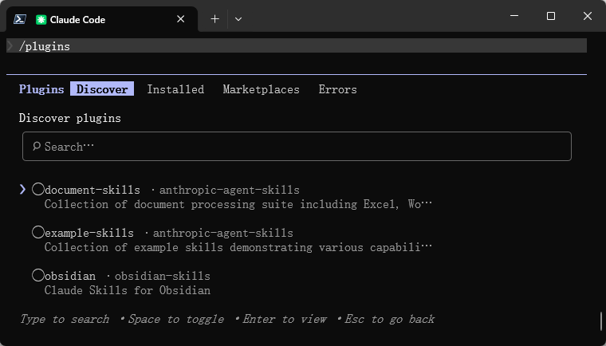

# claude code简介

Claude Code 是 [Anthropic](https://www.anthropic.com/) 推出的面向开发者的 AI 编程协作工具。

Claude Code 定位不是聊天，而是在本地代码仓库中执行高权限、可上下文感知的工程任务。

Claude Code 与在聊天窗口里写几段代码不同，它理解你的整个项目，能直接读取你的文件、运行测试并根据反馈修改代码。

Claude Code 不是一个代码生成器，而是一个能读项目、懂上下文、遵守约束的 AI 编程搭档。

Claude Code 是 Agent（智能体工具），不是 Chat（聊天工具）。

# 安装claude code

在`Windows Powershell`中执行：

```bash
irm https://claude.ai/install.ps1 | iex
```

安装完成后的claude在`C:\Users\asus\.local\bin`目录下存在`claude.exe`则说明安装成功；

## 配置环境变量

将`claude.exe`的文件位置加入到环境变量中：


之后确定并退出命令行，重新打开命令行输入

```bash
PS D:\> claude --version
2.1.114 (Claude Code)
PS D:\> 
```

环境变量配置完成。

## 绕过校验

安装并配置好环境变量后，初次使用 Claude Code ，可能会强制要求登录 Anthropic 账户，需要通过修改配置，来绕过校验，在C盘用户目录下（C:\Users\\%USERNAME%\\.claude.json）找到`claude.json`，加入以下代码:

```json
"hasCompletedOnboarding": true,
```

保存文件，然后在新终端中重新运行 `claude`。

注意：最后需要加上英文版的`,`。

再次执行`claude`即可正常启动：


# 切换国产大模型
## 阿里云（百炼平台）

进入`阿里云百炼`：
官网：[https://bailian.console.aliyun.com/](https://bailian.console.aliyun.com/)

### API-Key创建

首先需要在在阿里云百炼中 [创建API-Key](https://bailian.console.aliyun.com/cn-beijing?spm=a2c4g.11186623.0.0.7c6c5ec6Q6vx5O&tab=model#/api-key&userCode=okjhlpr5)；

### 环境变量配置

在 Windows 中，可以通过 CMD 或 PowerShell 将阿里云百炼提供的 Base URL 和 [API Key](https://help.aliyun.com/zh/model-studio/get-api-key) 设置为环境变量。

#### CMD

```cmd
# 用百炼 API Key 替换 YOUR_DASHSCOPE_API_KEY
setx ANTHROPIC_API_KEY "YOUR_DASHSCOPE_API_KEY"
setx ANTHROPIC_BASE_URL "https://dashscope.aliyuncs.com/apps/anthropic"
setx ANTHROPIC_MODEL "qwen3.6-plus"
```

查看参数是否设置成功

```cmd
echo %ANTHROPIC_API_KEY%
echo %ANTHROPIC_BASE_URL%
echo %ANTHROPIC_MODEL%
```

#### PowerShell

```powershell
# 用百炼 API Key 替换 YOUR_DASHSCOPE_API_KEY
[Environment]::SetEnvironmentVariable("ANTHROPIC_API_KEY", "YOUR_DASHSCOPE_API_KEY", [EnvironmentVariableTarget]::User)
[Environment]::SetEnvironmentVariable("ANTHROPIC_BASE_URL", "https://dashscope.aliyuncs.com/apps/anthropic", [EnvironmentVariableTarget]::User)
[Environment]::SetEnvironmentVariable("ANTHROPIC_MODEL", "qwen3.6-plus", [EnvironmentVariableTarget]::User)
```

配置完成后重启PowerShell。

查看参数是否设置成功：

```powershell
echo $env:ANTHROPIC_API_KEY
echo $env:ANTHROPIC_BASE_URL
echo $env:ANTHROPIC_MODEL 
```
### 模型切换

#### 方式1（进入claude后切换）

进入claude后输入
```plaintext
/model [模型名称]
```

#### 方式2（命令行直接切换进入）

```plaintext
claude --model qwen3.6-plus
```

具体的模型名称可查看阿里云百炼中的模型名称。

### 参考

[阿里云百炼Claude Code接入参考](https://help.aliyun.com/zh/model-studio/claude-code?spm=a2c4g.11186623.help-menu-2400256.d_0_4_2.9c8a6fd1PDWZcP)

## 腾讯云（Tencent Cloud）

### API-Key创建

首先需要在在 [腾讯混元API管理](https://hunyuan.cloud.tencent.com/#/app/apiKeyManage) 中创建API-Key；

### 环境变量配置

#### PowerShell

```PowerShell
# 用腾讯混元 API Key 替换 YOUR_DASHSCOPE_API_KEY

[Environment]::SetEnvironmentVariable("ANTHROPIC_API_KEY", "YOUR_DASHSCOPE_API_KEY", [EnvironmentVariableTarget]::User)

[Environment]::SetEnvironmentVariable("ANTHROPIC_BASE_URL", "https://api.hunyuan.cloud.tencent.com/anthropic", [EnvironmentVariableTarget]::User)

[Environment]::SetEnvironmentVariable("ANTHROPIC_MODEL", "hunyuan-2.0-thinking-20251109", [EnvironmentVariableTarget]::User)
```

配置完成后重启`PowerShell`即可使用。
### token用量查询

[腾讯云-资源包管理](https://console.cloud.tencent.com/hunyuan/packages)

### 参考

[混元 Anthropic API 兼容接口相关调用示例](https://cloud.tencent.com/document/product/1729/127293)

## 国家超算平台

#### API-Key创建

首先需要在在 [国家超算平台API管理]([https://hunyuan.cloud.tencent.com/#/app/apiKeyManage](https://www.scnet.cn/ui/console/index.html#/llm/apikeys)) 中创建API-Key；

### 环境变量配置

#### PowerShell

```PowerShell
# 用国家超算平台 API Key 替换 YOUR_DASHSCOPE_API_KEY

[Environment]::SetEnvironmentVariable("ANTHROPIC_API_KEY", "YOUR_DASHSCOPE_API_KEY", [EnvironmentVariableTarget]::User)

[Environment]::SetEnvironmentVariable("ANTHROPIC_BASE_URL", "https://api.scnet.cn/api/llm/anthropic", [EnvironmentVariableTarget]::User)

[Environment]::SetEnvironmentVariable("ANTHROPIC_MODEL", "MiniMax-M2.5", [EnvironmentVariableTarget]::User)
```

配置完成后重启`PowerShell`即可使用。

### 参考

[国家超算平台第三方工具接入](https://www.scnet.cn/ac/openapi/doc/2.0/moduleapi/tutorial/callbytools_claudecode.html)

## CC-Switch

仓库：[https://github.com/farion1231/cc-switch](https://github.com/farion1231/cc-switch)

# 卸载claude code

## 步骤1 删除npm包

```bash
npm uninstall -g @anthropic-ai/claude-code  
npm uninstall -g https://gaccode.com/claudecode/install
```

## 步骤2 删除配置文件

```bash
# 删除用户配置和状态
rm -rf ~/.claude
rm ~/.claude.json

# 删除特定用于项目的配置（在您的项目目录行）
rm -rf .claude
rm -f .mcp.json

# 删除用户设置和状态
Remove-Item -Path "$env:USERPROFILE\.claude" -Recurse -Force
Remove-Item -Path "$env:USERPROFILE\.claude.json" -Force

# 删除特定于项目的设置（从您的项目目录运行）
Remove-Item -Path ".claude" -Recurse -Force
Remove-Item -Path ".mcp.json" -Force
```

# claude code基础知识

### 命令行命令(help)

| 选项                                               | 含义                                                                                                                                                                                                                                                                                                                                                               | 示例  |
| ------------------------------------------------ | ---------------------------------------------------------------------------------------------------------------------------------------------------------------------------------------------------------------------------------------------------------------------------------------------------------------------------------------------------------------- | --- |
| --add-dir <directories...>                       | 额外允许工具访问的目录                                                                                                                                                                                                                                                                                                                                                      |     |
| --agent <agent>                                  | 为当前会话指定代理。会覆盖 settings.json 中的 “agent” 设置                                                                                                                                                                                                                                                                                                                        |     |
| --agents <json>                                  | 用 JSON 对象定义自定义代理(例如 '{"reviewer":{"description":"Reviews code","prompt":"You are a code reviewer"}}')                                                                                                                                                                                                                                                            |     |
| --allow-dangerously-skip-permissions             | 启用可在不开启默认选项的情况下跳过所有权限检查。仅建议在没有网络访问的沙箱环境中使用                                                                                                                                                                                                                                                                                                                       |     |
| --allowedTools, --allowed-tools <tools...>       | 以逗号或空格分隔的工具名称列表，仅允许这些工具（例如 "Bash(git *) Edit"）                                                                                                                                                                                                                                                                                                                   |     |
| --append-system-prompt <prompt>                  | 在默认系统提示后追加一段系统提示                                                                                                                                                                                                                                                                                                                                                 |     |
| --bare                                           | 最简模式：跳过 Hook、LSP、插件同步、署名、自动记忆、后台预取、钥匙串读取以及 CLAUDE.md 自动发现。等同于设置 CLAUDE_CODE_SIMPLE=1。Anthropic 认证只能通过 ANTHROPIC_API_KEY 或 --settings 指定（不读取 OAuth 与钥匙串）。第三方提供商（Bedrock/Vertex/Foundry）使用各自凭证。Skill 仍通过 /skill‑name 解析。可显式通过以下参数提供上下文：--system-prompt[-file]、--append-system-prompt[-file]、--add-dir (CLAUDE.md 目录)、--mcp-config、--settings、--agents、--plugin-dir |     |
| --betas <betas...>                               | 在 API 请求中包含的 Beta 头（仅 API Key 用户可用）                                                                                                                                                                                                                                                                                                                              |     |
| --brief                                          | 启用 SendUserMessage 工具，实现代理向用户的通信                                                                                                                                                                                                                                                                                                                                 |     |
| --chrome                                         | 启用 Chrome 集成中的 Claude                                                                                                                                                                                                                                                                                                                                            |     |
| -c, --continue                                   | 继续当前目录下最近一次的会话                                                                                                                                                                                                                                                                                                                                                   |     |
| --dangerously-skip-permissions                   | 跳过所有权限检查。仅建议在无网络访问的沙箱环境中使用                                                                                                                                                                                                                                                                                                                                       |     |
| -d, --debug [filter]                             | 启用调试模式，可选过滤类别（例如 "api,hooks" 或 "!1p,!file"）                                                                                                                                                                                                                                                                                                                      |     |
| --debug-file <path>                              | 将调试日志写入指定文件（自动启用调试模式）                                                                                                                                                                                                                                                                                                                                            |     |
| --disable-slash-commands                         | 禁用所有 Skill（斜杠命令）                                                                                                                                                                                                                                                                                                                                                 |     |
| --disallowedTools, --disallowed-tools <tools...> | 以逗号或空格分隔的工具名称列表，禁止这些工具（例如 "Bash(git *) Edit"）                                                                                                                                                                                                                                                                                                                    |     |
| --effort <level>                                 | 为当前会话设定努力等级（low, medium, high, xhigh, max）                                                                                                                                                                                                                                                                                                                       |     |
| --exclude-dynamic-system-prompt-sections         | 将机器相关的系统提示块（cwd、环境信息、记忆路径、git 状态）移动到第一条用户消息中，以提升跨用户 Prompt‑Cache 的复用。仅在使用默认系统提示时生效（--system-prompt 时被忽略）。默认 false                                                                                                                                                                                                                                                |     |
| --fallback-model <model>                         | 当默认模型过载时自动回退到指定模型（仅在 --print 时有效）                                                                                                                                                                                                                                                                                                                                |     |
| --file <specs...>                                | 启动时下载的文件资源。格式为 file_id:relative_path（例：--file file_abc:doc.txt file_def:img.png）                                                                                                                                                                                                                                                                                 |     |
| --fork-session                                   | 在恢复会话时创建全新 Session ID（配合 --resume 或 --continue 使用）                                                                                                                                                                                                                                                                                                               |     |
| --from-pr [value]                                | 通过 PR 编号/URL 恢复与该 PR 关联的会话，或打开交互式选择器（可附加搜索关键词）                                                                                                                                                                                                                                                                                                                   |     |
| -h, --help                                       | 显示帮助信息                                                                                                                                                                                                                                                                                                                                                           |     |
| --ide                                            | 启动时自动连接 IDE（当且仅当只找到一个有效的 IDE 时）                                                                                                                                                                                                                                                                                                                                  |     |
| --include-hook-events                            | 在输出流中包含所有 Hook 生命周期事件（仅在 --output-format=stream-json 时有效）                                                                                                                                                                                                                                                                                                        |     |
| --include-partial-messages                       | 包含实时到达的部分消息块（仅在 --print 与 --output-format=stream-json 时有效）                                                                                                                                                                                                                                                                                                       |     |
| --input-format <format>                          | 输入格式（仅在 --print 时有效）：“text” (默认) 或 "stream-json"（实时流式输入），可选值: "text", "stream-json"                                                                                                                                                                                                                                                                              |     |
| --json-schema <schema>                           | 用于结构化输出验证的 JSON Schema 示例： {"type":"object","properties":{"name":{"type":"string"}},"required":["name"]}                                                                                                                                                                                                                                                         |     |
| --max-budget-usd <amount>                        | 在使用 --print 时，设置 API 调用的最高美元费用上限                                                                                                                                                                                                                                                                                                                                 |     |
| --mcp-config <configs...>                        | 从 JSON 文件或字符串加载 MCP 服务器（空格分隔）                                                                                                                                                                                                                                                                                                                                    |     |
| --mcp-debug                                      | [已废弃] 请使用 --debug；启用 MCP 调试模式（显示 MCP 服务器错误）                                                                                                                                                                                                                                                                                                                      |     |
| --model <model>                                  | 为当前会话指定模型。可使用别名（如 'sonnet'、'opus'）或完整模型名称（如 'claude-sonnet-4-6'）                                                                                                                                                                                                                                                                                                 |     |
| -n, --name <name>                                | 设置本会话的显示名称（会出现在提示框、/resume 选择器及终端标题中）                                                                                                                                                                                                                                                                                                                            |     |
| --no-chrome                                      | 禁用 Chrome 集成中的 Claude                                                                                                                                                                                                                                                                                                                                            |     |
| --no-session-persistence                         | 禁用会话持久化——会话不会保存到磁盘，且不能恢复（仅在 --print 时有效）                                                                                                                                                                                                                                                                                                                         |     |
| --output-format <format>                         | 输出格式（仅在 --print 时有效）：“text" (默认)、"json"（单一结果）或 "stream-json"（实时流式），可选值: "text", "json", "stream-json"                                                                                                                                                                                                                                                            |     |
| --permission-mode <mode>                         | 会话使用的权限模式（可选: "acceptEdits", "auto", "bypassPermissions", "default", "dontAsk", "plan"）                                                                                                                                                                                                                                                                          |     |
| --plugin-dir <path>                              | 为本次会话加载插件目录（可多次指定: --plugin-dir A --plugin-dir B），默认 []                                                                                                                                                                                                                                                                                                          |     |
| -p, --print                                      | 打印响应并退出（适用于管道）。在非交互式模式下（-p 或 stdout 非 TTY，如管道或重定向输出）会跳过工作空间信任对话。仅在信任的目录中使用                                                                                                                                                                                                                                                                                       |     |
| --remote-control-session-name-prefix <prefix>    | 自动生成 Remote Control 会话名称的前缀（默认: 主机名）                                                                                                                                                                                                                                                                                                                             |     |
| --replay-user-messages                           | 在使用 --input-format=stream-json 与 --output-format=stream-json 时，将 stdin 的用户消息重新回写到 stdout，以便确认                                                                                                                                                                                                                                                                    |     |
| -r, --resume [value]                             | 通过会话 ID 恢复对话，或打开带可选搜索词的交互式选择器                                                                                                                                                                                                                                                                                                                                    |     |
| --session-id <uuid>                              | 为会话指定特定 UUID（必须是合法的 UUID）                                                                                                                                                                                                                                                                                                                                        |     |
| --setting-sources <sources>                      | 逗号分隔的设置来源列表（user, project, local）                                                                                                                                                                                                                                                                                                                                |     |
| --settings <file-or-json>                        | 加载额外设置的 JSON 文件路径或 JSON 字符串                                                                                                                                                                                                                                                                                                                                      |     |
| --strict-mcp-config                              | 仅使用通过 --mcp-config 指定的 MCP 服务器，忽略其它 MCP 配置                                                                                                                                                                                                                                                                                                                       |     |
| --system-prompt <prompt>                         | 为会话使用的系统提示                                                                                                                                                                                                                                                                                                                                                       |     |
| --tmux                                           | 为工作树创建 tmux 会话（需要 --worktree）。在支持 iTerm2 原生面板时使用 iTerm2；使用 --tmux=classic 则为传统 tmux                                                                                                                                                                                                                                                                              |     |
| --tools <tools...>                               | 指定可用工具列表（内置集合）。使用空字符串 "" 禁用全部工具，使用 "default" 启用全部工具，或列出具体工具名称（如 "Bash,Edit,Read"）                                                                                                                                                                                                                                                                                |     |
| --verbose                                        | 覆盖配置文件中的 verbose 模式设置                                                                                                                                                                                                                                                                                                                                            |     |
| -v, --version                                    | 输出版本号                                                                                                                                                                                                                                                                                                                                                            |     |
| -w, --worktree [name]                            | 为本次会话创建新的 Git worktree（可选指定名称）                                                                                                                                                                                                                                                                                                                                   |     |

### 对话内命令


#### 会话管理

| 命令              | 含义     | 使用场景                                                              |
| --------------- | ------ | ----------------------------------------------------------------- |
| /clear          | 清空上下文  | 当需要重新开始时                                                          |
| /compact        | 压缩对话   | 当上下文过长，需要重新开始对话并且不希望丢掉之前的记忆                                       |
| /rename \[名称\]  | 重命名会话  | 重命名会话，如不提供名称则根据对话内容自动生成                                           |
| /resume \[名称\]  | 选择历史对话 | 从历史中选择并恢复之前的对话，继续之前未完成的任务                                         |
| /export         | 导出对话   | 导出当前对话内容                                                          |
| /btw            | 临时对话   | By the way缩写，可以暂时切出正在执行的项目，隔离上下文，方便使用者与CC进行临时对话。会话完毕后，可按esc消除临时会话 |
| /reset          | 重置对话   |                                                                   |
| /tasks          | 管理后台任务 |                                                                   |
| /fork 或 /branch | 创建会话分支 | 在当前对话点创建一个分支。当你想探索两种不同的方法而又不想失去当前位置时很有用。                          |
#### 配置与设置

| 命令                  | 含义         | 使用场景                                                            |
| ------------------- | ---------- | --------------------------------------------------------------- |
| /config 或 /settings | 配置         | 配置各种设置，包括切换"显示回合时长"和发布渠道，支持搜索设置                                 |
| /model              | 切换模型       | 用于切换不同的模型，此处需要注意如果模型提供商不是同一个需要修改`ANTHROPIC_BASE_URL`及`API-Keys` |
| /theme              | 主题切换       | 可切换内置主题                                                         |
| /permissions        | 管理工具权限     | 允许按工具名称过滤规则（原名 /allowed-tools）                                  |
| /hooks              | 管理钩子配置     |                                                                 |
| /keybindings        | 配置自定义键盘快捷键 |                                                                 |
#### 插件与MCP

| 命令              | 含义   | 使用场景                                                       |
| --------------- | ---- | ---------------------------------------------------------- |
| /plugin         | 插件管理 | 管理插件，包含 install、enable/disable、marketplace、validate 子命令    |
| /reload-plugins |      | 激活待处理的插件更改而无需重启                                            |
| /mcp            |      | 启用/禁用 MCP 服务器，还有 add、add-json、add-from-claude-desktop 等子命令 |
#### 统计与诊断

| 命令       | 含义     | 使用场景                                                        |
| -------- | ------ | ----------------------------------------------------------- |
| /status  | 状态     | 查看当前cc状态，提供有趣的 Claude Code 统计信息，如喜爱的模型、使用图表、连续使用天数，支持日期范围过滤 |
| /usage   |        | 显示当前套餐使用情况                                                  |
| /cost    | 查看费用情况 | API用户用于查询当前AI模型的API费用情况                                     |
| /doctor  | 检测     | 检测当前cc安装情况，提供全面的错误消息和诊断，验证权限规则语法，帮助识别和修复无效的设置文件             |
| /debug   |        | 让 Claude 帮助排查当前会话问题                                         |
| /context |        | 帮助调试上下文问题，可视化上下文使用情况，包括分组的技能和代理                             |
#### 效率与模式

| 命令      | 含义          | 使用场景                                                                      |
| ------- | ----------- | ------------------------------------------------------------------------- |
| /init   | 初始化         | 用于初始化项目，claude会自动扫描当前文件夹，读取代码、现有文档、配置文件以及代码结构，然后生成一份专属于你项目的 CLAUDE.md 文件。 |
| /effort | 配置努力程度      | 重置努力程度为默认（/effort auto）或设置下一回合的努力程度                                       |
| /plan   | 进入plan模式    | 进入计划模式，可选择提供描述                                                            |
| /docs   | 索引文档        | 让claude参考指定文档                                                             |
| /memory | 编辑CLAUDE.md | 编辑CLAUDE.md文件，可选CLAUDE.md或CLAUDE.local.md                                 |
#### 内容操作

| 命令                    | 含义   | 使用场景                                        |
| --------------------- | ---- | ------------------------------------------- |
| /undo 或 /rewind       | 撤销更改 | 撤销上次的文件修改                                   |
| /redo                 | 重做更改 | 重做被撤销的修改                                    |
| /review               | 代码审查 | 检查Git暂存区改动                                  |
| /add-dir              |      | 向外部脚本公开目录                                   |
| /rewind 或 /checkpoint |      | 将对话和/或你的代码回放到之前的某个点。如果我走上了错误的道路，这能让你重新回到正轨。 |
#### 工具与任务

| 命令               | 含义   | 使用场景                                              |
| ---------------- | ---- | ------------------------------------------------- |
| /simplify        | 核查代码 | 输入后会派生出3个agent，从代码质量、运行效率和复用性三个角度做一次代码审核，然后自动优化修改 |
| /diff            | 差异查看 | 打开一个交互式差异查看器，显示我所做的每个更改。使用箭头键导航。                  |
| /security-review |      | 分析待处理的更改以寻找安全漏洞：注入、认证问题、数据暴露。                     |
#### 其他命令

| 命令             | 含义          | 使用场景 |
| -------------- | ----------- | ---- |
| /help          | 提供有关可用命令的信息 |      |
| /release-notes | 查看发布说明      |      |


#### 前缀触发器

| 符号       | 类型              | 作用                            |
| -------- | --------------- | ----------------------------- |
| /        | command（命令）     | 执行内置操作                        |
| @        | context（上下文）    | 引用文件或目录                       |
| !        | bash模式          | 直接执行终端命令（会消耗token）            |
| #        | memory（记忆注入）    | 把内容持久写入CLAUDE.md项目记忆中，跨会话长期有效 |
| &        | async（异步任务）     |                               |
| \\+Entry | multiline（多行输入） | 换行不发送，写多行内容，长需求描述一次性写完        |
| 无前缀      | 自然语言            | 普通任务指令                        |
#### 参考

[Claude Code 内置 / 命令完整列表](https://zhuanlan.zhihu.com/p/2018844788078687993)

[这里有50个以上的斜杠命令在Claude Code中，大家可能不知道它们的存在](https://www.reddit.com/r/ClaudeAI/comments/1shz99l/here_are_50_slash_commands_in_claude_code_that/?tl=zh-hans)

### 快捷键

#### 常规操作

| 快捷键       | 描述              | 上下文                                                   |
| --------- | --------------- | ----------------------------------------------------- |
| Ctrl+C    | 取消当前输入或生成       | 标准中断                                                  |
| Ctrl+D    | 退出claude code会话 | EOF信号                                                 |
| Ctrl+G    | 在默认文本编辑器中打开     | 在默认文本编辑器中编辑您的提示或自定义响应                                 |
| Ctrl+L    | 清除终端屏幕          | 保留对话历史                                                |
| Ctrl+O    | 切换详细输出          | 显示详细的工具使用和执行状态                                        |
| Ctrl+R    | 反向搜索命令历史        | 交互式搜索以前的命令                                            |
| Shift+Tab | 切换权限模式          | 在[自动编辑模式](ClaudeCode使用.md#自动编辑模式)、Plan Mode 和正常模式之间切换 |
| Alt+P     | 切换模型            | 在不清除提示的情况下切换模型                                        |
| Alt+T     | 切换扩展思考          | 启用或禁用扩展思考模式。首先运行 `/terminal-setup` 以启用此快捷键            |

#### 文本编辑

| 快捷键    | 描述             | 上下文                           |
| ------ | -------------- | ----------------------------- |
| Ctrl+K | 删除到行尾          | 存储已删除的文本以供粘贴（需使用Ctrl+Y粘贴）     |
| Ctrl+U | 删除整行           | 存储已删除的文本以供粘贴（需使用Ctrl+Y粘贴）     |
| Ctrl+Y | 粘贴已删除的文本       | 粘贴用 `Ctrl+K` 或 `Ctrl+U` 删除的文本 |
| Alt+Y  | 循环粘贴历史存储已删除的文本 | 粘贴后，循环浏览以前删除的文本。              |
| Alt+B  | 将光标向后移动一个单词    |                               |
| Alt+F  | 将光标向前移动一个单词    |                               |
#### 其他

| 快捷键    | 描述    |
| ------ | ----- |
| Ctrl+J | 多行换行符 |

### 三种工作模式

claude code可按场景切换模式，提高使用效率。

#### 自动编辑模式

**特点**：免确认批量操作。

<mark style="background: #FFB86CA6;">自动编辑模式（accept edits on 免确认批量操作）</mark>适合无需逐次确认的文件创建、修改场景。按下 <mark style="background: #BBFABBA6;">Shift+Tab</mark> 一次即可开启，此时 Claude 会自动执行编辑操作，无需手动确认。比如提示 “创建一个酷炫的 todolist 应用”，它会直接生成文件并修改，省去反复确认的时间。



#### Plan模式

**特点**：前期规划神器。

面对项目搭建或复杂问题时，用 Shift+Tab 两次（或者执行`/plan`）开启 Plan 模式(paln mode on）。它会<mark style="background: #FF5582A6;">先梳理方案框架</mark>，比如要做 “像素风格的移动端 todolist”，会自动规划技术栈、页面结构、适配方案等，<mark style="background: #FF5582A6;">确认后再动手</mark>。若不满意可直接说 “重新规划”，直到符合预期。



#### Yolo模式

**特点**：全权限放手干。

重构代码、启动新项目或修复复杂 bug 时，用 `claude --dangerously-skip-permissions` 进入 Yolo 模式。<mark style="background: #FF5582A6;">此时 Claude 拥有更高权限，可直接执行更多操作</mark>（需注意安全，建议在沙箱环境使用）。进入后仍能用 Shift+Tab 调整模式，灵活切换权限粒度。


### CLAUDE.md

`CLAUDE.md` 是 Claude Code 中最重要的配置文件，<mark style="background: #FF5582A6;">用于向 Claude 传递项目级别的持久指令</mark>。每次启动 Claude Code 会话时，它都<mark style="background: #FFB86CA6;">会自动读取并加载这个文件中的内容，作为系统级上下文融入每一次对话中</mark>。

通俗地说，`CLAUDE.md` 就是你在项目中给 Claude 写的一份工作手册——告诉它这个项目是什么、遵循什么规范、有哪些注意事项，让它每次都能以符合项目要求的方式工作，而不是每次对话都重新解释。

#### CLAUDE.md的作用

没有 `CLAUDE.md` 时，Claude 每次都从零开始理解你的项目，你需要反复告诉它：用哪个包管理器、代码风格是什么、测试怎么跑、哪些文件不要动……有了 `CLAUDE.md`，这些信息只需写一次，Claude 每次都会遵守。

- **统一团队行为**：将文件提交到 git，所有团队成员使用 Claude Code 时都遵循相同的规范；
- **减少重复沟通**：项目约定、架构规则、禁止事项只写一次，永久生效；
- **降低出错概率**：明确告知 Claude 哪些操作有风险，避免它做出错误的决策；
- **加速 AI 理解**：帮助 Claude 快速定位关键文件和理解项目结构，减少不必要的文件探索；

#### CLAUDE.md文件位置

Claude Code 会从多个位置加载 `CLAUDE.md`，不同位置的文件作用范围不同：

| 位置    | 路径                        | 作用范围                  |
| ----- | ------------------------- | --------------------- |
| 项目根目录 | {项目根目录}/CLAUDE.md         | 当前项目所有会话              |
| 项目本地  | {项目根目录}/.claude/CLAUDE.md | 当前项目所有会话              |
| 子目录   | {任意子文件夹}/CLAUDE.md        | Claude 打开该目录下的文件时自动加载 |
| 全局用户级 | ~/.claude/CLAUDE.md       | 当前用户的所有项目             |
当多个位置都存在 `CLAUDE.md` 时，Claude Code 会将它们**全部加载并合并**，优先级从高到低依次为：

```txt
项目本地 → 项目根目录 → 子目录 → 全局用户级
```

#### 快速创建CLAUDE.md

在项目目录中启动Claude Code，使用`/init`命令进行初始版本的CLAUDE.md创建，Claude Code 会分析你的项目结构、代码风格、已有配置文件（如 `package.json`、`pyproject.toml`、`.eslintrc` 等），自动生成一份符合项目实际情况的 `CLAUDE.md`，然后可以在此基础上补充和调整。

#### CLAUDE.md文件内容结构

`CLAUDE.md` 是一个普通的 Markdown 文件，没有强制的格式要求，但良好的结构能帮助 Claude 更快找到关键信息。

````CLAUDE.md
# 项目名称

一句话说明这个项目是什么，方便 Claude 快速定位项目性质。

## 技术栈
- 语言：Python 3.11
- 框架：FastAPI 0.110
- 数据库：PostgreSQL 15 + SQLAlchemy ORM
- 测试：pytest

## 常用命令

### 开发
```bash
uv run uvicorn main:app --reload   # 启动开发服务器
uv run pytest                       # 运行所有测试
uv run pytest -k "test_auth"        # 运行指定测试
```

### 代码检查
```bash
uv run ruff check .                 # 代码检查
uv run ruff format .                # 代码格式化
```

## 项目结构
- `src/api/` — API 路由和请求处理
- `src/models/` — 数据库模型定义
- `src/services/` — 业务逻辑层
- `tests/` — 测试文件，与 src/ 目录结构镜像对应

## 编码规范
- 使用 `uv` 管理依赖，不使用 pip 直接安装
- 所有函数必须有类型注解
- 字符串一律使用双引号
- 新增 API 路由必须同步添加测试

## 注意事项
- 不要修改 `migrations/` 目录下的已有文件，只能新增迁移文件
- `config/secrets.py` 包含敏感配置，禁止输出其内容到日志或终端
- 数据库操作必须通过 Service 层，不要在路由层直接操作 ORM
````

##### 核心内容模块

###### 1. 常用命令

这是 `CLAUDE.md` 中**最高频被参考**的部分。Claude 在执行测试、构建、代码检查等任务时，会优先查找这里定义的命令，避免猜测或使用错误的命令：

````CLAUDE.md
## 常用命令

### 安装依赖
```bash
npm ci                    # 安装依赖（CI 环境使用，严格按 lock 文件安装）
```

### 开发
```bash
npm run dev               # 启动开发服务器（端口 3000）
npm run build             # 构建生产版本
npm run preview           # 预览生产构建
```

### 测试
```bash
npm test                  # 运行所有测试
npm test -- --watch       # 监听模式
npm test -- --coverage    # 生成覆盖率报告
```

### 代码质量
```bash
npm run lint              # ESLint 检查
npm run lint:fix          # 自动修复可修复的问题
npm run typecheck         # TypeScript 类型检查
```
````

###### 2. 项目结构说明

帮助 Claude 快速定位文件，减少不必要的目录扫描，尤其在大型项目中效果明显：

````CLAUDE.md
## 项目结构

```
src/
├── app/                  # Next.js App Router 页面
│   ├── (auth)/           # 需要登录才能访问的页面组
│   └── api/              # API 路由
├── components/           # 可复用 UI 组件
│   ├── ui/               # 基础 UI 组件（Button、Input 等）
│   └── features/         # 业务组件（按功能模块组织）
├── lib/                  # 工具函数和配置
│   ├── db/               # 数据库客户端和查询
│   └── auth/             # 认证相关逻辑
└── types/                # TypeScript 类型定义
```

关键文件：
- `src/lib/db/client.ts` — 数据库连接配置
- `src/middleware.ts` — 认证中间件，处理路由保护
- `env.example` — 所有必要的环境变量示例
````

###### 3. 编码规范

告知 Claude 项目的代码风格和约定，确保生成的代码与现有代码库风格一致：

````CLAUDE.md
## 编码规范

### 通用
- 文件名使用 kebab-case（如 `user-profile.ts`），类名使用 PascalCase
- 优先使用具名导出（named export），避免默认导出（default export）
- 异步函数一律使用 async/await，禁止使用 .then() 链式调用

### 组件规范
- 组件文件与其测试文件放在同一目录（如 `Button.tsx` 和 `Button.test.tsx`）
- Props 类型使用 interface 定义，命名格式为 `${组件名}Props`
- 不要将业务逻辑写在组件中，提取为自定义 Hook 或 Service

### 错误处理
- API 路由使用统一的错误响应格式：`{ error: string, code: string }`
- 客户端错误通过 Error Boundary 捕获，不要在每个组件里单独 try/catch
````

###### 4. 架构约束与禁止事项

这是防止 Claude 犯"聪明但错误"决策的关键部分。对于你了解但 Claude 不知道的特殊情况，必须明确写出来：

````CLAUDE.md
## 架构约束

- 所有数据库查询必须通过 `src/lib/db/queries/` 中的函数执行，不要在路由或组件中直接写 SQL
- 状态管理使用 Zustand，不要引入 Redux 或其他状态管理库
- 样式使用 Tailwind CSS utility class，不要新增 CSS 文件或使用 CSS Modules

## 注意事项（重要）

- `legacy/` 目录下的代码是遗留代码，**禁止修改**，只能读取
- `.env.local` 和 `.env.production` 包含真实密钥，**禁止输出文件内容**
- `prisma/migrations/` 中已有的迁移文件**禁止修改**，数据库变更只能新增迁移
- 修改 `src/middleware.ts` 前必须先告知我，该文件影响所有路由的认证逻辑
````

###### 6. 开发环境说明

帮助 Claude 理解项目的运行环境，避免因环境差异导致命令执行失败：

````CLAUDE.md
## 开发环境

- Node.js：需要 v20 或以上版本（通过 `.nvmrc` 指定）
- 包管理器：pnpm（禁止使用 npm 或 yarn 安装依赖）
- 本地数据库：Docker Compose 启动（`docker compose up -d`）
- 端口：前端 3000，API 3001，数据库 5432

### 环境变量
参考 `.env.example` 文件配置本地环境变量，复制为 `.env.local` 后填入实际值。
必填项：`DATABASE_URL`、`NEXTAUTH_SECRET`、`NEXTAUTH_URL`
````

##### 多模块仓库（Monorepo）配置

在 Monorepo 中，可以在仓库根目录放一个全局 `CLAUDE.md`，每个子目录下再放各自的 `CLAUDE.md`。Claude 打开某个子包的文件时，会同时加载根目录和该子包目录下的两个文件：

```CLAUDE.md
my-monorepo/
├── CLAUDE.md                  ← 全局规范：共用命令、整体架构、通用约定
├── packages/
│   ├── web/
│   │   └── CLAUDE.md          ← 前端专属：React 规范、样式约定、构建流程
│   ├── api/
│   │   └── CLAUDE.md          ← 后端专属：API 设计规范、数据库约定
│   └── shared/
│       └── CLAUDE.md          ← 共享包：导出规则、版本管理约定
└── tools/
    └── CLAUDE.md              ← 工具脚本：特殊说明和使用限制
```

##### 用@语法引用外部文件

当项目已经有了规范文档（如 API 设计规范、数据库设计文档等），不需要将内容复制到 `CLAUDE.md` 中，直接用 `@文件路径` 引用即可。

Claude 读取 `CLAUDE.md` 时会自动加载引用的文件内容：

```CLAUDE.md
## 规范文档

详细的 API 设计规范请参考：
@docs/api-design-guide.md

数据库设计约定：
@docs/database-conventions.md

组件库使用说明：
@docs/component-guidelines.md
```

> 引用的文件路径是相对于 `CLAUDE.md` 所在目录的相对路径。引用的文件内容会占用上下文窗口，避免引用过大的文件（建议单个引用文件不超过 500 行）。

##### 全局CLAUDE.md

用户级别的 `~/.claude/CLAUDE.md` 适合存放跨项目通用的个人偏好和习惯，这些内容对所有项目生效：

```CLAUDE.md
<!-- 文件路径：~/.claude/CLAUDE.md -->
# 个人全局配置

## 回答偏好
- 回复使用中文
- 代码修改前先简要说明修改思路，不要直接给出代码
- 遇到有多种实现方案时，列出选项让我选择，而不是直接选一种

## 通用约定
- 提交信息使用英文，格式：`type(scope): description`
- 新文件开头不加版权注释
- 优先使用原生 API，避免引入不必要的依赖

## 安全习惯
- 修改认证相关代码前主动提示我注意安全影响
- 不要在代码注释或日志中输出任何密钥或 token
```

##### karpathy


## plugin(插件)

Claude Code插件系统简而言之可以使用以下公式概括：

```text
插件 = 自定义命令 + Sub Agents + Hooks + MCPS
```

#### /plugin

在 Claude Code 里输入 /plugin，会打开插件管理器（一个带 Tab 的界面），常用的几个 Tab：

* **Discover**：逛插件“应用商店”；
* **Installed**：你装了哪些、启用/禁用/卸载；
* **Marketplaces**：你添加了哪些“商店”；
* **Errors**：插件没生效时先看这里；

如果没有 `/plugin` 命令，通常是版本太老，插件功能要求 Claude Code >= 1.0.33（跑一下 claude --version）。



### plugin安装

plugin通常安装步骤为：

1. 添加插件市场（Marketplaces）；
2. 选择插件进行安装（Discover）；
3. 选择安装位置完成安装；

#### 添加插件市场

Claude Code插件系统可以配置多个插件市场，配置方式和添加插件市场一致；
```bash
# 添加市场
/plugin marketplace add <组织名>/<仓库名称>
```

#### 安装插件

```cli
# 安装插件
/plugin install <插件名称>@<插件市场名称>
```

#### 安装位置

插件安装有 scope（和 Claude Code 其它配置的 scope 是一套体系）：
* **user**：装在 ~/.claude/settings.json，自己所有项目都能用（默认）；
* **project**：装在 .claude/settings.json，团队随仓库一起共享；
* **local**：装在 .claude/settings.local.json，只在本机生效，且一般会被 gitignore；

### 常用plugin

anthropic官方plugin
[anthropic-agent-skills](https://github.com/anthropics/skills)
```bash
/plugin marketplace add anthropics/skills
/plugin install anthropic-agent-skills
```

[andrej-karpathy-skills](https://github.com/forrestchang/andrej-karpathy-skills)

```bash
/plugin marketplace add forrestchang/andrej-karpathy-skills
/plugin install andrej-karpathy-skills@karpathy-skills
```

[obsidian-skills](https://github.com/kepano/obsidian-skills)

```bash
/plugin marketplace add kepano/obsidian-skills
/plugin install obsidian@obsidian-skills
```

### 卸载插件

```CLI
/plugin uninstall <插件名称>@<插件市场名称>
```

### 插件市场

###### Claude Code Templates

涵盖了 DevOps自动化、文档生成、项目管理、测试套件等。实用性强，收录的都是开发日常高频使用场景插件。

* 官网地址：[https://www.aitmpl.com/plugins](https://www.aitmpl.com/plugins)
* github地址：[https://github.com/davila7/claude-code-templates](https://github.com/davila7/claude-code-templates)
##### Anthropic Marketplaces

涵盖了Agent SDK开发、Git工作流自动化、全面的功能开发工作流程等官方插件，稳定性值得信赖。

* github地址：[https://github.com/anthropics/claude-code](https://github.com/anthropics/claude-code)

##### Claude Code Marketplaces

社区聚合站点，把各个插件市场进行了聚合展示。

* 官网地址：[https://claudemarketplaces.com/](https://claudemarketplaces.com/)

##### Seth Hobson

收录了很多 自定义命令、MCP、专业化Agent工作流 以及 开发工具。

* 官网地址：[https://sethhobson.com/](https://sethhobson.com/)

### 自定义plugin

暂未完成

- 插件开发指南：[https://docs.claude.com/en/docs/claude-code/plugins](https://docs.claude.com/en/docs/claude-code/plugins)
- 高级插件开发：[https://docs.claude.com/en/docs/claude-code/plugins#develop-more-complex-plugins](https://docs.claude.com/en/docs/claude-code/plugins#develop-more-complex-plugins)
- 插件市场管理：[https://docs.claude.com/en/docs/claude-code/plugin-marketplaces](https://docs.claude.com/en/docs/claude-code/plugin-marketplaces)
- 技术参考文档：[https://docs.claude.com/en/docs](https://docs.claude.com/en/docs/claude-code/plugins-reference)

### 参考

[Claude Code上线插件系统，AI编程模式再次升级](https://zhuanlan.zhihu.com/p/1966078675586904155)

## skills(技能)

skills 本质上就是教 AI 按固定流程做事的操作说明书，一旦写好，就能像函数一样反复调用。可以把 Skills 看成把某类事情应该怎么专业做这件事，封装成一个可复用、可自动触发的能力模块。

**核心形式：**
- 一个 Skill 就是一个文件夹，里面必须有一个 SKILL.md 文件（包含说明和元数据），可选其他资源文件（如脚本、示例、参考文档）。
    
- Skill 是一个 Markdown 文件（SKILL.md），用于教 Claude 在特定场景下按你的方式做事。
    
- 本质是其实就是相当于给 AI 代理发放一本专业手册，AI 不会每次都从零学习，而是根据任务自动调用手册中的知识。
    
- 简单来说，过去我们用提示词（prompt）教 AI 做事，现在用 Agent Skills 可以把提示词 + 资源打包成可复用、可共享的技能包，更高效、更可靠。


### skills工作原理

skills 的关键是渐进式披露，分三层加载：

- **层级 1：技能发现** -- AI 先读取所有技能的元数据（name 和 description），判断任务是否相关，这些元数据始终在系统提示中。
- **层级 2：加载核心指令** -- 如果相关，AI 自动读取 SKILL.md 的正文内容，获取详细指导。
- **层级 3：加载资源文件** -- 只在需要时读取额外文件（如脚本、示例），或通过工具执行脚本。

### skills解决的问题

普通 AI 代理（如 Claude 或 Copilot）很聪明，但缺少特定上下文时容易出错。例如：

- 团队有自己的代码规范，但 AI 每次都要手动提醒。
- 需要处理 PDF 表单、调试 GitHub Actions 等复杂流程，AI 可能不知道最佳实践。

skills 解决这些问题：

- **自动触发**：AI 根据任务自动加载相关技能，无需手动输入长提示。
- **可复用 & 可共享**：一次创建，全团队或社区使用，支持 Git 版本控制。
- **高效利用上下文**：采用渐进式披露（progressive disclosure），只加载需要的部分，避免上下文窗口溢出。
- **跨平台**：同一个 Skill 可以在 Claude、VS Code Copilot、Cursor 等工具中使用。

### skills安装

可根据需求，将skill文件放入项目下或者全局的`.claude/skills/<skill-name>`文件夹下。

### 常用skills

[find-skills](https://github.com/vercel-labs/skills/tree/main/skills/find-skills) 一个能为当前任务快速找到最匹配skills的元skill


### 参考

官方skills仓库：[https://github.com/anthropics/skills](https://github.com/anthropics/skills)


## hook

# 开源项目

https://github.com/xu-xiang/everything-claude-code-zh

**为 AI 智能体（Agent）框架打造的性能优化系统。源自 Anthropic 黑客松获胜作品。**

这不仅仅是配置文件。它是一个完整的系统：包含技能（Skills）、本能（Instincts）、内存优化、持续学习、安全扫描以及研究优先的开发模式。这些生产级的智能体（Agents）、钩子（Hooks）、命令（Commands）、规则（Rules）以及 MCP 配置，是在构建真实产品的 10 个多月高强度日常使用中演化而来的。

适用于 **Claude Code**， **Codex**， **Cowork** 以及其他 AI 智能体框架。


# 常用网站


claude code技能宇宙 [https://oneskill.one/](https://oneskill.one/?)
面向每个 Agent 的 Skills 市场 [https://lobehub.com/zh/skills](https://lobehub.com/zh/skills)
# 免费Token

[2026 大模型 API 免费额度汇总20260317](https://cloud.tencent.com/developer/article/2626756?cps_key=1d358d18a7a17b4a6df8d67a62fd3d3d)