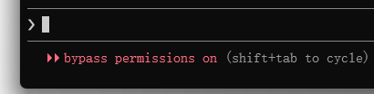

# claude code简介

Claude Code 是 [Anthropic](https://www.anthropic.com/) 推出的面向开发者的 AI 编程协作工具。

Claude Code 定位不是聊天，而是在本地代码仓库中执行高权限、可上下文感知的工程任务。

Claude Code 与在聊天窗口里写几段代码不同，它理解你的整个项目，能直接读取你的文件、运行测试并根据反馈修改代码。

Claude Code 不是一个代码生成器，而是一个能读项目、懂上下文、遵守约束的 AI 编程搭档。

Claude Code 是 Agent（智能体工具），不是 Chat（聊天工具）。

# 安装claude code

在`Windows Powershell`中执行：

```bash
irm https://claude.ai/install.ps1 | iex
```

安装完成后的claude在`C:\Users\asus\.local\bin`目录下存在`claude.exe`则说明安装成功；

## 配置环境变量

将`claude.exe`的文件位置加入到环境变量中：


之后确定并退出命令行，重新打开命令行输入

```bash
PS D:\> claude --version
2.1.114 (Claude Code)
PS D:\> 
```

环境变量配置完成。

## 绕过校验

安装并配置好环境变量后，初次使用 Claude Code ，可能会强制要求登录 Anthropic 账户，需要通过修改配置，来绕过校验，在C盘用户目录下（C:\Users\\%USERNAME%\\.claude.json）找到`claude.json`，加入以下代码:

```json
"hasCompletedOnboarding": true,
```

保存文件，然后在新终端中重新运行 `claude`。

注意：最后需要加上英文版的`,`。

再次执行`claude`即可正常启动：


# 切换国产大模型
## 阿里云（百炼平台）

进入`阿里云百炼`：
官网：[https://bailian.console.aliyun.com/](https://bailian.console.aliyun.com/)

### API-Key创建

首先需要在在阿里云百炼中 [创建API-Key](https://bailian.console.aliyun.com/cn-beijing?spm=a2c4g.11186623.0.0.7c6c5ec6Q6vx5O&tab=model#/api-key&userCode=okjhlpr5)；

### 环境变量配置

在 Windows 中，可以通过 CMD 或 PowerShell 将阿里云百炼提供的 Base URL 和 [API Key](https://help.aliyun.com/zh/model-studio/get-api-key) 设置为环境变量。

#### CMD

```cmd
# 用百炼 API Key 替换 YOUR_DASHSCOPE_API_KEY
setx ANTHROPIC_API_KEY "YOUR_DASHSCOPE_API_KEY"
setx ANTHROPIC_BASE_URL "https://dashscope.aliyuncs.com/apps/anthropic"
setx ANTHROPIC_MODEL "qwen3.6-plus"
```

查看参数是否设置成功

```cmd
echo %ANTHROPIC_API_KEY%
echo %ANTHROPIC_BASE_URL%
echo %ANTHROPIC_MODEL%
```

#### PowerShell

```powershell
# 用百炼 API Key 替换 YOUR_DASHSCOPE_API_KEY
[Environment]::SetEnvironmentVariable("ANTHROPIC_API_KEY", "YOUR_DASHSCOPE_API_KEY", [EnvironmentVariableTarget]::User)
[Environment]::SetEnvironmentVariable("ANTHROPIC_BASE_URL", "https://dashscope.aliyuncs.com/apps/anthropic", [EnvironmentVariableTarget]::User)
[Environment]::SetEnvironmentVariable("ANTHROPIC_MODEL", "qwen3.6-plus", [EnvironmentVariableTarget]::User)
```

配置完成后重启PowerShell。

查看参数是否设置成功：

```powershell
echo $env:ANTHROPIC_API_KEY
echo $env:ANTHROPIC_BASE_URL
echo $env:ANTHROPIC_MODEL 
```
### 模型切换

#### 方式1（进入claude后切换）

进入claude后输入
```plaintext
/model [模型名称]
```

#### 方式2（命令行直接切换进入）

```plaintext
claude --model qwen3.6-plus
```

具体的模型名称可查看阿里云百炼中的模型名称。

### 参考

[阿里云百炼Claude Code接入参考](https://help.aliyun.com/zh/model-studio/claude-code?spm=a2c4g.11186623.help-menu-2400256.d_0_4_2.9c8a6fd1PDWZcP)

## 腾讯云（Tencent Cloud）

### API-Key创建

首先需要在在 [腾讯混元API管理](https://hunyuan.cloud.tencent.com/#/app/apiKeyManage) 中创建API-Key；

### 环境变量配置

#### PowerShell

```PowerShell
# 用腾讯混元 API Key 替换 YOUR_DASHSCOPE_API_KEY

[Environment]::SetEnvironmentVariable("ANTHROPIC_API_KEY", "YOUR_DASHSCOPE_API_KEY", [EnvironmentVariableTarget]::User)

[Environment]::SetEnvironmentVariable("ANTHROPIC_BASE_URL", "https://api.hunyuan.cloud.tencent.com/anthropic", [EnvironmentVariableTarget]::User)

[Environment]::SetEnvironmentVariable("ANTHROPIC_MODEL", "hunyuan-2.0-thinking-20251109", [EnvironmentVariableTarget]::User)
```

配置完成后重启`PowerShell`即可使用。
### token用量查询

[腾讯云-资源包管理](https://console.cloud.tencent.com/hunyuan/packages)

### 参考

[混元 Anthropic API 兼容接口相关调用示例](https://cloud.tencent.com/document/product/1729/127293)

## 国家超算平台

#### API-Key创建

首先需要在在 [国家超算平台API管理]([https://hunyuan.cloud.tencent.com/#/app/apiKeyManage](https://www.scnet.cn/ui/console/index.html#/llm/apikeys)) 中创建API-Key；

### 环境变量配置

#### PowerShell

```PowerShell
# 用国家超算平台 API Key 替换 YOUR_DASHSCOPE_API_KEY

[Environment]::SetEnvironmentVariable("ANTHROPIC_API_KEY", "YOUR_DASHSCOPE_API_KEY", [EnvironmentVariableTarget]::User)

[Environment]::SetEnvironmentVariable("ANTHROPIC_BASE_URL", "https://api.scnet.cn/api/llm/anthropic", [EnvironmentVariableTarget]::User)

[Environment]::SetEnvironmentVariable("ANTHROPIC_MODEL", "MiniMax-M2.5", [EnvironmentVariableTarget]::User)
```

配置完成后重启`PowerShell`即可使用。

### 参考

[国家超算平台第三方工具接入](https://www.scnet.cn/ac/openapi/doc/2.0/moduleapi/tutorial/callbytools_claudecode.html)

# 卸载claude code

## 步骤1 删除npm包

```bash
npm uninstall -g @anthropic-ai/claude-code  
npm uninstall -g https://gaccode.com/claudecode/install
```

## 步骤2 删除配置文件

```bash
# 删除用户配置和状态
rm -rf ~/.claude
rm ~/.claude.json

# 删除特定用于项目的配置（在您的项目目录行）
rm -rf .claude
rm -f .mcp.json

# 删除用户设置和状态
Remove-Item -Path "$env:USERPROFILE\.claude" -Recurse -Force
Remove-Item -Path "$env:USERPROFILE\.claude.json" -Force

# 删除特定于项目的设置（从您的项目目录运行）
Remove-Item -Path ".claude" -Recurse -Force
Remove-Item -Path ".mcp.json" -Force
```

# cc常用操作

### 命令行命令


### 对话内命令

| 命令       | 含义          | 使用场景                                                                      |
| -------- | ----------- | ------------------------------------------------------------------------- |
| /init    | 初始化         | 用于初始化项目，claude会自动扫描当前文件夹，读取代码、现有文档、配置文件以及代码结构，然后生成一份专属于你项目的 CLAUDE.md 文件。 |
| /clear   | 清空上下文       | 当需要重新开始时                                                                  |
| /reset   | 重置对话        |                                                                           |
| /compact | 压缩对话        | 当上下文过长，需要重新开始对话并且不希望丢掉之前的记忆                                               |
| /cost    | 查看费用情况      | API用户用于查询当前AI模型的API费用情况                                                   |
| /model   | 切换模型        | 用于切换不同的模型，此处需要注意如果模型提供商不是同一个需要修改`ANTHROPIC_BASE_URL`及`API-Keys`           |
| /status  | 状态          | 查看当前cc状态                                                                  |
| /doctor  | 检测          | 检测当前cc安装情况                                                                |
| /review  | 代码审查        | 检查Git暂存区改动                                                                |
| /docs    | 索引文档        | 让claude参考指定文档                                                             |
| /theme   | 主题切换        | 可切换内置主题                                                                   |
| /memory  | 编辑CLAUDE.md | 编辑CLAUDE.md文件，可选CLAUDE.md或CLAUDE.local.md                                 |
| /tasks   | 管理后台任务      |                                                                           |
| /export  | 导出对话        | 导出当前对话内容                                                                  |
| /plan    | 进入plan模式    |                                                                           |

#### 前缀触发器

| 符号       | 类型              | 作用                            |
| -------- | --------------- | ----------------------------- |
| /        | command（命令）     | 执行内置操作                        |
| @        | context（上下文）    | 引用文件或目录                       |
| !        | bash模式          | 直接执行终端命令（会消耗token）            |
| #        | memory（记忆注入）    | 把内容持久写入CLAUDE.md项目记忆中，跨会话长期有效 |
| &        | async（异步任务）     |                               |
| \\+Entry | multiline（多行输入） | 换行不发送，写多行内容，长需求描述一次性写完        |
| 无前缀      | 自然语言            | 普通任务指令                        |

### 快捷键

#### 常规操作

| 快捷键       | 描述              | 上下文                                    |
| --------- | --------------- | -------------------------------------- |
| Ctrl+C    | 取消当前输入或生成       | 标准中断                                   |
| Ctrl+D    | 退出claude code会话 | EOF信号                                  |
| Ctrl+G    | 在默认文本编辑器中打开     | 在默认文本编辑器中编辑您的提示或自定义响应                  |
| Ctrl+L    | 清除终端屏幕          | 保留对话历史                                 |
| Ctrl+O    | 切换详细输出          | 显示详细的工具使用和执行状态                         |
| Ctrl+R    | 反向搜索命令历史        | 交互式搜索以前的命令                             |
| Shift+Tab | 切换权限模式          | 在[自动编辑模式](#自动编辑模式)、Plan Mode 和正常模式之间切换 |


#### 文本编辑

| 快捷键 | 描述  | 上下文 |
| --- | --- | --- |
|     |     |     |
#### 其他

| 快捷键 | 描述  | 上下文 |
| --- | --- | --- |
|     |     |     |

### 三种工作模式

claude code可按场景切换模式，提高使用效率。

#### 自动编辑模式

**特点**：免确认批量操作。

<mark style="background: #FFB86CA6;">自动编辑模式（accept edits on 免确认批量操作）</mark>适合无需逐次确认的文件创建、修改场景。按下 <mark style="background: #BBFABBA6;">Shift+Tab</mark> 一次即可开启，此时 Claude 会自动执行编辑操作，无需手动确认。比如提示 “创建一个酷炫的 todolist 应用”，它会直接生成文件并修改，省去反复确认的时间。


#### Plan模式

**特点**：前期规划神器。

面对项目搭建或复杂问题时，用 Shift+Tab 两次（或者执行`/plan`）开启 Plan 模式(paln mode on）。它会<mark style="background: #FF5582A6;">先梳理方案框架</mark>，比如要做 “像素风格的移动端 todolist”，会自动规划技术栈、页面结构、适配方案等，<mark style="background: #FF5582A6;">确认后再动手</mark>。若不满意可直接说 “重新规划”，直到符合预期。


#### Yolo模式

**特点**：全权限放手干。

重构代码、启动新项目或修复复杂 bug 时，用 `claude --dangerously-skip-permissions` 进入 Yolo 模式。<mark style="background: #FF5582A6;">此时 Claude 拥有更高权限，可直接执行更多操作</mark>（需注意安全，建议在沙箱环境使用）。进入后仍能用 Shift+Tab 调整模式，灵活切换权限粒度。




# Skills


# 免费Token

[2026 大模型 API 免费额度汇总20260317](https://cloud.tencent.com/developer/article/2626756?cps_key=1d358d18a7a17b4a6df8d67a62fd3d3d)