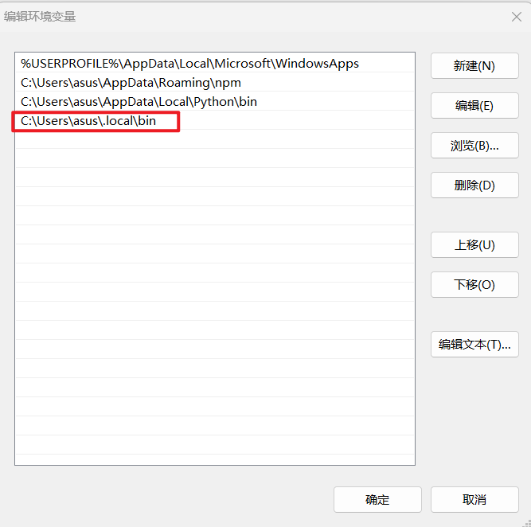
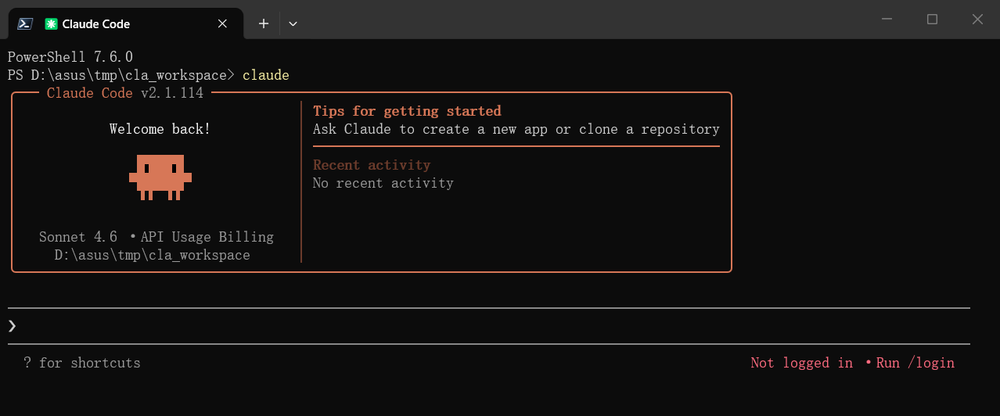

# 安装claude

在Windows Powershell中执行：

```bash
irm https://claude.ai/install.ps1 | iex
```

安装完成后的claude在`C:\Users\asus\.local\bin`目录下存在`claude.exe`则说明安装成功；

# 配置环境变量

将`claude.exe`的文件位置加入到环境变量中：



之后确定并退出命令行，重新打开命令行输入

```bash
PS D:\> claude --version
2.1.114 (Claude Code)
PS D:\> 
```

环境变量配置完成。

# 绕过校验

安装并配置好环境变量后，初次使用 Claude Code ，可能会强制要求登录 Anthropic 账户，需要通过修改配置，来绕过校验，在C盘用户目录下（C:\Users\\%USERNAME%\\.claude.json）找到`claude.json`，加入以下代码:

```json
"hasCompletedOnboarding": true,
```

保存文件，然后在新终端中重新运行 `claude`。

注意：最后需要加上英文版的`,`。

再次执行`claude`即可正常启动：



# 切换国产大模型

进入`阿里云百炼`：
官网：[https://bailian.console.aliyun.com/](https://bailian.console.aliyun.com/)

### API-Key创建

首先需要在在阿里云百炼中创建API-Key；

### 环境变量配置

在 Windows 中，可以通过 CMD 或 PowerShell 将阿里云百炼提供的 Base URL 和[API Key](https://help.aliyun.com/zh/model-studio/get-api-key)设置为环境变量。
#### CMD

```cmd
# 用百炼 API Key 替换 YOUR_DASHSCOPE_API_KEY
setx ANTHROPIC_API_KEY "YOUR_DASHSCOPE_API_KEY"
setx ANTHROPIC_BASE_URL "https://dashscope.aliyuncs.com/apps/anthropic"
setx ANTHROPIC_MODEL "qwen3.6-plus"
```

查看参数是否设置成功

```cmd
echo %ANTHROPIC_API_KEY%
echo %ANTHROPIC_BASE_URL%
echo %ANTHROPIC_MODEL%
```

#### PowerShell

```powershell
# 用百炼 API Key 替换 YOUR_DASHSCOPE_API_KEY
[Environment]::SetEnvironmentVariable("ANTHROPIC_API_KEY", "YOUR_DASHSCOPE_API_KEY", [EnvironmentVariableTarget]::User)
[Environment]::SetEnvironmentVariable("ANTHROPIC_BASE_URL", "https://dashscope.aliyuncs.com/apps/anthropic", [EnvironmentVariableTarget]::User)
[Environment]::SetEnvironmentVariable("ANTHROPIC_MODEL", "qwen3.6-plus", [EnvironmentVariableTarget]::User)
```

配置完成后重启PowerShell。

查看参数是否设置成功：

```powershell
echo $env:ANTHROPIC_API_KEY
echo $env:ANTHROPIC_BASE_URL
echo $env:ANTHROPIC_MODEL 
```
## 模型切换

### 方式1（进入claude后切换）

进入claude后输入
```plaintext
/model [模型名称]
```

### 方式2（命令行直接切换进入）

```plaintext
claude --model qwen3.6-plus
```

具体的模型名称可查看阿里云百炼中的模型名称。

# 参考
[https://help.aliyun.com/zh/model-studio/claude-code#03fe567f8f8wx](https://help.aliyun.com/zh/model-studio/claude-code?spm=a2c4g.11186623.help-menu-2400256.d_0_4_2.9c8a6fd1PDWZcP)