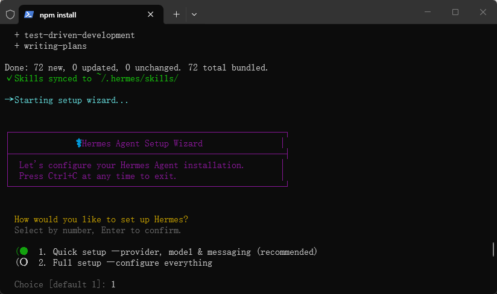
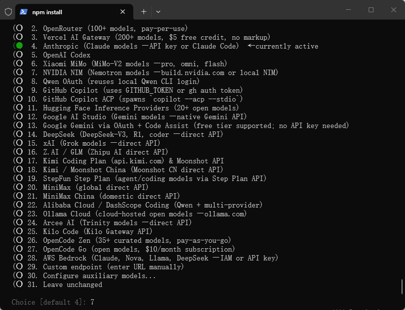

# 安装Hermes（未成功）

管理员身份打开`PowerShell`，运行：

```powershell
Set-ExecutionPolicy -ExecutionPolicy RemoteSigned -Scope CurrentUser
```

## 执行官方安装脚本

```powershell
irm https://raw.githubusercontent.com/NousResearch/hermes-agent/main/scripts/install.ps1 | iex
```

等待安装完成。





# 参考
[【保姆级教程】经过两天踩坑，终于在Windows中完成Hermes Agent的部署](https://zhuanlan.zhihu.com/p/2028964819114442758)