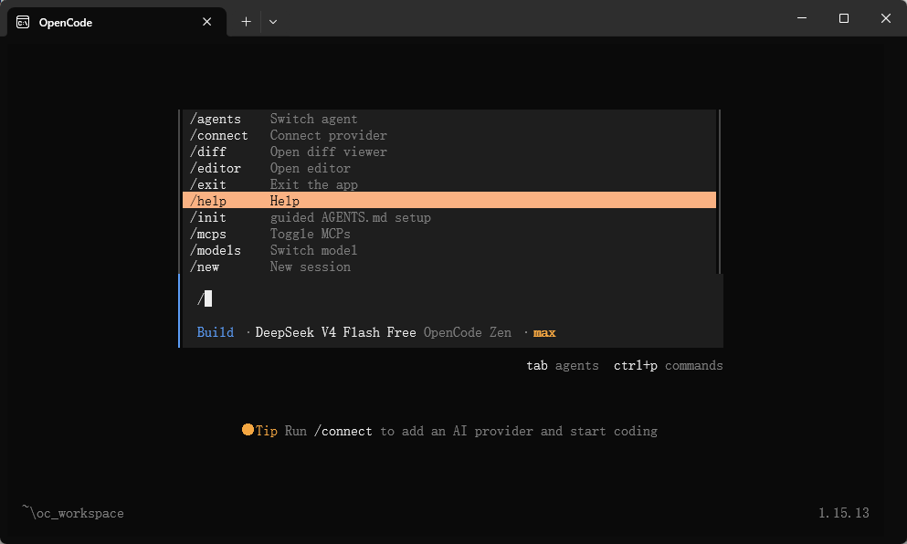

OpenCode 是一个开源的 AI 编程代理（AI coding agent），支持在终端（Terminal）、桌面应用和主流 IDE（如 VS Code）中与 AI 交互完成代码相关任务。

OpenCode 类似于 Claude 的 Code 模式或 Cursor 的 Agent 功能，但完全开源、隐私优先，支持多种大语言模型（LLM），并强调终端体验。
# 安装

```bash
npm install -g opencode-ai
```

# 基础知识

## 关键特性

**两种内置 Agent 模式（在TUI窗口使用TAB按键切换）：**

- **Build 模式**：全权限，可直接编辑文件、执行命令。
- **Plan 模式**：只读规划，默认拒绝编辑，需要确认。

工具集：bash 执行、文件读写、grep 搜索、LSP 诊断等。

上下文感知：自动分析项目结构，生成 AGENTS.md 指南。

分享与协作：一键生成会话分享链接。

## OpenCode CLI

### Web界面

```bash
# 打开默认web界面
opencode web
# 打开以4096为断开的opencode web界面
opencode web --port 4096
# 在网络中访问
opencode web --hostname 0.0.0.0
```

## OpenCode TUI（终端界面）

OpenCode 提供了一个交互式终端界面（TUI，Terminal User Interface），用于在命令行中与 AI 进行高效协作开发。

TUI 是 OpenCode 的核心使用方式，所有代码分析、修改、执行都通过这个界面完成。

OpenCode TUI 本质是一个可执行命令的 AI 对话终端，它把开发、命令行和 AI 融合在一起。

所有的 TUI 命令使用斜杆 / 唤起。

在 TUI 输入框中输入 / 就会列出联想的命令：



#### OpenCode TUI 命令


| 命令                           | 描述                  | 快捷键       |
| ---------------------------- | ------------------- | --------- |
| /connect                     | 添加LLM提供商并配置API Keys | ——        |
| /compact                     | 压缩当前会话上下文           | ctrl+x->c |
| /details                     | 切换工具执行详情显示          | ctrl+x->d |
| /editor                      | 打开外部编辑器编写信息         | ctrl+x->e |
| /exit（/quit /q）              | 退出TUI               | ctrl+x->q |
| /export                      | 导出当前对话为 Markdown    | ctrl+x->x |
| /init                        | 创建/更新 AGENTS.md     | ctrl+x->i |
| /models                      | 列出可用模型              | ctrl+x->m |
| /new（/clear）                 | 新建会话                | ctrl+x->n |
| /redo                        | 重做被 /undo 撤销的操作     | ctrl+x->r |
| /sessions（/resume /continue） | 会话列表与切换             | ctrl+x->l |
| /share                       | 分享当前会话              | ctrl+x->s |
| /themes                      |                     |           |


# 参考

[https://www.runoob.com/opencode/opencode-tutorial.html](https://www.runoob.com/opencode/opencode-tutorial.html)