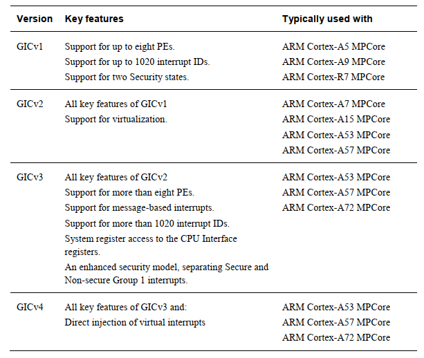
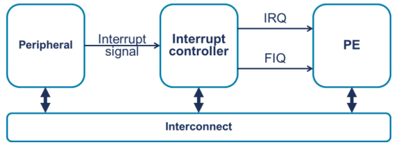
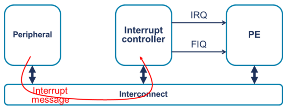
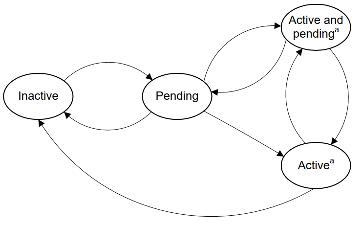
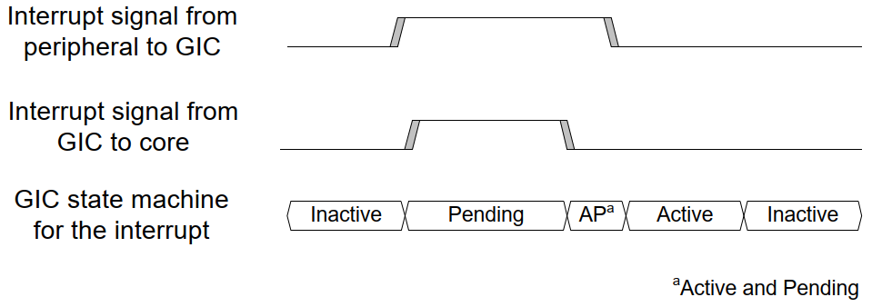
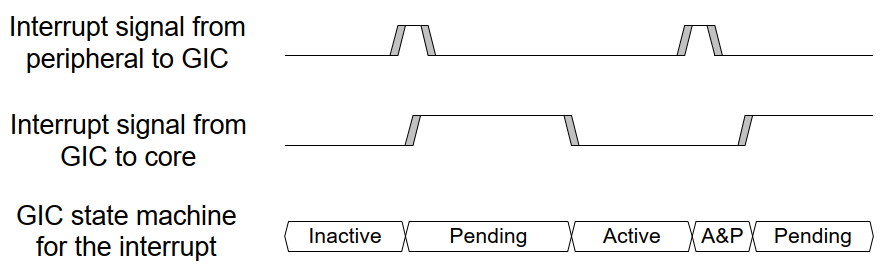
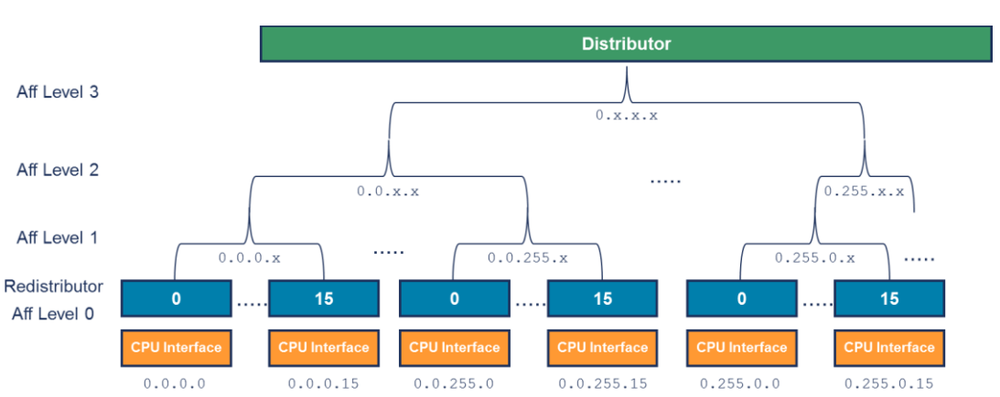
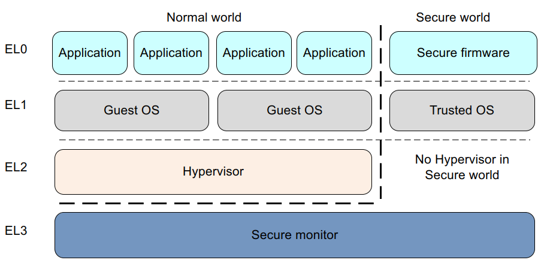
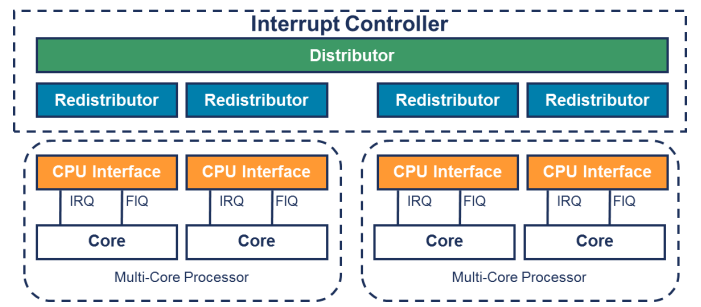

# 基础知识

GIC控制器对来自整个系统的所有中断进行编组，确定它们的优先级，并将它们发送到一个核心进行处理。 GIC 主要用于提高处理器效率并启用中断虚拟化。GIC 基于 Arm GIC 架构实现。该架构已从 GICv1 发展到最新版本的 GICv3 和 GICv4。

GIC中断控制器架构的分类：GICv1（已弃用）、GICv2、GICv3、GICv4；

ARM公司中断控制器IP对应架构：
* GIC400：支持GICv2架构；
* GIC500：支持GICv3架构；
* GIC600：支持GICv3架构；
* GIC700：支持GICv4架构；

GIC的核心功能是对soc中外设的中断源进行管理，并提供给软件，配置以及控制这些中断源。
* 当对应的中断源有效时，GIC根据该中断源的配置，决定是否将该中断信号发送给CPU。如果存在多个中断源有效，GIC将会进行仲裁，选择高优先级的中断发送给CPU。
* 当CPU接收到GIC发送的中断，通过读取GIC的寄存器，就可以知道中断来自于哪里，从而可以做出相应的处理。
* 当CPU处理完中断后，会告诉GIC（访问GIC的寄存器）该中断处理完毕。GIC接收到CPU处理完中断后，就将该中断源取消，避免又重新发送中断给CPU及允许中断抢占。

## ARM Core访问GIC的方式

ARM Core访问GIC寄存器的方式有两种：
1. 使用memory-mapped的方式：SoC在设计时预留一块内存区域给GIC，ARM Core通过读写该地址来进行GIC寄存器的操作；
2. 通过系统寄存器的方式：通过MSR/MRS（armv8-arch32使用MCR/MRC）来进行读写GIC寄存器；

ARM Core访问各版本GIC寄存器的方式：
* ARM Core访问GICv2所有寄存器（distributor、cpu interface）都是使用memmory-mapped的方式进行访问；
* <mark style="background: #D2B3FFA6;">ARM Core访问GICv3的distributor/redistributor使用memory-mapped方式进行访问；</mark>
* <mark style="background: #D2B3FFA6;">GICv3的ITS/CPU interface既可以使用memory-mapped方式访问，也可以使用系统寄存器方式访问；</mark>

## 不同版本GIC一览表



> 《GICv3_Software_Overview_Official_Release_B.pdf》2.2 Brief history of the GIC architecture p7

当前ARM64主流的GIC架构为GICv3（GICv3 依然是基石（Foundational），但 GICv4.x 已成为高性能移动端和服务器端的主流标准。）；

# GIC架构

## GICv2


## GICv3

ARM 通用中断控制器架构规范（GIC）3.0 和 4.0 版本均使用”处理单元”（PE）一词作为实现 ARM 架构的机器的通用术语。例如，ARMCortex-A57 MPCore™是一款多核处理器，最多可包含四个核心。对于 ARMCortex-A57 MPCore™，架构规范中将每个核心都称为一个处理单元（PE）。

### 中断类型

| 中断                                           | 中断类型     | 描述                                                                                                                             |
| :------------------------------------------- | :------- | :----------------------------------------------------------------------------------------------------------------------------- |
| SPI (Shared Peripheral Interrupt)            | 共享外设中断   | 全局外设中断，可以路由到特定的PE，也可以路由到一组PEs                                                                                                  |
| PPI (Private Peripheral Interrupt)           | 私有外设中断   | 针对单个特定PE的外设中断，无法路由，常见为每个PE的通用定时器中断（Generic Timer）                                                                              |
| SGI (Software Generated Interrupt)           | 软件生成中断   | 通常用来做核间中断，通过向GIC的SGI寄存器写值触发                                                                                                    |
| LPI (Locality-specific Peripheral Interrupt) | 局部特定外围中断 | LPI（低功耗中断）是GICv3新引入的中断类型，它与其他类型的中断在许多方面有所不同。<mark style="background: #FFB86CA6;">特别是，LPI 始终是基于消息的中断</mark>，并且其配置信息保存在内存而不是寄存器中 |

> 《GICv3_Software_Overview_Official_Release_B.pdf》3. GICv3 fundamentals p9

#### 中断号（INTID）分配

| INTID     | 中断类型                     | 描述                                                                                            |
| --------- | ------------------------ | --------------------------------------------------------------------------------------------- |
| 0-15      | SGIs                     | 和PE绑定，每个PE都有自己的0-15号中断                                                                        |
| 16-31     | PPIs                     | 和PE绑定，每个PE都有自己的16-31号中断                                                                       |
| 32-1019   | SPIs                     | 外设中断，整个SoC只有这一套，那些PE响应这些中断取决于路由到哪个PE                                                          |
| 1020-1023 | Special Interrupt Number | 特殊中断号，用于指示特殊情况，可查看《GICv3_Software_Overview_Official_Release_B.pdf》5.3 Spurious interrupts p22 |
| 1024-8192 | Reserved                 | 保留                                                                                            |
| 8192及以上   | LPIs                     | 最大值由芯片设计决定                                                                                    |

> 《GICv3_Software_Overview_Official_Release_B.pdf》3.1.2 Interrupt Identifiers p9

#### 中断如何发送到中断控制器

传统方式：外设中断信号通过专用硬件中断线和中断控制器连接，中断控制器通过硬件连线（区分IRQ和FIQ）与PE相连。



>《GICv3_Software_Overview_Official_Release_B.pdf》3.1.3 How interrupts are signaled to the interrupt controller p9

GICv3还支持基于消息（message）的中断触发方式。基于消息的中断是指先将中断消息写入内存中，然后通过写入GIC中断控制器中的寄存器来设置和清除的中断。基于消息的中断触发方式可以有效的去掉外设与中断控制器间的硬件中断线，在大型SoC系统中能显著减轻硬件设计者的工作量（外设动辄会存在成百上千的中断线连接到SoC上）。



> 《GICv3_Software_Overview_Official_Release_B.pdf》3.1.3 How interrupts are signaled to the interrupt controller p10

在GICv3中，SPI可以被设置基于message的中断，LPI则全都是基于message的中断，不过使用的寄存器不同。

| 中断类型 | message-base中断使用的寄存器                                                                    |
| ---- | --------------------------------------------------------------------------------------- |
| SPI  | GICD_SETSPI_NSR asserts（触发） an interrupt<br/>GICD_CLRSPI_NSR deassert（解除） an interrupts |
| LPI  | GITS_TRANSLATER                                                                         |

### 中断状态

GIC中断控制器为每个SPI、PPI、SGI的中断维护一个状态机：
* **Inactive**：中断未触发（not assert）；
* **Pending**：中断已经触发（assert）了，但未被PE响应；
* **Active**：中断已经触发，并且被PE响应（acknowledged）了。
* **Active and Pending**：前一个中断已经响应（acknowledged），该中断线上的后一个中断处于Pending状态；

<mark style="background: #FF5582A6;">注意</mark>：LPI没有Active、Active and Pending两种状态，以上状态机不适用于LPI。



> 《GICv3_Software_Overview_Official_Release_B.pdf》3.2 Interrupt state machine p11

#### 电平触发



> 《GICv3_Software_Overview_Official_Release_B.pdf》3.2.1 Level sensitive p11

| 状态转移                         | 触发条件           | 描述                                                                                                                                                                                                                                       |
| ---------------------------- | -------------- | ---------------------------------------------------------------------------------------------------------------------------------------------------------------------------------------------------------------------------------------- |
| Inactive to Pending          | 外设assert中断信号   | 中断线电平触发GIC，GIC将中断信号发送到PE（前提是中断已使能且优先级足够高），GIC状态机切换到Pending；                                                                                                                                                                              |
| Pending to Active & Pending  | PE读取IAR寄存器     | PE读取GIC中断控制器的IAR（Interrupt Acknowledge Register）寄存器以响应中断，状态机切换到Active and Pending状态。此时发生两件事：<br/>1. GIC到PE的中断信号被硬件自动deassert（由IAR读操作触发的硬件行为）；<br/>2. 外设到GIC的中断信号仍维持有效电平（假设高电平触发）。因此中断同时处于Active（PE已响应，正在处理）和Pending（外设中断源未清除，信号仍有效）两种状态； |
| Active and Pending to Active | 外设deassert中断信号 | ISR处理了外设的中断请求（如读取外设状态寄存器、清除中断标志位等），外设硬件在中断源被清除后将中断信号线deassert（恢复为非有效电平）。GIC检测到电平变化后，自动移除Pending状态，仅保留Active状态（PE仍在执行ISR后续流程）；                                                                                                            |
| Active to Inactive           | PE写入EOIR寄存器    | PE完成中断处理后，软件写入EOIR（End of Interrupt Register）寄存器通知GIC中断处理完成。GIC执行优先级降级（priority drop）并将中断去激活（deactivate），状态机回到Inactive，允许该中断源再次触发新的中断；                                                                                                   |

#### 边沿触发



> 《GICv3_Software_Overview_Official_Release_B.pdf》3.2.2 Edge-triggered p12


| 状态转移                          | 描述                                                                                                                                                          |
| ----------------------------- | ----------------------------------------------------------------------------------------------------------------------------------------------------------- |
| Inactive to Pending           | GIC检测到中断信号发送跳变（上升沿或下降沿）并触发PE后，GIC状态机切换到Pending状态（之后中断信号回到什么电平都无所谓）。                                                                                         |
| Pending to Active             | PE读取GIC的IAR寄存器响应中断，GIC将状态机切到Active，此时GIC通知PE的中断信号被deassert（是因为操作了GIC的IAR寄存器，硬件行为完成GIC到PE的deassert）。                                                         |
| Active to Active and Pending  | 在PE处理当前中断期间（Active状态），同一中断源再次产生边沿触发中断，此时GIC对该中断的状态机切换到AP（<mark style="background: #FF5582A6;">注意</mark>：如果已经是 A&P 状态时又来边沿，**新边沿会被丢弃**（GIC 只能缓存一个 Pending））。 |
| Active and Pending to Pending | 当PEGIC的EOIR（End of Interrupt Register）后，表明完成了当前的中断处理，                                                                                                       |


#### 触发方式比较


```ASCII
信号电平:
         ┌──────────┐          ┌───┐   ┌───┐
         │          │          │   │   │   │
    ─────┘          └──────────┘   └───┘   └─────
         ↑          ↑          ↑   ↑   ↑   ↑
         上升沿    下降沿     上升沿 下降沿 上升沿 下降沿

电平触发（高电平有效）:
         ├──触发中──┤          ├─触发┤   ├─触发┤
         整个高电平期间都视为有效

边沿触发（上升沿）:
         ↑                     ↑       ↑
         仅在上升沿的瞬间触发一次
```


### 亲和路由

PE的亲和性由4个8位字段表示，类似于IP地址：

\<affinity level3\>.\<affinity level2\>.\<affinity level1\>.\<affinity level0\> 



> 《GICv3_Software_Overview_Official_Release_B.pdf》3.3 Affinity routing p13

### 安全模型

GICv3架构支持ARM TrustZone技术，每个INTID都必须分配一个group和security配置。

| 中断类型               | 示例应用                                                      |
| ------------------ | --------------------------------------------------------- |
| Secure Group 0     | Interrupts for EL3（Secure Firmware）                       |
| Secure Group 1     | Interrupts for EL1（Trusted OS）                            |
| Non-secure Group 1 | Interrupts for the Non-secure state（OS and/or Hypervisor） |
Group 0中断试中以FIQ信号的形式发出。Group 1中断则根据PE的当前安全状态和异常级别，以IRQ或FIQ信号的形式发出。




> 《ARM Cortex-A Series Programmer's Guide for ARMv8-A.pdf》Chapter 3 Fundamentals of ARMv8 p29(3-2)

在 ARMv8-A 和 GICv3 中，对两种安全状态的支持是可选的。实现可以选择只实现一种安全状态，也可以选择实现两种安全状态。


### 编程模型

GICv3中断控制器将寄存器分为三层：
* Distributor interface（寄存器命名格式：GICD_\*）;
* Redistributor interface（寄存器命名格式：GICR_\*）;
* CPU interface（寄存器命名格式：ICC_\*\_ELn）



> 《GICv3_Software_Overview_Official_Release_B.pdf》3.5 Programmers’ model p16


| Register interface               | 描述                                                                                      | 功能                                                                                                                                                            |
| -------------------------------- | --------------------------------------------------------------------------------------- | ------------------------------------------------------------------------------------------------------------------------------------------------------------- |
| Distributor interface(GICD_\*)   | Distributor寄存器的访问采用memory-mapped方式访问，包含的设置一般是全局的，意味着会影响到所有连接在该GIC上的PE；<br/>用来配置SPI类型中断； | - SPI中断优先级分发<br/>- 启用或禁用SPI中断<br/>- 每个SPI中断的路由状态<br/>- 配置每个SPI的触发方式（电平触发或边沿触发）<br/>- 生成基于消息的SPI<br/>- 控制SPI中断状态机                                              |
| Redistributor interface(GICR_\*) | 每个PE对应一组Redistrator；<br/>用来配置SGI和PPI中断；                                                 | - 启用和禁用SGI和PPI<br/>- 设置SGI和PPI优先级<br/>- 配置每个PPI的触发方式（电平触发/边沿触发）<br/>- 分配每个SGI和PPI所需的中断组<br/>- 控制SGI和PPI的状态机<br/>- 控制内存中LPI相关中断属性和挂起状态的数据结构基地址<br/>- 每个PE的功耗控制 |
| CPU interface(ICC_\*_ELn)        | 每组Redistributor都连接到一个CPU interface，CPU interface的配置也是针对某个具体的PE；                         | - 用于启用中断处理的常规控制与配置。<br/>- 响应中断<br/>- 执行优先级降级和中断deactive操作<br/>- 为每个PE设置中断优先级掩码<br/>- 为每个PE配置中断抢占策略<br/>- 仲裁PE最高待处理的最高优先级中断                                    |

> 《GICv3_Software_Overview_Official_Release_B.pdf》3.5 Programmers’ model p16

#GICv3

《GICv3_Software_Overview_Official_Release_B.pdf》

## GICv4


