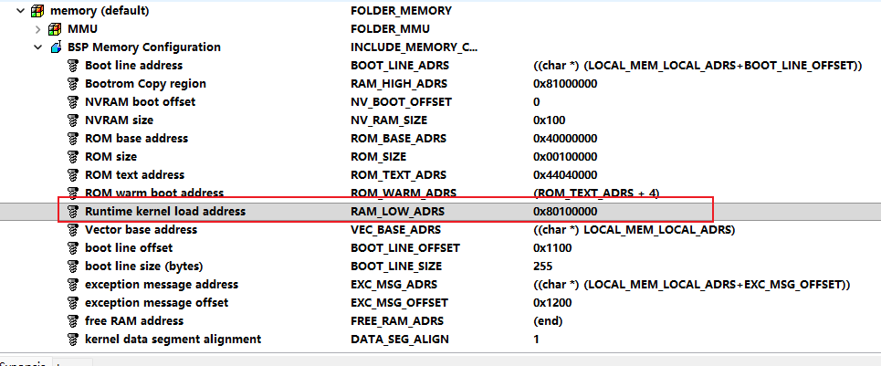
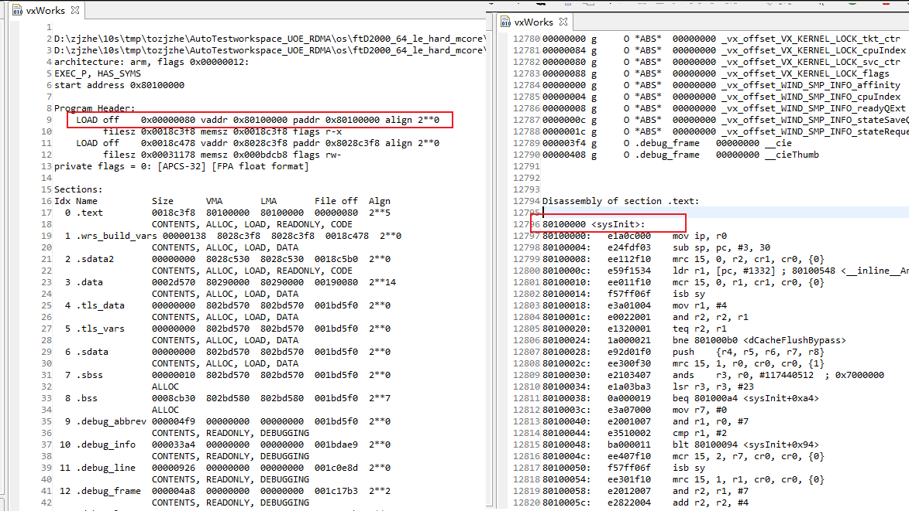

# VxWorks内核启动流程

VxWorks的启动可以分为两种，一种是直接从rom中引导，另外一种是通过bootloader引导VxWorks启动，后者通常使用uboot进行引导启动。

```c
romInit
    romStart
    	/* RAM启动入口点 */
    	sysInit
            usrInit
                sysStart
                usrBootHwInit
                sysHwInit
                usrKernelInit
                    kIP.rootRtn		= (FUNCPTR) usrRoot;
                    kernelInit (_KERNEL_INIT_PARAMS_VN_AND_SIZE, &kIP);
                            (void) taskInitExcStk (pTcb, "tRootTask", 0,
                                                   (VX_SUPERVISOR_MODE | VX_UNBREAKABLE | 
                                                     VX_DEALLOC_STACK),
                                                   pRootStackBase, rootStackSize,
                                                   pRootExcStackBase, taskKerExcStackSize,
                                                   pParams->rootRtn, (_Vx_usr_arg_t) pMemPoolStart, 
                                                   (_Vx_usr_arg_t) memPoolSize,
                                                   0L, 0L, 0L, 0L, 0L, 0L, 0L, 0L);
                                usrRoot
                                    usrNetworkInit
                                        usrNetEndLibInit
                                    usrAppInit
```

## 从bootrom启动

### romInit

romInit 函数作为系统冷启动的第一个函数，会初始化CPU和一段内存，当romInit函数正常初始化成功后，从LOCAL_MEM_LOCAL_ADRS 到 LOCAL_MEM_LOCAL_ADRS + LOCAL_MEM_SIZE的内存可以正常进行读写访问。

> [vxworks-6.9\target\config\arm_a15_ctx\romInit.s]

### romStart

将代码从ROM移植到RAM中，然后，跳到VxWorks 镜像中。romStart函数将跳转到ursInit 函数中。
1.    将数据段和text段的内容拷贝到ROM中。
2.    清除未使用的RAM。
3.    romStart函数跳转到RAM的入口函数usrInit。

> [vxworks-6.9\target\config\all\bootInit.c]

## 从RAM启动

VxWorks系统从RAM启动通常使用uboot作为启动前的bootloader，uboot跳转至VxWorks的位置为sysInit函数，可通过读取编译后的elf文件进行查看





<center>VxWorks启动内核跳转位置</center>

### sysInit

sysInit是VxWorks 在 RAM 中的系统启动入口点，是启动后执行的第一段代码，主要完成中断禁用、堆栈设置以及跳转至usrInit

> [vxworks-6.9\target\config\\[board]\sysALib.s]

```assembly
/*******************************************************************************
*
* sysInit - start after boot
*
* This routine is the system start-up entry point for VxWorks in RAM, the
* first code executed after booting.  It disables interrupts, sets up
* the stack, and jumps to the C routine usrInit() in usrConfig.c.
*
* The initial stack is set to grow down from the address of sysInit().  This
* stack is used only by usrInit() and is never used again.  Memory for the
* stack must be accounted for when determining the system load address.
*
* NOTE: This routine should not be called by the user.
*
* RETURNS: N/A
*
* void sysInit (UINT32 startType)       /@ THIS IS NOT A CALLABLE ROUTINE @/
*
*/

FUNC_BEGIN(sysInit)
	...
    MOV     r12, r0                     /* save startType */

    /* Set initial stack pointer so stack grows down from start of code */

    ADR    sp, FUNC(sysInit)            /* Initialize stack pointer */

    /*
     * Set the processor to a known state: the reset state with
     * MMU and caches disabled and program flow/branch prediction enabled.
     * See "ARM Architecture Reference Manual ARMv7-A and ARMv7-R edition"
     * (ARM DDI 0406) and "Cortex-A15 Processor Technical Reference Manual"
     * (ARM DDI 0438) for details.
     */
    
    MRC    p15, 0, r2, c1, c0, 0        /* Read control register into r2 */

    LDR    r1, =MMU_INIT_VALUE          /* Defined in mmuCortexA8Lib.h */
    MCR    p15, 0, r1, c1, c0, 0        /* Write to control register */
    ISB                                 /* Ensure processor state is set */

    /* invalidate the data caches, flushing them if necessary */

    LDR     r1, =SYS_CTL_DCACHE_ENABLE
    AND     r2, r2, r1
    TEQ     r2, r1                      /* Check if data caches were enabled */
    BNE     dCacheFlushBypass

    /*
     * Note the following about _CORTEX_AR_ENTIRE_DATA_CACHE_OP:
     * Registers r0-r3 are modified, r4-r8 are preserved via the stack and
     * a DSB is performed before returning.
     */

    _CORTEX_AR_ENTIRE_DATA_CACHE_OP (c14)  /* Flush & invalidate data caches */
    B       dCacheInvalDone

dCacheFlushBypass:
    _CORTEX_AR_ENTIRE_DATA_CACHE_OP (c6)   /* Invalidate data caches */

dCacheInvalDone:
    ISB                                    /* Instruction Synch Barrier */

    /* set Context ID Register to zero, including Address Space ID */

    MCR    p15, 0, r1, c13, c0, 1

    /* disable interrupts in CPU and switch to SVC32 mode */

    MRS    r1, cpsr
    BIC    r1, r1, #MASK_MODE
    ORR    r1, r1, #MODE_SVC32 | I_BIT | F_BIT
    MSR    cpsr, r1


    LDR r2, =0xffffffff
    MCR CP_MMU, 0, r2, c3, c0, 0 /* write DACR */

    MOV r2, #0
    MCR CP_MMU, 0, r2, c7, c5, 0        /* invalidate BTB */
    ISB
    DSB

    LDR r1, =L$pStaticMmuL1PageTable
    LDR r1, [r1]
    MCR CP_MMU, 0, r1, c2, c0, 0    /* set the TTBR */
    ISB
    DSB

    MOV r2, #0
    MCR CP_MMU, 0, r2, c8, c7, 0    /* invalidate all I & D TLBs */
    ISB
    DSB

    MRC CP_MMU, 0, r2, c1, c0, 0 /* read control register */
    LDR r1, =MMUCR_M_ENABLE
    ORR r2, r2, r1
    MCR CP_MMU, 0, r2, c1, c0, 0 /* write control register */
    
   
    MOV    fp, #0                       /* Initialize frame pointer */

    /* Make sure Boot type is set correctly. */

    MOV    r0, r12                      /* restore startType */    
    
    MOV    r1,#BOOT_NORMAL
    CMP    r1,r0
    BEQ    L$_Good_Boot

    MOV    r1,#BOOT_NO_AUTOBOOT
    CMP    r1,r0
    BEQ    L$_Good_Boot

    MOV    r1,#BOOT_CLEAR
    CMP    r1,r0
    BEQ    L$_Good_Boot

    MOV    r1,#BOOT_QUICK_AUTOBOOT
    CMP    r1,r0
    BEQ    L$_Good_Boot

    MOV    r0, #BOOT_NORMAL             /* default startType */

L$_Good_Boot:

    /* now call usrInit (startType) */

    B      FUNC(usrInit)

    FUNC_END(sysInit)
```

### usrInit

usrInit函数主要实现了清零BSS、设置默认中断向量、初始化硬件设备、使能cache、以及创建第一个usrRoot的根任务初始化一些基础的机制和设备。

> [vxworks-6.9\target\proj\\[board]\prjConfig.c]

```c
/******************************************************************************
*
* usrInit - pre-kernel initialization
*/

void usrInit (int startType)
    {
    sysStart (startType);               /* clear BSS and set up the vector table base address. */
    usrBootHwInit ();                   /* call usrBootHwInit() routine */
    cacheLibInit (USER_I_CACHE_MODE, USER_D_CACHE_MODE); /* include cache support */
    excShowInit ();                     /* exception show routines */
    excVecInit ();                      /* exception handling */
    sysHwInit ();                       /* call the BSPs sysHwInit routine during system startup */
    usrCacheEnable ();                  /* optionally enable caches */
    objInfoInit ();                     /* object management routines that requires lookup in a 			list of objects, such as the objNameToId() routine. */
    objLibInit ((OBJ_ALLOC_FUNC)FUNCPTR_OBJ_MEMALLOC_RTN, 				    (OBJ_FREE_FUNC)FUNCPTR_OBJ_MEMFREE_RTN,   				    OBJ_MEM_POOL_ID, 			      				    OBJ_LIBRARY_OPTIONS); /* object management */
    vxMemProbeInit ();                  /* Initialize vxMemProbe exception handler support */
    classListLibInit ();                /* object class list management */
    semLibInit ();                      /* semaphore support infrastructure */
                                        /* mutex semaphores */
                                        /* mutex semaphore creation routine */
    classLibInit ();                    /* object class management */
    kernelBaseInit ();                  /* required component DO NOT REMOVE. */
    taskCreateHookInit ();              /* user callouts on task creation/deletion */
    sysDebugModeInit ();                /* a flag indicating the system is in 'debug' mode */
    usrKernelInit (VX_GLOBAL_NO_STACK_FILL); /* context switch and interrupt handling (DO NOT REMOVE). */
    }
```

#### sysHwInit

是vxWorks板级支持包BSP的入口完成，用于完成BSP定制的外设的初始化，主要包含以下几个部分：初始化中断控制器、遍历PCI总线并初始化总线上设备（网络设备、USB设备等）、初始化串口、初始化电源管理、初始化硬盘设备等工作。

> [vxworks-6.9\target\config\\[board]\sysLib.c]

#### usrKernelInit

> [vxworks-6.9\target\config\comps\src\usrKernel.c]

```c
/*******************************************************************************
*
* usrKernelInit - configure kernel data structures
*
* \NOMANUAL
*/

void usrKernelInit
    (
    BOOL noStackFill
    )
    {
    _KERNEL_INIT_PARAMS	kIP;
#ifdef INCLUDE_KERNEL_PROXIMITY_HEAP
    PHYS_MEM_DESC       memDesc;
    char *              firstRamDescStartAddr;
    char *              firstRamDescEndAddr;
#endif

#ifdef _WRS_CONFIG_SMP
    /*
     * set the number of CPUs available for SMP.
     * Any uses of vxCpuConfigured before here will use the value
     * of vxCpuConfigured set to VX_SMP_NUM_CPUS, which is the value
     * configured by the BSP.  vxCpuConfigured will also be updated when the 
     * idle tasks are created in case there are fewer than CPUs than expected,
     * eg. if we are not starting on core 0.
     */

    vxCpuConfigured = min (VX_MAX_SMP_CPUS, VX_SMP_NUM_CPUS);

    kernelLockInit ();
#endif /* _WRS_CONFIG_SMP */

#ifdef INCLUDE_REBOOT_HOOKS
    pRebootHookTbl = &rebootHookTbl[0];
    rebootHookTblSize = MAX_REBOOT_HOOKS;
#endif	/* INCLUDE_REBOOT_HOOKS */

#ifdef INCLUDE_ISR_OBJECTS
    isrLibInit ();                      /* initialize ISR object */
#endif	/* INCLUDE_ISR_OBJECTS */

    globalNoStackFill = noStackFill; 	/* Global stack fill variable */

    taskLibInit (TASK_USER_EXC_STACK_SIZE,
		 TASK_USER_EXC_STACK_OVERFLOW_SIZE,
		 0, /* Not used for now, reserved for future use. */
		 TASK_USER_EXEC_STACK_OVERFLOW_SIZE,
		 TASK_USER_EXEC_STACK_UNDERFLOW_SIZE,
		 TASK_KERNEL_EXEC_STACK_OVERFLOW_SIZE,
		 TASK_KERNEL_EXEC_STACK_UNDERFLOW_SIZE); /* initialize task */
							 /* object          */

    /*
     * configure the kernel scheduler descriptor, and the initialzation
     * NOTE: INCLUDE_VX_NATIVE_SCHEDULER and VX_NATIVE_SCHED_CONSTANT_RDY_Q
     * is being replaced by INCLUDE_VX_TRADITIONAL_SCHEDULER and
     * VX_TRAD_SCHED_CONSTANT_RDY_Q
     */

#if (defined (INCLUDE_VX_NATIVE_SCHEDULER) || \
     defined (INCLUDE_VX_TRADITIONAL_SCHEDULER))
    /* install the standard priority based preemptive scheduler */

#if ((VX_TRAD_SCHED_CONSTANT_RDY_Q == TRUE) || \
     (VX_NATIVE_SCHED_CONSTANT_RDY_Q == TRUE))

#ifndef _WRS_CONFIG_SMP
    qPriBMapInit (&readyQHead, Q_TRAD_PRI_BMAP, &readyQBMap, 
		  VX_TASK_PRIO_SYSTEM_MAX);
#else
    readyQInit (Q_TRAD_PRI_BMAP, VX_TASK_PRIO_SYSTEM_MAX);
#endif

#else /* !VX_TRAD_SCHED_CONSTANT_RDY_Q */

#ifndef _WRS_CONFIG_SMP
    qPriListInit (&readyQHead, Q_TRAD_PRI_LIST, QUEUE_NONINTERRUPTIBLE);
#else
# error VX_TRAD_SCHED_CONSTANT_RDY_Q is required for SMP
#endif

#endif /* !VX_TRAD_SCHED_CONSTANT_RDY_Q */

#elif (defined (INCLUDE_POSIX_PTHREAD_SCHEDULER))

#ifndef _WRS_CONFIG_SMP

#ifdef INCLUDE_PX_SCHED_SPORADIC_POLICY
    qPriBMapInit (&readyQHead, Q_PX_SS_PRI_BMAP, &readyQBMap, 
		  VX_TASK_PRIO_SYSTEM_MAX);
#else
    qPriBMapInit (&readyQHead, Q_PX_PRI_BMAP, &readyQBMap, 
		  VX_TASK_PRIO_SYSTEM_MAX);
#endif

#else /* _WRS_CONFIG_SMP */

#ifdef INCLUDE_PX_SCHED_SPORADIC_POLICY
    readyQInit (Q_PX_SS_PRI_BMAP, VX_TASK_PRIO_SYSTEM_MAX);
#else
    readyQInit (Q_PX_PRI_BMAP, VX_TASK_PRIO_SYSTEM_MAX);
#endif

#endif /* _WRS_CONFIG_SMP */

    /*
     * POSIX_PTHREAD_RR_TIMESLICE is the configuration parameter for POSIX
     * thread Round Robin scheduling. It specifies the time slice for
     * POSIX threads with SCHED_RR policy. This parameter can be changed
     * through the configuration MACRO in 00vxWorks.cdf.
     */

    roundRobinSlice = POSIX_PTHREAD_RR_TIMESLICE;

    /* install the round robin hook */

    tickAnnounceHookAdd ((FUNCPTR) taskPxWindTickAnnounceHook);
    roundRobinHookInstalled = TRUE;

#elif (!defined (INCLUDE_CUSTOM_SCHEDULER))

#error Need to choose 1 component from INCLUDE_VX_TRADITIONAL_SCHEDULER, \
       INCLUDE_POSIX_PTHREAD_SCHEDULER, or INCLUDE_CUSTOM_SCHEDULER

#endif /* INCLUDE_POSIX_PTHREAD_SCHEDULER */


#if (TASK_PRIORITY_SET_COMPATIBLE == TRUE)
    /*
     * To ease migration for applications that expect the old (incorrect)
     * behaviour for priority changes (including priority inheritance), the
     * TASK_PRIORITY_SET_COMPATIBLE configuration parameter is provided.
     * With the old behaviour (parameter set TRUE), a running task may
     * be preemted when it's priority is lowered to a level at which other
     * ready tasks are waiting. This configuration option will be
     * eventually removed.
     */

#ifdef INCLUDE_Q_PRI_LIST
    qTradPriListSetCompatible ();
#endif
#ifdef INCLUDE_Q_PRI_BMAP
    qTradPriBMapSetCompatible ();
#endif
#endif /* VX_TASK_PRIORITY_SET_COMPATIBLE == TRUE */

    /* Initialize tick queue */

    qPriDeltaInit (&tickQHead, Q_PRI_DELTA);

    /* 初始化延迟队列 */

    workQInit (WIND_JOBS_MAX);

#ifdef INCLUDE_KERNEL_PROXIMITY_HEAP
    /* 
     *  Read the first RAM descriptor entry. 
     *  don't need return from function call 
     */
    (void) sysMemDescGet (MEM_DESC_RAM, 0, &memDesc);

    firstRamDescStartAddr = (char *) memDesc.virtualAddr;
    firstRamDescEndAddr   = (char *) (memDesc.virtualAddr + memDesc.len - 1);

    memPoolEndAdrs   = (char *) MEM_POOL_START + KERNEL_PROXIMITY_HEAP_SIZE - 1;

    /* Check for address rollovers */

    if (memPoolEndAdrs > MEM_POOL_START)
	{
	/* memPoolEndAdrs is valid, but check that the descriptor covers it */

	if (firstRamDescEndAddr > firstRamDescStartAddr)
	    {
	    memPoolEndAdrs = min (firstRamDescEndAddr, memPoolEndAdrs);
	    }
	}
    else
	{
	/* The configured KERNEL_PROXIMITY_HEAP_SIZE causes rollover */

	if (firstRamDescEndAddr > firstRamDescStartAddr)
	    {

	    /*
	     * If the entire 0th descriptor can be used, use the smaller of the
	     * end of the 0th descriptor or the end of the kernel region
	     */

	    memPoolEndAdrs = min (firstRamDescEndAddr,
				  (char *)(KERNEL_SYS_MEM_RGN_BASE + 
					   KERNEL_SYS_MEM_RGN_SIZE - 1));
	    }
	else
	    {
	    /* Use the end of the kernel region as a last resort */

	    memPoolEndAdrs = (char *) (KERNEL_SYS_MEM_RGN_BASE + 
		                       KERNEL_SYS_MEM_RGN_SIZE - 1);
	    }
	}
#else
#ifdef INCLUDE_ADR_SPACE_LIB
    memPoolEndAdrs = min ((char *) MEM_POOL_START + KERNEL_HEAP_SIZE,
			  sysMemTop ());
#else
    memPoolEndAdrs = sysMemTop ();
#endif
    memPoolEndAdrs--;
#endif

#ifdef	INCLUDE_TLS
    /* Initialize Thread Local Storage library for __thread variables support */

    tlsLibInit (wrs_kernel_tls_vars_start,
    		(UINT32) ((unsigned long int) wrs_kernel_tls_vars_size),
		wrs_kernel_tls_data_start,
		(UINT32) ((unsigned long int) wrs_kernel_tls_data_size),
		(UINT32) ((unsigned long int) wrs_kernel_tls_data_align));
#endif	/* INCLUDE_TLS */

    /* start the kernel specifying usrRoot as the root task */

    bfill ((char *)&kIP, sizeof(kIP), 0);

    kIP.rootRtn		= (FUNCPTR) usrRoot;
    kIP.rootMemSize	= ROOT_STACK_SIZE;
    kIP.pMemPoolStart	= MEM_POOL_START;
    kIP.pMemPoolEnd	= memPoolEndAdrs;
    kIP.intStackSize	= ISR_STACK_SIZE;
    kIP.lockOutLevel	= INT_LOCK_LEVEL;
    kIP.vmPageSize	= VM_PAGE_SIZE;

#ifdef	_ARCH_SUPPORTS_PROTECT_INTERRUPT_STACK
# ifdef	INCLUDE_PROTECT_INTERRUPT_STACK
	/* else already zero, by bfill above */
    kIP.intStackOverflowSize  = INTERRUPT_STACK_OVERFLOW_SIZE;
    kIP.intStackUnderflowSize = INTERRUPT_STACK_UNDERFLOW_SIZE;
# endif  /* INCLUDE_PROTECT_INTERRUPT_STACK */
#endif	/* _ARCH_SUPPORTS_PROTECT_INTERRUPT_STACK */

#ifdef	_WRS_CONFIG_SMP

# ifdef  IDLE_TASK_EXCEPTION_STACK_SIZE
    kIP.idleTaskExcepStkSize = IDLE_TASK_EXCEPTION_STACK_SIZE;
# else
    kIP.idleTaskExcepStkSize = KERNEL_TASK_EXC_STACK_SIZE;
# endif  /* IDLE_TASK_EXCEPTION_STACK_SIZE */

# ifdef  _ARCH_SUPPORTS_PROTECT_IDLE_TASK_STACK
#  ifdef  INCLUDE_PROTECT_IDLE_TASK_STACK

#   ifdef  IDLE_TASK_EXC_STACK_OVERFLOW_SIZE
    kIP.idleTaskExcepStkOverflowSize = IDLE_TASK_EXC_STACK_OVERFLOW_SIZE;
#   endif  /* IDLE_TASK_EXC_STACK_OVERFLOW_SIZE */

#   ifdef  IDLE_TASK_EXC_STACK_UNDERFLOW_SIZE
    kIP.idleTaskExcepStkUnderflowSize = IDLE_TASK_EXC_STACK_UNDERFLOW_SIZE;
#   endif  /* IDLE_TASK_EXC_STACK_UNDERFLOW_SIZE */

#  endif  /* INCLUDE_PROTECT_IDLE_TASK_STACK */
# endif  /* _ARCH_SUPPORTS_PROTECT_IDLE_TASK_STACK */
#endif	/* _WRS_CONFIG_SMP */

/* initialized the _func_eventXXX for both proj build and BSP build */

#ifdef INCLUDE_VXEVENTS
#ifdef INCLUDE_TASK_SHOW
    _func_eventTaskShow = eventTaskShow;
#endif /* INCLUDE_TASK_SHOW) */
#if (defined (INCLUDE_SEM_SHOW) || (defined (INCLUDE_MSG_Q_SHOW)))
    _func_eventRsrcShow = eventRsrcShow;
#endif /* defined (INCLUDE_SEM_SHOW) || (defined (INCLUDE_MSG_Q_SHOW)) */
#endif /* INCLUDE_VXEVENTS */

#ifdef	INCLUDE_TM_TIMING_FRAMEWORK
/* Capture an "end of usrInit()" timestamp */
    TM_TIMESTAMP_GET(tmTfwUsrInitEndTime);
#endif	/* INCLUDE_TM_TIMING_FRAMEWORK */

    /* 构架初始化任务taskRoot()上下文，启动taskRoot任务，其主流程为usrRoot */
    kernelInit (_KERNEL_INIT_PARAMS_VN_AND_SIZE, &kIP);

    /* we do not return from kernelInit() */
    }
```

队列相关描述参考 [VxWorks内核解读-6_6.3.1 就绪队列](https://www.vxworks.net/bsp/983-vxworks-kernel-analysis-6#:~:text=%E5%9B%9B%E7%A7%8D%E9%98%9F%E5%88%97%EF%BC%9A-,6.3.1%20%E5%B0%B1%E7%BB%AA%E9%98%9F%E5%88%97,-%E5%9C%A8VxWorks%E7%9A%84)

##### kernelInit

kernelInit函数的作用是启动内核，进行更深入层次的设备初始化。并作为一个任务进行运行：tRootTask ---- usrRoot函数。

1)    创建中断栈，在内存池的首部，创建根栈，创建任务控制块（TCB）。启动usrRoot进程，并终止ursInit进程。
2)    同时使能ursInit函数中的所有中断。

> [vxworks-6.9\target\src\wind\kernelLib.c]

### usrRoot

> [vxworks-6.9\target\proj\\[board]\prjConfig.c]

```c
/******************************************************************************
*
* usrRoot - entry point for post-kernel initialization
*/

void usrRoot (char *pMemPoolStart, unsigned memPoolSize)
    {
    usrKernelCoreInit ();               /* core kernel facilities */
    poolLibInit();                      /* memory pools of fixed size items */
    memInit (pMemPoolStart, memPoolSize, 				 MEM_PART_DEFAULT_OPTIONS); /* full featured memory allocator */
    memPartLibInit (pMemPoolStart, memPoolSize); /* core memory partition manager */
                                        /* basic MMU component */
    usrMmuInit ((VIRT_ADDR) pMemPoolStart, memPoolSize); /* MMU global map support */
    usrKernelCreateInit ();             /* object creation routines */
    memInfoInit ();                     /* memory allocator info routines */
    envLibInit (ENV_VAR_USE_HOOKS);     /* unix compatible environment variables */
    edrStubInit ();                     /* protected error log stub initialization */
    kernelIdleTaskActivate();           /* Add Idle Tasks Support (SMP Only) */
    usrSysHwInit2();                    /* call the usrSysHwInit2 routine during system startup */
    sysClkInit ();                      /* System clock component */
    vxIpiLibInit ();                    /* Inter Processor Interrupts for SMP and AMP */
    cpcInit ();                         /* CPUs Cross-Processor Call (SMP Only) */
    usrIosCoreInit ();                  /* core I/O system */
    usrKernelExtraInit ();              /* extended kernel facilities */
    usrIosExtraInit ();                 /* extended I/O system */
    sockLibInit ();                     /* Socket API */
    usrNetworkInit ();                  /* Initialize the network subsystem */
    selTaskDeleteHookAdd ();            /* selectInit, part 2, install task delete hook */
    cplusCtorsLink ();                  /* run compiler generated initialization functions at system startup */
    usrSmpInit ();                      /* Enable multi-processor capability of the kernel */
    usrToolsInit ();                    /* software development tools */
    usrAppInit ();                      /* call usrAppInit() (in your usrAppInit.c project file) after startup. */
    }
```

usrRoot函数


# 参考

[VxWorks的启动流程](https://www.vxworks.net/bsp/88-vxworks-boot-process)

[VxWorks内核解读-6](https://www.vxworks.net/bsp/983-vxworks-kernel-analysis-6)