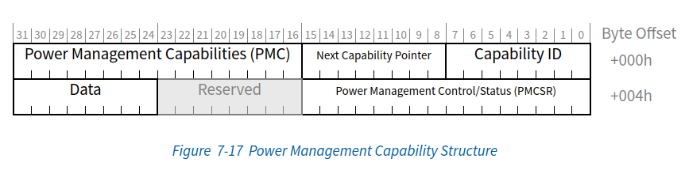
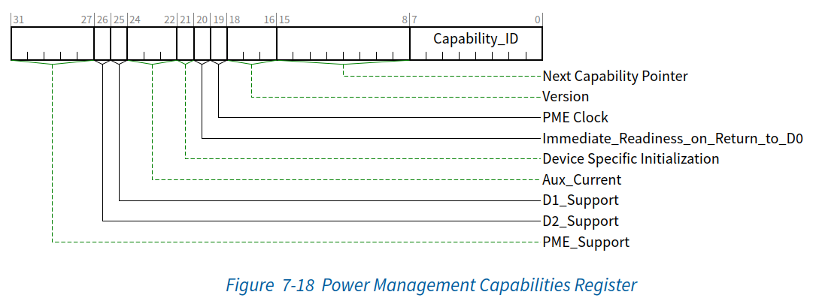
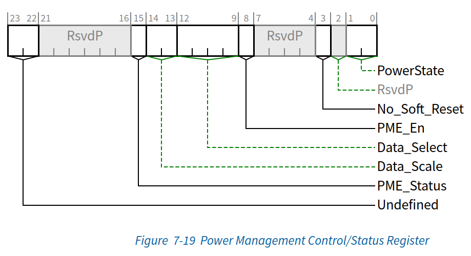

# Capability结构

## Power Management-电源管理能力（0x01）

该结构是所有PCIe设备Func所必须的，该功能在 [PCI Bus Power Management Interface Specification  Revision 1.2](https://lekensteyn.nl/files/docs/PCI_Power_Management_12.pdf) 有明确定义。对于PCIe来说，其结构与传统PCI相同。

### 电源管理状态

电源管理状态被定义为不同的、可区分的功耗节省级别。这些状态通过特定的状态编号来表示。按照惯例，PCI总线的电源状态以“B”为前缀，后面跟着电源管理的编号（0~3），编号越大，所实现的功耗节省效果越明显。同样，对于PCI Func来说，其电源管理状态以“D”作为前缀，后面跟着相同的状态编号（0~3）。电源管理状态的编号越大，实现的功耗节省效果也越明显。

#### PCI Func状态

在电源管理系统中，每个PCI Func最多可定义四种电源状态，这些状态包括 D0 到 D3，其中D0为最大功率状态，而D3为最小功率状态。D1和D2则是介于D0（开启）和D3（关闭）之间的中间功率节省状态。

虽然这些电源状态的概念对于系统中的所有Func都是普遍适用的，但转换到给定电源管理状态时的含义或预期功能行为取决于Func的类型（或类别）。

##### D0状态

所有Func都必须支持D0状态。D0分为两个不同的子状态：“<mark style="background: #FF5582A6;">未初始化</mark>”（uninitialized）子状态和“<mark style="background: #FF5582A6;">激活</mark>”（Active）子状态。当组件退出常规复位后，该组件的所有Func都进入D0未初始化状态。当Func完成FLR复位时，它也进入D0未初始化状态。配置完成后，Func进入D0激活状态，这是PCIe Func完全可操作的状态。只要该Func的“内存空间使能”（Memory Space Enable）、“I/O 空间使能”（I/O Space Enable）或“总线主控使能”（Bus Master Enable）位中的任意一个或组合被置位（Set），该功能就会进入 D0活动状态。

###### D0uninitialized状态

正常复位或软件控制PCIe设备从D3hot状态迁移至D0状态时，进入D0uninitialized；此时PCIe设备相关寄存器恢复到默认状态，在该状态下的特性如下：  

1. 只响应配置相关事务的处理；  
2. 命令寄存器使能位全部恢复到了默认状态，这意味着它不能发起Memory或I/O读写事务。

###### D0Active状态

一旦PCIe相关配置寄存器被软件配置和启用，它将处于D0激活状态，并完全运行。

##### D1状态

D1状态的支持是可选的，在D1状态下，Func不得在链路上发起任何请求TLP（PME消息除外）。配置请求和消息请求是处于D1状态的Func所接受的仅有的TLP类型。所有其他接收到的请求必须作为“不支持的请求”（Unsupported Requests）进行处理，而所有接收到的完成包（Completions）则可选择作为“意外完成包”（Unexpected Completions）进行处理。如果在D1状态下检测到由接收到的TLP（例如’不支持的请求“）引起的错误，且启用了错误报告功能，则必须将链路恢复至L0状态（若尚未处于L0状态）并发送错误消息。如果在D1状态下检测到由非接收TLP事件（例如”完成超时“）引起的错误，则必须在Func被重新配置回D0状态时发送错误信息。

##### D2状态

D2状态的支持是可选的，当处于D2状态时，Func不得在链路上发起任何TLP请求（PME消息除外）配置请求和消息请求是Func在D2状态下唯一接受的TLP类型。所有其他接收到的请求必须作为”不支持的请求“（Unsupported Requests）处理，而所有接收到的完成包则可选择作为”意外完成包“（Unexpected Completions）处理。如果在D2状态下检测到由接收到的TLP（例如”不支持的请求“）引起的错误，且已启用错误报告功能，则必须将链路恢复至L0状态（若尚未处于L0状态）并发送错误消息。如果在D2状态下检测到由非接收TLP时间（例如”完成超时“）引起的错误，则必须在Func被重新配置回D0状态时发送错消息。

##### D3状态

D3状态必须支持（同时包括D3cold和D3hot状态）。该状态时PCIe设备的功耗最小。

如果PMCSR中的No_Soft_Reset字段已被置位，则处于D3hot状态的Func必须维护功能上下文。当Func从D3hot转换到D0状态后，系统软件无需对其进行重新初始化（该Func将处于D0active状态）。如果No_Soft_Reset字段被清除，则Func在D3hot状态下无需保持其功能上下文，这并不保证功能上下文一定会被清楚，软件绝不能依赖此行为。因此，在这种情况下，由于功能在转换到 D0 后将处于 D0uninitialized状态，系统软件必须对其进行完全的重新初始化。

###### D3hot状态

在D3hot状态下，Func仅接受配置请求和消息请求这两种TLP。其他收到的请求必须作为”不支持的请求“处理。并且所有接收到的完成报文（Completions）可选择性的作为”非预期完成报文“（Unexpected Completions，UC）进行处理。如果在D3hot状态下检测到由接收到的TLP引起的错误，并且已启用错误报告，则链路如果尚不在L0状态，则必须返回到L0状态，并发送一条错误消息。

###### D3cold状态

当主电源被移除时，Func将转换到D3cold状态。上电顺序及其关联的冷复位（Cold Reset）会使Func从D3cold状态转换到D3uninitialized状态，并且硬件将为Func恢复上电默认值，这与初始上电时完全相同。此时软件必须对Func进行完全的初始化以重新建立所有的功能上下文，从而完成将Func恢复至D3active状态的过程。

#### 总线电源状态 

总线的电源管理状态可以通过其在特定时刻的某些属性来表征，例如是否供电、时钟速度以及允许何种类型的总线活动。这些状态被称为 B0、B1、B2 和 B3。

#### 链路电源状态

PCIe协议定义了以下物理层Link状态，这些状态也对应了LTSSM状态，L-state由下游组件的D-state决定，除L3外其他状态的LinkUp都仍为1。

- L0 - Fully Active状态；
- L0s - 低功耗模式，仅支持ASPM方式，硬件自动发起的，软件无法控制，单向进入，如USP有大量数据，DSP没有数据的时候DSP可以独立进入L0s；
- L1 - 低功耗模式，支持PCI-PM和ASPM两种方式；L1子状态可以关闭参考时钟、Tx common mode电路，Rx electric idle detect电路更加省电；
- L2 -可选低功耗模式，仅支持PCI-PM方式，关闭参考时钟、关闭PLL、关闭Main Power, 但是需要保留Aux Power；
- L3 - 可选低功耗模式，仅支持PCI-PM方式，处于所有power都off的状态，非LTSSM状态；

省电顺序：L0<L0s<L1<L2<L3，越省电的状态recovery到L0正常工作状态的时间就会越长。
L1和L2/3 Ready的进入需要在L0状态下协商进行。

### Power Management Capability结构

> 《PCI Express® Base Specification Revision 5.0.pdf》7.5.2 PCI Power Management Capability Structure p712

#### Power Management Capabilites Register (Offset 00h)

> 《PCI Express® Base Specification Revision 5.0.pdf》7.5.2.1 Power Management Capabilities Register (Offset 00h) p712

| Bits  | 定义                                  | 描述                                                                                                                                                                                                                                                                                                                                                                                                                                                                                                                                                                                                               | 属性  |
| ----- | ----------------------------------- | ---------------------------------------------------------------------------------------------------------------------------------------------------------------------------------------------------------------------------------------------------------------------------------------------------------------------------------------------------------------------------------------------------------------------------------------------------------------------------------------------------------------------------------------------------------------------------------------------------------------- | --- |
| 7:0   | Capability ID                       | 此字段返回01h，表示这是PCI电源管理结构（Power Management Capability）。每个Func在其能力列表中只能由一个Capability_ID设为01h的项。                                                                                                                                                                                                                                                                                                                                                                                                                                                                                                                      | RO  |
| 15:8  | Next Capability Pointer             | 该字段提供了一个指向“功能配置空间”（Function’s Configuration Space）内下一项“能力列表”（capabilities list）条目位置的偏移量。如果能力列表中没有其他条目，则该字段被设为 00h。                                                                                                                                                                                                                                                                                                                                                                                                                                                                                               | RO  |
| 18:16 | Version                             | 对于符合本规范的Func，必须硬链接到011b。                                                                                                                                                                                                                                                                                                                                                                                                                                                                                                                                                                                         | RO  |
| 19    | PME Clock                           | 不适用于 PCI Express，且必须硬连线至 0b。                                                                                                                                                                                                                                                                                                                                                                                                                                                                                                                                                                                     | RO  |
| 20    | Immediate_Readiness_on_Return_to_D0 | 若该位为“1”，则该功能（Function）在被置于 D0 状态后，即刻便能确保成功完成有效的访问操作。此类访问包括配置周期（Configuration cycles）；若该功能恢复至 D0active 状态，还包括内存（Memory）和 I/O 周期。 当该位为“1”时，针对该功能的访问操作，软件无需遵守从 D0 状态转换后通常要求的访问延迟规定。 该保证机制的具体实现方式不在本文档的讨论范围内。 允许系统软件或固件提供能够覆盖该位所指示信息的机制，但此类软件或固件机制不在本规范的涵盖范围内。                                                                                                                                                                                                                                                                                                                                | RO  |
| 21    | Device Specific Initialization      | DSI 位指示该Func是否需要特殊初始化。 当该位置位时，表示该Func在转换至 D0uninitialized状态后，需要执行设备特定的初始化序列。                                                                                                                                                                                                                                                                                                                                                                                                                                                                                                                      | RO  |
| 24:22 | Aux_Current                         | 该 3 位字段报告了该功能（Function）对 Vaux 辅助电流的需求。 如果该功能实现了 数据寄存器（Data Register），则该字段必须硬连线（hardwired）为 000b。 如果 PME_Support 为 0 xxxxb（即不支持从 D3Cold 状态发出 PME 信号），则该字段必须硬连线为 0000b。 对于 PME_Support 为 1 xxxxb（即支持从 D3Cold 状态发出 PME 信号）且未实现数据寄存器的功能，适用以下编码定义： 111b 375mA 110b 320mA 101b 270mA 100b 220mA 011b 160mA 010b 100mA 001b 55mA 000b 0（自供电）                                                                                                                                                                                                                                | RO  |
| 25    | D1_Support                          | 如果该位被置位，则该Func支持 D1 电源管理状态。 不支持 D1 的Func必须始终返回 0b 作为该位的值。                                                                                                                                                                                                                                                                                                                                                                                                                                                                                                                                                    | RO  |
| 26    | D2_Support                          | 如果该位被置位，则此Func支持 D2 电源管理状态。 不支持 D2 的Func对于该位必须始终返回 0b。                                                                                                                                                                                                                                                                                                                                                                                                                                                                                                                                                       | RO  |
| 31:27 | PME_Support                         | 该 5 位字段指示了该功能（Function）可在哪些电源状态下生成 PME 和/或转发 PME 消息。 若某位的值为 0b，则表示该功能无法在相应的电源状态下发出 PME 信号。 bit(27) X XXX1b                可在 D0 状态下生成 PME bit(28) X XX1Xb                可在 D1 状态下生成 PME bit(29) X X1XXb                可在 D2 状态下生成 PME bit(30) X 1XXXb                可在 D3Hot 状态下生成 PME bit(31) 1 XXXXb                可在 D3Cold 状态下生成 PME 位 31（可在 D3Cold 状态下发出 PME 信号）属于特殊情况。设置该位的功能需要某种形式的辅助电源。建议在设置该位之前，采用特定于实现的机制来验证辅助电源是否可用。 对于代表根联合体（Root Complex）或交换机（Switch）端口的 PCI-PCI 桥接结构，必须设置与所支持 D 状态对应的每一位，以表明该桥接器将转发 PME 消息。仅当端口在主电源不可用的情况下仍能转发 PME 消息时，才可设置位 31。 | RO  |

#### Power Management Control/Status Register(Offset 04h)

该寄存器用于管理 PCI 功能（Function）的电源管理状态，以及启用或监控 PME。

PME 上下文（PME Con​​text）包含 PME_Status 和 PME_En 位的值，实现唤醒功能（例如识别网络唤醒数据包并生成 PME 消息）在 D3Cold 状态下所需的特定实现状态，以及在转换到 D0uninitialized 状态期间必须保留的任何其他特定实现状态。

如果某Func支持在 D3Cold 状态下生成 PME，则其 PME 上下文不受复位（Reset）操作的影响。这是因为该Func的 PME 机制本身可能正是触发唤醒事件并导致系统转换回 D0 状态的原因。因此，必须保留 PME 上下文以供系统软件处理。

如果不支持在 D3Cold 状态下生成 PME，则所有 PME 上下文都会在复位信号有效时被初始化。

>《PCI Express® Base Specification Revision 5.0.pdf》7.5.2.2 Power Management Control/Status Register (Offset 04h) p714

| Bits  | 定义            | 描述                                                                                                                                                                                                                                                                                                                | 属性     |
| ----- | ------------- | ----------------------------------------------------------------------------------------------------------------------------------------------------------------------------------------------------------------------------------------------------------------------------------------------------------------- | ------ |
| 1:0   | PowerState    | 该 2 位字段既用于确定Func当前的电源状态，也用于将Func设置为新的电源状态。该字段各取值的定义如下： 00b        D0 01b        D1 10b        D2 11b        D3Hot 如果软件尝试向该字段写入一个不受支持的可选状态，写入操作必须正常完成；但写入的数据会被丢弃，且不会发生状态变更。 该字段的默认值为 00b。                                                                                       | RW     |
| 3     | No_Soft_Reset | 该位指示在向 PowerState 字段写入数据以将 Func 从 D3Hot 状态转换为 D0 状态后，该功能所处的状态。 当该位置位时，此转换过程会保留Func的内部状态；此时功能处于 D0Active 状态，且无需额外的软件干预。 当该位清零时，此转换会导致Func的内部状态变为未定义。 无论该位状态如何，若功能通过“基本复位”（Fundamental Reset）从 D3Hot 转换为 D0，则会进入 D0uninitialized 状态；在此过程中，仅当支持并启用了 PME 时，才会保留 PME 上下文。 | RO     |
| 8     | PME_En        | 当该位被置位时，允许该Func生成 PME；当该位被清零时，不允许该功能生成 PME。 若 PME_Support 为 1 xxxxb（支持从 D3Cold 状态生成 PME），或者该功能消耗辅助电源且辅助电源可用，则该位为 RWS 类型，且不受常规复位（Conventional Reset）或 FLR 的影响。 若 PME_Support 为 0 xxxxb，则该字段不具备 Sticky 特性（即为 RW 类型）。 若 PME_Support 为 0 0000b，则允许将该位硬连线（hardwired）为 0b。                       | RW/RWS |
| 12:9  | Data_Select   | 该 4 位字段用于选择通过 Data 寄存器和 Data_Scale 字段上报的数据。 如果未实现 Data 寄存器，则该字段必须硬连线为 0000b。 该字段的默认值为 0000b。                                                                                                                                                                                                              | RW     |
| 14:13 | Data_Scale    | 该字段指示了解析数据（Data）寄存器值时所使用的比例因子。该字段的值和含义取决于 Data_Select 字段所选定的数据值。 该字段是数据寄存器（偏移量 7）的必要组成部分；若实现了数据寄存器，则必须实现该字段。 若未实现数据寄存器，则该字段必须硬连线为 00b。                                                                                                                                                                    | RO     |
| 15    | PME_Status    | 当该Func本应产生 PME 信号时，该位会被置位。该位的值不受 PME_En 位值的影响。 如果电源管理能力（Power Management Capabilities）寄存器中的 PME_Support 位（第 31 位）被清零，则允许将该位硬连线（hardwired）为 0b。 对于消耗辅助电源的功能，当辅助电源可用时，必须保持该“粘性”（sticky）寄存器的值。在此类Func中，该寄存器的值不会因常规复位（Conventional Reset）或 FLR 而改变。                                                           | RWICS  |
| 23:22 | Undefined     | 这些位在先前的规范中已有定义，软件应将其忽略。                                                                                                                                                                                                                                                                                           | RO     |

#### Data(Offset 07h)

数据寄存器（Data register）是一个可选的 8 位只读寄存器，它提供了一种机制，使Func模块能够报告其随状态变化的运行功耗或功耗值。

如果实现了数据寄存器，则必须同时实现 Data_Select 和 Data_Scale 字段。如果未实现该寄存器，则必须将其硬连线为 00h。

软件可以通过向 Data_Select 字段写入不同值，并检查数据寄存器或 Data_Scale 字段中返回的非零数据，来检测数据寄存器是否存在。任何非零的数据寄存器或 Data_Select 读取数据均表明已实现该数据寄存器组件。

>《PCI Express® Base Specification Revision 5.0.pdf》7.5.2.3 Data (Offset 07h) p716

| Bits | 定义   | 描述                                                                 | 属性  |
| ---- | ---- | ------------------------------------------------------------------ | --- |
| 7:0  | Data | 该寄存器用于报告由 Data_Select 字段所请求的状态相关数据。该寄存器的值根据 Data_Scale 字段报告的值进行缩放。 | RO  |

使用数据寄存器（Data register）时，需先向 PMCSR 中的 Data_Select 字段写入适当的值，然后读取 Data_Scale 字段和数据寄存器。将从数据寄存器读取的二进制值乘以 Data_Scale 所指示的比例因子，即可得出所需的测量值。

## MSI（Message Signaled Interrupts）-消息信号中断能力（0x05）

# Extended Capabilities结构

