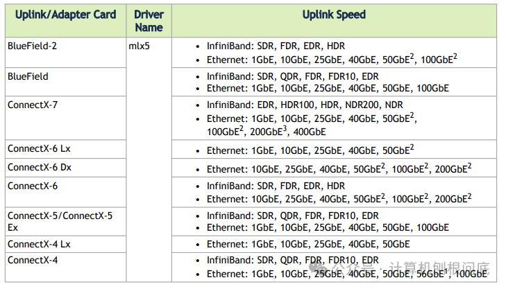

在当前的数据中心和高性能计算环境中，100G到400G的高带宽网络已逐渐成为标配，而在这个领域，Mellanox网卡凭借其卓越的性能和稳定性占据了主导地位。然而，在部署高性能项目时，你是否遇到过这样的困扰：明明安装了Mellanox网卡，系统却看不到任何网络接口？

这种现象通常是因为Mellanox网卡支持两种不同的工作模式：**IB Controller模式**和**ETH Controller模式**。在ETH模式下，网卡运行RoCE（RDMA over Converged Ethernet）协议，可以在传统以太网基础设施上提供RDMA功能；而在IB模式下，网卡运行原生的InfiniBand协议，提供更低的延迟和更高的性能。



当网卡处于IB模式时，使用常规的`ip link`命令是看不到网络接口的，只有在加载了`ib_ipoib`驱动后，才会出现`ib0`、`ib1`这样的IB over IP接口。这正是许多工程师在初次接触时感到困惑的原因。

本文将详细介绍如何通过命令行在这两种模式之间进行切换，帮助你根据实际的网络环境和性能需求，灵活配置Mellanox网卡的工作模式。

## 前提条件

模式切换需要使用Mellanox提供的配置工具`mlxconfig`，这要求系统中安装相应的驱动包。目前有两种方式可以获取这些工具：

### 方式一：安装DOCA-Host软件包（推荐）

Mellanox已将MLNX\_OFED转向DOCA-Host，从2025年1月开始，所有新功能将仅包含在DOCA-OFED中。MLNX\_OFED的最后独立版本是2024年10月的长期支持版本（3年支持）。

```
# 下载并安装DOCA-Host（包含DOCA-OFED profile）# 具体下载地址请访问Mellanox官网获取最新版本./doca-host-install --profile ofedreboot
```

### 方式二：安装传统MLNX\_OFED驱动

对于需要使用传统OFED驱动的环境：

```
# 下载并安装MLNX_OFED驱动（以RHEL/CentOS为例）  
./mlnxofedinstall --all  
reboot
```

安装完成后，验证工具是否可用：

```
# 检查mlxconfig工具  
which mlxconfig  
  
# 检查驱动版本  
ofed_info -s
```

## 识别当前模式

### 启动MST服务

```
# 启动Mellanox Software Tools服务  
mst start  
  
# 查看可用设备  
mst status
```

### 查看当前链路类型

```
# 查询当前配置，假设设备路径为/dev/mst/mt4115_pciconf0  
mlxconfig -d /dev/mst/mt4115_pciconf0 q | grep LINK_TYPE  
  
# 输出示例：  
# LINK_TYPE_P1                    IB(1)    或    ETH(2)  
# LINK_TYPE_P2                    IB(1)    或    ETH(2)
```

参数含义：

-   `LINK_TYPE=1`：IB模式
    
-   `LINK_TYPE=2`：ETH模式
    

### 通过网络接口判断

```
# IB模式下，使用ip link看不到常规网口  
# 但加载ipoib驱动后可以看到ib0、ib1等设备  
ip link show | grep ib  
  
# ETH模式下，可以看到常规的网络接口  
ip link show
```

## 模式切换命令

### 切换到ETH模式

```
# 设置端口1为ETH模式  
mlxconfig -d /dev/mst/mt4115_pciconf0 s LINK_TYPE_P1=2  
  
# 设置端口2为ETH模式  
mlxconfig -d /dev/mst/mt4115_pciconf0 s LINK_TYPE_P2=2
```

### 切换到IB模式

```
# 设置端口1为IB模式  
mlxconfig -d /dev/mst/mt4115_pciconf0 s LINK_TYPE_P1=1  
  
# 设置端口2为IB模式  
mlxconfig -d /dev/mst/mt4115_pciconf0 s LINK_TYPE_P2=1
```

### 命令执行过程

执行切换命令时会出现确认提示：

```
mlxconfig -d /dev/mst/mt4115_pciconf0 s LINK_TYPE_P1=2  
  
Apply new Configuration? (y/n) [n] : y  
Applying... Done!
```

## 使配置生效

**重要**：配置修改后必须重启系统才能生效。

```
reboot
```

## 验证切换结果

### 重启后检查配置

```
# 重新启动MST服务  
mst start  
  
# 查看新的链路类型配置  
mlxconfig -d /dev/mst/mt4115_pciconf0 q | grep LINK_TYPE
```

### 验证网络接口

```
# ETH模式下查看网络接口  
ip link show  
  
# IB模式下查看IB设备状态  
ibstat
```

## 常用设备路径

不同型号的Mellanox网卡设备路径可能不同，常见的包括：

```
/dev/mst/mt4115_pciconf0    # ConnectX-4系列  
/dev/mst/mt4117_pciconf0    # ConnectX-4 LX系列    
/dev/mst/mt4119_pciconf0    # ConnectX-5系列  
/dev/mst/mt4121_pciconf0    # ConnectX-6系列  
/dev/mst/mt4123_pciconf0    # ConnectX-7系列
```

可以通过`mst status`命令查看具体的设备路径。

## 恢复出厂设置

如果配置出现问题，可以恢复到出厂默认设置：

```
mlxconfig -d /dev/mst/mt4115_pciconf0 reset  
reboot
```

## 注意事项

1.  **必须重启**：所有配置修改都需要重启系统才能生效
    
2.  **驱动依赖**：必须先安装Mellanox DOCA-Host或OFED驱动才能使用mlxconfig工具
    
3.  **网络规划**：切换模式前确保网络基础设施支持目标模式
    
4.  **双端口设置**：如果网卡有两个端口，通常需要同时设置P1和P2
    

通过以上命令，就可以在Mellanox RDMA网卡的IB和ETH模式之间进行切换，满足不同网络环境的需求。