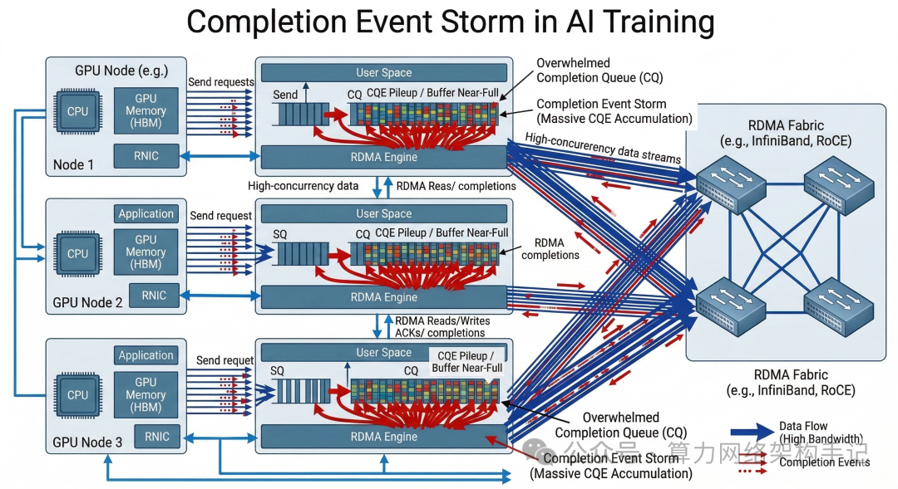

这里是「算力网络架构手记」北京

-   专注 AI 集群网络架构与性能优化
    
-   深入 GPU×RoCE×NCCL×K8s 跨层瓶颈
    
-   只拆真实问题，不写概念科普
    

___


___

[我把 AI 训练网络通信路径完整画了一遍](https://mp.weixin.qq.com/s?__biz=Mzk0MzY3NTQzOQ==&mid=2247484534&idx=1&sn=0ca412f2b6b0851257775a233e7d7ae1&scene=21#wechat_redirect)

00 开头

做 AI 集群网络的人可能都会遇到过一个奇怪的问题：

训练刚开始时一切正常，但随着通信规模增加，系统会出现：

```
GPU 利用率下降
NCCL 延迟抖动
通信吞吐下降
```

排查交换机：

```
没有丢包
没有 ECN
没有 buffer 溢出
```

排查链路：

```
带宽充足
```

最后发现一个非常隐蔽的问题：

> **Completion Queue 被打满了。**

而当第一次听说这个问题时都会疑惑：

```
不就是个完成通知队列吗？
为什么它会成为性能瓶颈？
```

今天我们把 **RDMA Completion Queue 的工作机制彻底拆解开**。

01

RDMA 并不是“发送即完成”

在传统网络中，一个 send() 调用完成通常意味着：

```
数据已经进入 TCP 发送缓冲
```

但在 RDMA 中，事情不同。

应用程序执行的是：

```
ibv_post_send()
```

这个操作只是：

```
把 Work Request 放入 Send Queue
```

真正的执行流程是：

```
Application
	│
post WR
	│
Send Queue
	│
NIC 执行 RDMA
	│
Completion Queue
	│
Application 确认完成
```

也就是说：

> **RDMA 的“完成”是通过 CQ 通知的。**


02

什么是 Completion Queue

Completion Queue（CQ）本质上是：

```
一个环形队列
```

NIC 在完成一个 RDMA 操作时，会生成：

```
Completion Entry (CQE)
```

并写入 CQ。

一个 CQE 通常包含：

```
Work Request ID
状态码
操作类型
完成时间
```

应用程序会不断执行：

```
ibv_poll_cq()
```
从 CQ 中取出完成事件。

如果 CQ 没有被及时消费，就会发生：

```
CQ 积压
```

03

AI 训练会产生海量 Completion Event

AI 训练通信的特点是：

```
极高消息速率
```

例如一个典型 NCCL AllReduce：

```
GPU 数量：256
Channel：16
Chunk：4MB
```

每个 chunk 会被切分成：

```
多个 RDMA packet
```

NIC 在执行 RDMA 操作时通常会生成：

```
一个 CQE 对应一个 WR
```

如果通信并发很高，就会产生：

```
每秒数百万 CQE
```

这对 CQ 处理能力提出了极高要求。



04

CQ 为什么会成为瓶颈

Completion Queue 的瓶颈主要来自三个方面：

```
NIC 写入速度
CPU 读取速度
CQ 容量
```

也就是说：

```
生产速度 > 消费速度
```

就会产生：

```
CQ backlog
```

当 CQ 填满时，NIC 会触发：

```
CQ Overrun
```
这时 RDMA 连接可能被强制终止。

05

CQ Polling 是 CPU 密集型操作

很多人以为 RDMA 是：

```
完全绕过 CPU
其实不是。
```

虽然数据传输在 NIC 中完成，但：

```
CQ polling 需要 CPU
```

应用程序需要不断执行：

```
ibv_poll_cq()
```

这个过程是：

```
busy polling
```

也就是说：

```
CPU 必须不断轮询 CQ
```

如果 CPU 不够快：


06

CQ 深度不足的典型问题

CQ 是一个固定深度的环形队列，例如：

```
4096
8192
16384
```

如果 CQ 深度太小，在高并发通信中就会出现：

```
CQ overflow
```

这会导致：

```
IBV_EVENT_CQ_ERR
```

在 AI 集群中，这种错误通常表现为：

```
NCCL hang
```

或：

```
通信异常中断
```

07

Completion 审核的作用

为了减少 CQE 数量，RDMA 提供了一种机制：

```
Completion Moderation（审核）
```

其思想是：

```
不是每个 WR 都产生 CQE
```

例如：

```
每 16 个 WR 产生一个 CQE
```

这样可以显著减少：

```
CQ event rate
```

但这种机制也会带来副作用：

```
完成通知延迟
```
因此需要权衡。

08

CQ 与 QP 的关系

一个 CQ 通常可以被多个 QP 共享。

例如：

```
16 QP
1 CQ
```

但这也意味着：

```
CQE 汇聚
```

如果很多 QP 同时完成任务，就会产生：

```
Completion burst
```

这会造成：

```text
瞬时CQ压力
```


在实际 AI 集群中，CQ 调优通常包括：

### 1 调整 CQ 深度

例如：

```
8192
65536
```

防止：

```
CQ overflow
```

### 2 调整 CQ moderation

减少：

```
CQE rate
```

### 3 CPU 绑定

将 CQ polling 线程绑定到：

```
NUMA 本地 CPU
```

减少：

```
cache miss
```

### 4 CQ 分片

不要让太多 QP 共享一个 CQ：

```
16 QP → 1 CQ
```

可能需要调整为：

```
4 QP → 1 CQ
```

```
为什么部分 AI 网络问题其实是 CQ 问题
```

很多工程师在排查 AI 网络性能问题时，往往只关注：

```
交换机
ECN
PFC
Buffer
```

但事实上：

> **很多问题发生在主机 NIC 内部。**

Completion Queue 就是最典型的例子。

如果 CQ 处理能力不足，就会出现：

```
通信延迟抖动
GPU idle
吞吐下降
```

而这些问题：

```
在交换机上完全看不到
```

理解 CQ 的工作机制，其实是在理解：

> **AI 训练通信的“最后一公里”。**

在现代 AI 集群中，一个节点每秒可能产生：

```
数百万 Completion Event
```
