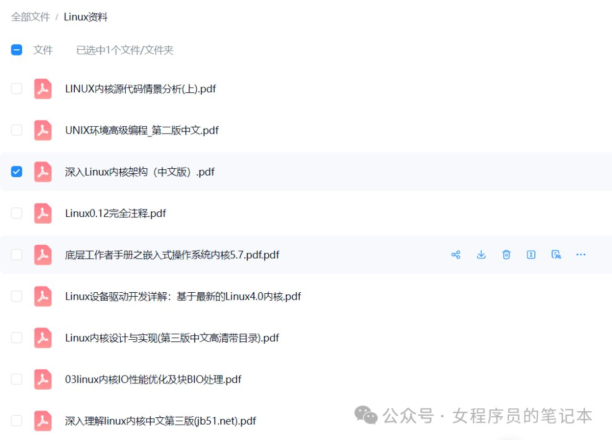

公众号名称：女程序员的笔记本

作者名称：程序媛MM

发布时间：2026-07-29 00:01

Hello，大家好，我是程序媛MM。

本文约3500字，今天继续跟随《[一份靠谱的Linux终端产品应用层软件架构学习计划](https://mp.weixin.qq.com/s?__biz=Mzg4NzUyMjEzNw==&mid=2247491247&idx=1&sn=68bd91a8f1eb5b995fe7797043cdda7b&scene=21#wechat_redirect)》的计划来学习看门狗相关内容，本文梳理了适合消费类如IPC产品的看门狗完整技术方案以及面试答题模板。

关注公众号, 即可获得与Linux相关的电子书籍以及常用开发工具，文末有文档清单。

---

  

## 一 看门狗基础原理

### 1.1 核心定义

看门狗（Watchdog）是一套**倒计时复位机制**，分为硬件看门狗、内核软件看门狗、业务层健康监督三层，用于解决 IPC 摄像头、NVR、智能家居网关、电视盒子等 7×24 小时无人值守设备死机、业务假活、内核卡死问题。

> **底层逻辑**：独立计数器持续递减，正常运行时软件定期执行**喂狗（清零计数器）**；超过设定阈值未喂狗，自动触发整机复位，恢复设备可用性。

---

### 1.2 三大类看门狗原理与适用场景

#### （1）硬件看门狗（HW WDT，最终兜底）

芯片内置独立 RC 振荡器，不依赖系统主时钟、内核调度、用户态进程；内核崩溃、调度卡死、中断屏蔽、应用全死锁时仍能正常计时。

-   **设备节点**：`/dev/watchdog`、`/dev/watchdog0`（iTCO\_wdt、sp5100\_tco、平台专用 WDT 驱动）；
    
-   **关键特性**：
    

-   `nowayout` 锁（内核配置 `CONFIG_WATCHDOG_NOWAYOUT=y` 后，进程崩溃不自动关闭看门狗）；
    
-   预超时中断（pretimeout，用于紧急现场保存）；
    
-   窗口看门狗（限制喂狗时间窗口，防止异常循环高频喂狗）；
    

-   **作用**：兜底内核/硬件级致命故障，是 IPC 设备最后一道保险。
    

#### （2）内核自带软件看门狗（内核健康检测）

Linux 内核内置两套监控，无需外部硬件：

1.  **Soft Lockup 软死锁检测**：监控单 CPU 长时间不发生调度切换（默认 10s 阈值），检测内核死循环、自旋锁长期持有、高优先级任务抢占不放；触发后打印栈回溯日志，可配置直接 `panic` 重启。
    
2.  **NMI Hard Lockup 硬死锁检测**：利用不可屏蔽中断监控 CPU 完全关中断卡死（连调度器都无法运行），强制生成 crash 日志并复位。
    

配套工具 \*\*`lockdep`\*\*：开发期动态检测互斥锁循环等待、锁顺序倒置，提前规避业务死锁根源。

#### （3）用户态业务监督看门狗（解决业务假活，IPC 核心痛点）

**传统方案缺陷**：单独定时进程无脑喂硬件狗，即便 IPC 业务死锁、视频流卡死、RTSP 服务阻塞、队列耗尽，喂狗进程仍正常运行，设备呈现“假活不复位”。

**核心原理**：**多维健康心跳聚合**，不单一依靠进程存活，同时校验任务执行、业务进度、资源状态、IPC 数据流，所有健康条件满足后才允许喂硬件看门狗，完美覆盖消费 IPC 典型假活故障：

-   音视频线程互斥锁循环死锁；
    
-   高优先级编码任务长期抢占 CPU，低优先级预览/回放线程饥饿；
    
-   码流缓冲区、帧池耗尽，生产者消费者互相阻塞；
    
-   RTSP/ONVIF 状态机卡死，持续重试但无有效码流输出；
    
-   网卡、USB 摄像头总线悬挂，I/O 请求永久等待。
    

---

### 1.3 传统看门狗设计致命缺陷

1.  独立高优先级喂狗进程：仅证明自身能调度，掩盖业务线程饥饿、死锁；
    
2.  定时循环无条件喂狗：活锁场景下持续喂狗，业务停滞无感知；
    
3.  仅单一心跳标志位：无法区分“线程运行”和“业务有效完成”；
    
4.  无预超时现场保存：复位后无法定位死机根因；
    
5.  无分层恢复机制：轻微业务故障直接整机重启，影响用户体验。
    

---

## 二 消费类产品落地分层看门狗完整方案

### 2.1 整体分层架构（三级防护，从上至下）

```
业务层健康监督进程（Supervisor）
    ↓ 校验全部业务健康指标 → 允许喂狗
内核层监控（soft/hard lockup + lockdep）
    ↓ 内核异常直接 panic
硬件看门狗（底层兜底，所有软件失效仍生效）
```

#### 第一层：用户态业务健康 Supervisor

##### 1）受监控业务参与者

所有影响设备核心功能的进程/线程统一注册健康契约：

-   视频采集线程、H264/H265 编码线程；
    
-   RTSP/ONVIF 流媒体服务、录像存储任务；
    
-   音频采集、语音对讲线程；
    
-   网络管理、SD 卡存储、云台控制进程；
    
-   消息队列、帧缓存池、互斥锁资源。
    

##### 2）双维度心跳上报（区分执行存活 & 业务进度）

每个业务模块分开上报两类单调计数器，杜绝假活误判：

1.  `exec_cnt`：线程被调度执行即自增（证明 CPU 分配）；
    
2.  `progress_cnt`：**仅完成有效业务后自增**（核心判定依据）：
    

-   采集：成功输出一帧有效图像；
    
-   编码：完成一帧码流写入缓存；
    
-   RTSP：成功发送一帧流、完成客户端握手；
    
-   录像：文件正常写入、分段完成；
    
-   存储：SD 卡读写请求无阻塞完成。
    

##### 3）四大维度健康校验规则（Supervisor 周期执行）

Supervisor 以 **100ms** 周期轮询所有模块快照，全部满足才下发喂狗指令：

1.  **执行层校验**：各线程 `exec_cnt` 周期内递增，无 CPU 饥饿；多核 IPC 校验每核调度心跳；
    
2.  **业务进度校验**：业务 pending 任务存在时，`progress_cnt` 必须在业务超时窗口内更新；空闲状态允许进度不变，但需标记无待处理帧/请求；
    
3.  **资源层校验**：
    

-   互斥锁：记录持有者、最大持有时长，超过阈值判定死锁；
    
-   帧缓存/消息队列：队列长期满/空、最旧帧滞留超时限判定流控失效；
    
-   内存池：分配失败次数持续上涨判定内存泄漏；
    

5.  **I/O 依赖校验**：USB 摄像头、网口、SD 卡无长期悬挂请求，异步操作必须有完成计数。
    

##### 4）分级恢复策略（减少不必要整机复位）

故障检测后阶梯式自愈，避免轻微故障直接复位 IPC：

-   **L0**：单事务重试、清空错误帧缓存；
    
-   **L1**：重启单一流媒体/采集线程，重建会话；
    
-   **L2**：复位 USB/网口外设，重建总线；
    
-   **L3**：重启整套业务子系统（编码 + 流媒体）；
    
-   **L4**：停止喂硬件看门狗，触发整机复位（恢复失败兜底）。
    

##### 5）预超时故障现场留存

硬件 WDT 开启 `pretimeout` 预超时中断，复位前以**原子/非阻塞方式**写入故障快照到 RTC 备份内存 / FRAM：

-   复位原因、故障模块名称、各线程进度计数器；
    
-   锁持有信息、队列水位、滞留帧时长；
    
-   CPU 占用、内核 soft lockup 日志、进程栈信息。
    

重启后应用读取快照，保存到本地日志，用于售后定位死机问题。

##### 6）长操作有界 Lease 机制

IPC 存在 SD 卡格式化、固件 OTA 升级、码流长时间存储等耗时操作，**禁止临时关闭看门狗**，改用限时授权：

业务申请 `lease` 并设置最大允许时长，操作中分段上报进度；超时未结束直接判定故障，防止无限延长喂狗窗口。

#### 第二层：Linux 内核监控配置（底层防护）

1.  开启 soft lockup 检测，调整阈值适配 IPC 高负载编码场景：
    
    ```
    # /etc/sysctl.conf
    kernel.watchdog_thresh=15      # 软死锁判定 15s（适当放宽避免编码负载误报）
    kernel.softlockup_panic=1      # 软死锁直接 panic 重启
    kernel.hardlockup_panic=1      # NMI 硬死锁直接 panic 重启（务必开启）
    ```
    
2.  开启 NMI 硬死锁看门狗，监控 CPU 完全关中断卡死；
    
3.  Debug 固件开启 `CONFIG_LOCKDEP`，运行时打印锁依赖死锁告警；
    
4.  内核开启 `panic_timeout`，内核崩溃后 5s 自动重启：
    
    ```
    kernel.panic=5
    ```
    

#### 第三层：硬件看门狗配置（最终兜底）

1.  **驱动加载**：根据平台加载对应 WDT 驱动，创建 `/dev/watchdog` 设备；
    
2.  **开启 nowayout**：确保内核编译 `CONFIG_WATCHDOG_NOWAYOUT=y`，防止 Supervisor 进程异常退出后看门狗自动关闭；
    
3.  **超时参数量化设计**：
    

-   Supervisor 检测周期：100ms，业务最大无进展窗口 3s；
    
-   故障恢复预算 2s，快照保存 500ms；
    
-   **硬件 WDT 总超时设置 8s**，预留检测、恢复、日志写入余量；
    

5.  **窗口看门狗启用**：限制喂狗窗口，杜绝业务活锁高频重复喂狗。
    

---

### 2.2 Supervisor 进程核心伪代码（Linux 用户态 C 实现）

```
#include <stdio.h>
#include <stdlib.h>
#include <unistd.h>
#include <sys/ioctl.h>
#include <linux/watchdog.h>

// 1. 业务模块健康快照结构体
typedef struct {
    uint32_t exec_cnt;           // 执行心跳
    uint32_t progress_cnt;       // 业务进度心跳
    uint64_t last_progress_ts;   // 最后一次有效业务时间戳
    uint32_t state;              // IDLE / BUSY / DEGRADED / FAILED
} participant_snap_t;

// 2. Supervisor 主循环
void supervisor_loop(void)
{
    int wdt_fd = open("/dev/watchdog", O_RDWR);
    if (wdt_fd < 0) {
        // 降级处理，打印错误并尝试软件模拟复位
        return;
    }

    // 设置硬件超时时间为 8s
    int timeout = 8;
    ioctl(wdt_fd, WDIOC_SETTIMEOUT, &timeout);

    // 【标准写法】通过 SETOPTIONS 开启 nowayout，防止进程退出关闭狗
    int flags = WDIOS_SETNOWAYOUT;
    ioctl(wdt_fd, WDIOC_SETOPTIONS, &flags);

    while (1) {
        collect_all_participant_snap();   // 读取所有业务模块快照
        health_result_t res = evaluate_health(); // 统一健康判定

        if (res.feed_allow) {
            // 标准推荐喂狗方式：ioctl KEEPALIVE（兼容性最佳）
            ioctl(wdt_fd, WDIOC_KEEPALIVE, NULL);
            // 备选：write(wdt_fd, "V", 1);  // 部分平台兼容
            record_feed_epoch();
        } else {
            // 分级自愈
            if (!try_bounded_recovery(&res)) {
                store_crash_snapshot();   // 保存故障现场
                // 停止喂狗，等待硬件 WDT 超时复位（永不 close(fd)）
                while (1) pause();
            }
        }
        usleep(100 * 1000);  // 100ms 检测周期
    }
}
```

---

### 2.3 IPC 产品配套工程化优化

1.  **复位风暴防护**：RTC 内存保存连续看门狗复位计数，短时间多次复位自动进入安全模式，停止自动录像、降级码流，避免无限重启；
    
2.  **多核适配**：多路 IPC 多核平台，每核维护独立调度心跳，Supervisor 校验所有 CPU 活性，防止单核卡死而其他核正常喂狗；
    
3.  **低功耗适配**：休眠时临时放宽 WDT 超时，唤醒后重新校验全量业务健康；
    
4.  **权限隔离**：仅 Supervisor 进程拥有 `/dev/watchdog` 读写权限，业务线程禁止直接操作硬件看门狗节点；
    
5.  **故障注入测试**：模拟死锁、编码活锁、队列耗尽、CPU 满载，验证所有故障均可在规定时间触发复位并留存日志。
    

---

## 三 面试答题完整模板（分基础简答、深度设计题两类）

### 题型 1：基础题——Linux/嵌入式 IPC 设备看门狗作用、原理、分类

#### 标准作答：

1.  **作用**：IPC 摄像头、NVR 等 7×24 小时运行设备，出现业务死锁、内核卡死、进程假活、硬件总线悬挂时，自动复位整机，恢复业务可用性，减少人工维护；
    
2.  **基础原理**：看门狗是独立倒计时计数器，软件定期喂狗清零；超时未喂狗触发复位；分为硬件、内核、业务三层；
    
3.  **三层分类与分工**：
    

-   **硬件看门狗**：芯片独立时钟，兜底内核/调度完全失效场景，不受软件故障影响；
    
-   **内核看门狗**：soft/hard lockup 检测 CPU 卡死，`lockdep` 开发期检测锁死锁；
    
-   **用户态业务监督看门狗**：解决传统方案“进程存活但业务停滞”的假活问题，多维校验业务进度、资源、数据流；
    

5.  **传统方案缺陷**：单一定时进程无脑喂狗，无法识别音视频死锁、流媒体活锁等业务假活故障。
    

---

### 题型 2：深度设计题——IPC 设备如何设计看门狗，规避业务死锁/假活？

#### 分四段作答（逻辑清晰，面试官高分点）

##### 第一段：点明核心痛点

传统仅靠独立任务喂硬件看门狗存在致命漏洞：多线程互斥锁死锁、编码高优先级抢占、流媒体状态机活锁、帧队列耗尽时，喂狗进程仍正常调度，设备**假死不复位**，IPC 无法预览、录像，用户无感知。因此需要**分层健康监督架构**，把看门狗从“检测线程存活”升级为“校验业务完整健康”。

##### 第二段：三层整体架构设计

1.  **上层：用户态 Health Supervisor 业务监督进程**
    

-   所有音视频、流媒体、存储业务模块分开上报两类心跳：执行计数、业务完成进度计数；
    
-   每 100ms 聚合校验四大维度：线程调度活性、业务进度是否持续推进、锁/队列/内存资源无长期占用、外设 I/O 无悬挂；
    
-   故障分级自愈：优先重启单线程/外设，恢复失败再停止喂狗；硬件预超时阶段保存故障快照，便于售后定位死锁根因；
    
-   长耗时操作采用有界 Lease，禁止直接关闭看门狗。
    

3.  **中层：Linux 内核原生监控防护**
    

-   开启 soft lockup、NMI 硬死锁检测，捕获内核自旋锁、关中断卡死；
    
-   开发固件开启 `lockdep`，静态+动态检测互斥锁循环等待，从源头规避死锁；
    
-   配置内核 `panic` 自动重启，覆盖内核崩溃场景。
    

5.  **底层：硬件看门狗最终兜底**
    

-   加载平台硬件 WDT 驱动，内核开启 `CONFIG_WATCHDOG_NOWAYOUT`；
    
-   量化设置超时时间，预留故障检测、自愈、日志写入余量；启用窗口看门狗，拦截异常循环高频喂狗；
    
-   独立 RC 时钟，内核、调度器全部失效仍能正常计时复位。
    

##### 第三段：死锁/假活专项解决方案

1.  **互斥锁死锁监控**：封装业务锁，记录持有者、持有时长、等待任务，Supervisor 无锁读取快照，锁持有超阈值判定死锁；开发期 `lockdep` 校验锁获取顺序，杜绝循环等待；
    
2.  **活锁/CPU 饥饿监控**：区分执行心跳与业务进度，线程持续调度但无有效帧输出，超过业务窗口判定活锁；监控多核 Idle 计数，识别高优先级任务长期抢占低优先级关键业务；
    
3.  **队列/缓冲区流控失效**：监控队列水位、入队出队计数、最旧帧滞留时间，生产者消费者互相阻塞时触发故障判定；
    
4.  **I/O 外设悬挂**：所有 USB、网口、SD 卡异步操作记录完成计数，长期无完成标记判定总线卡死。
    

##### 第四段：落地工程化保障

1.  限制整机复位次数，复位风暴进入安全降级模式；
    
2.  故障快照存入 RTC 备份内存，重启后持久化日志；
    
3.  权限管控，仅 Supervisor 可操作硬件看门狗设备；
    
4.  全场景故障注入测试，覆盖死锁、活锁、CPU 满载、外设失效等场景，验证检测时效与恢复逻辑。
    

##### 收尾总结一句话

> **硬件看门狗做最终复位执行器，内核监控底层调度故障，业务 Supervisor 聚合多维健康证据，只有所有业务链路持续正常推进，才允许喂狗，彻底解决 IPC 设备业务假活、死锁无法复位的痛点。**

---

## 四 总结

针对 Linux消费类设备无人值守、音视频多线程、资源竞争频繁、易出现业务假活的特性，不能仅使用单一硬件看门狗或简单定时喂狗。标准化落地方案采用**业务监督 + 内核检测 + 硬件看门狗**三层分层架构，通过区分执行心跳与业务进度心跳、监控锁/队列/I/O 资源、分级自愈、预超时现场留存，完整覆盖死锁、活锁、CPU 饥饿、外设悬挂等全部典型故障；同时配套量化超时参数、复位风暴防护、故障日志留存，兼顾设备稳定性与售后问题定位能力，可直接用于 NVR、网络摄像头、智能家居网关量产项目。


  

## 往期文章（欢迎订阅技术分享栏目全部文章）：

[【从零开始撸内核驱动源码】：以ttyserial(串口驱动)为例，串联字符设备驱动基础知识点的学习计划](https://mp.weixin.qq.com/s?__biz=Mzg4NzUyMjEzNw==&mid=2247490000&idx=1&sn=b219117d0c60c20221230c96b2bdcb48&scene=21#wechat_redirect)

[Linux内核源码顶层 Makefile分析并单独编译调试内核自带的驱动](https://mp.weixin.qq.com/s?__biz=Mzg4NzUyMjEzNw==&mid=2247489944&idx=1&sn=5c13e4390fcb78b4e10da9de12c9e546&scene=21#wechat_redirect)

[【从零开始撸内核驱动源码】：ttynull驱动](https://mp.weixin.qq.com/s?__biz=Mzg4NzUyMjEzNw==&mid=2247489934&idx=1&sn=cb8461b10214fe60f497a88ab326aeed&scene=21#wechat_redirect)

[Linux内核驱动安装失败问题调试及解决方法](https://mp.weixin.qq.com/s?__biz=Mzg4NzUyMjEzNw==&mid=2247489880&idx=1&sn=3bfc6b7f94cc7fbdaa3a387625707d74&scene=21#wechat_redirect)

[Linux内核驱动源码走读之编译内核及外部驱动实操指南](https://mp.weixin.qq.com/s?__biz=Mzg4NzUyMjEzNw==&mid=2247489856&idx=1&sn=9d004f36426104bdaa53e1c1d6b4c4bc&scene=21#wechat_redirect)

“**谢谢你看到这里**”

**嵌入式Linux设备内部跨模块通信方案对比与统一消息架构设计**

**嵌入式Linux设备内部跨模块通信方案对比与统一消息架构设计**

**分享读书心得、工作经验，自我成长和生活方式。**

**希望我的文字能对你有所帮助**

  

---

内容效果不满意？[点此反馈](https://feedback.notebooksyncer.com/feedback/c79595d3_1785285332590?u=https%3A%2F%2Fmp.weixin.qq.com%2Fs%3F__biz%3DMzg4NzUyMjEzNw%3D%3D%26mid%3D2247491313%26idx%3D1%26sn%3D5412a1592e9a43265d7ee8b5355ceaea%26chksm%3Dceb12a6cc73009266733cc738d8cd3aa81442afdf587cba6a693af90b945d15f163fe74af815%26mpshare%3D1%26scene%3D1%26srcid%3D0729eZD3f3crpVMWEn3abgnj%26sharer_shareinfo%3De6b4189f1c4ae2c37ef0c2962e45206f%26sharer_shareinfo_first%3De6b4189f1c4ae2c37ef0c2962e45206f%23rd&s=obsidian)