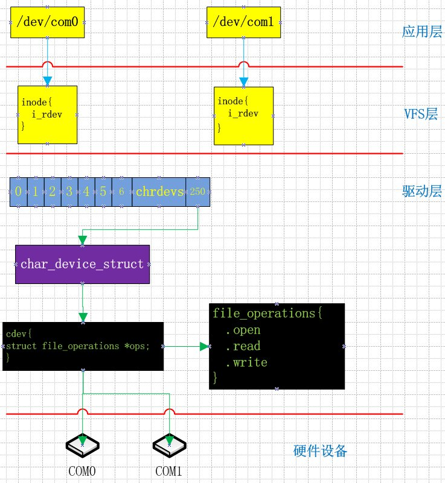
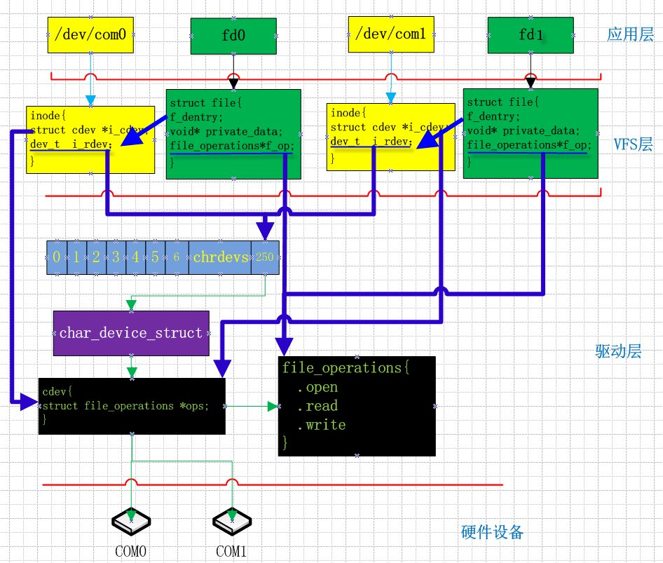
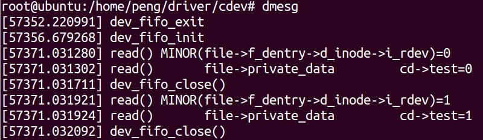
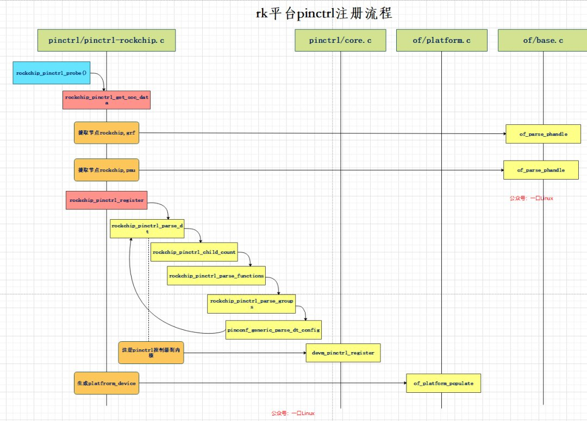
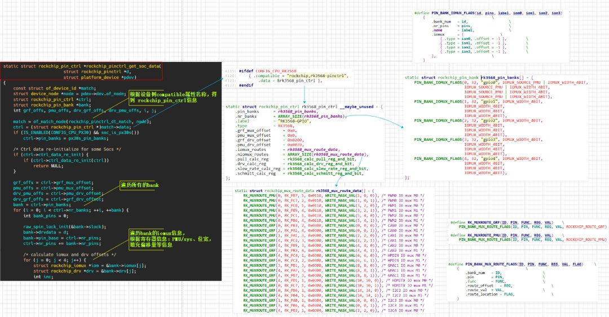

公众号名称：一口Linux

作者名称：土豆居士

发布时间：2026-07-29 10:00

击左上方蓝色“**一口Linux**”，选择“**设为星标**”

第一时间看干货文章

  

> ☞【干货】[嵌入式驱动工程师学习路线](http://mp.weixin.qq.com/s?__biz=MzUxMjEyNDgyNw==&mid=2247496985&idx=1&sn=c3d5e8406ff328be92d3ef4814108cd0&chksm=f96b87edce1c0efb6f60a6a0088c714087e4a908db1938c44251cdd5175462160e26d50baf24&scene=21#wechat_redirect)

> ☞【干货】[Linux嵌入式知识点-思维导图-免费获取](http://mp.weixin.qq.com/s?__biz=MzUxMjEyNDgyNw==&mid=2247497822&idx=1&sn=1e2aed9294f95ae43b1ad057c2262980&chksm=f96b8aaace1c03bc2c9b0c3a94c023062f15e9ccdea20cd76fd38967b8f2eaad4dfd28e1ca3d&scene=21#wechat_redirect)

> ☞【就业】**[一个可以写到简历的基于Linux物联网综合项目](https://mp.weixin.qq.com/s?__biz=MzUxMjEyNDgyNw==&mid=2247504919&idx=1&sn=2a10d2ee3660f36f13185bc9ee3d34e4&chksm=f96ba6e3ce1c2ff52a2f4d84c8ff49e20c26abe93a1fd9fce8fdffd98304dc3ce0e2ed9cd283&scene=21&token=1936399008&lang=zh_CN#wechat_redirect)**

> ☞【就业】**[简历模版](http://mp.weixin.qq.com/s?__biz=MzUxMjEyNDgyNw==&mid=2247518043&idx=1&sn=16892f858fd71d9fa493f2b5bdb29fac&chksm=f96bf5afce1c7cb97aa2246ad27d1e271ae56eb4c0046032a8af11be6a274bd7891f431a3d00&scene=21#wechat_redirect)**


## 一、前言

对于一款嵌入式产品来说，往往包含很多同种类型设备，比如多个\*\*串口、网口等这些驱动比较类似，仅仅是一些寄存器基地址不一样；还有就是厂家出厂的同类型的SOC，很多控制器驱动功能类似【比如gpio、I2S、I2C】，但是他们又有一些差异。

针对这些情况，我们完全可以把硬件信息解耦出来，将公用部分的软件逻辑功能分离出来，没有必须要为每一个设备单独写一个驱动。

本届结合瑞芯微平台，给大家介绍2种实现方法：

-   通过次设备号区分相同功能的外设；
    
-   通过设备树节点的compatible匹配方式得知当前设备版本，定义**struct of\_device\_id**结构体数组，并SOC名称以及差异内容封装并将地址填充到私有成员中。
    

## 二、通过次设备号区分外设

此种方式我们只需要在驱动中区分出设备的次设备号，然后根据次设备号的访问不同的内存地址空间即可。

### 1、原理

假定我们创建两个串口com0、com1，他们共用同一个主设备号**250**，次设备号分别为**0、1**，如果要让他们共用同一个字符设备驱动，那么我们的驱动要能够知道应用进程打开的是设备com0还是com1，并操作不同的串口。

首先创建两个设备节点：

```
mknod /dev/com0 c 250 0
mknod /dev/com1 c 250 1
```

执行结果如下：


  

内核为了维护这两个文件节点，内核需要创建结构体维护这两个文件，具体如下图所示：

当我们通过命令mknod创建一个字符设备文件，那么内核就会创建好一个inode会存在存储器中，创建和该文件实体一一对应的inode。

这个inode和其他的inode一样，通常用来存储关于这个文件的静态信息(不变的信息)，包括这个设备文件对应的设备号，文件的路径以及对应的驱动对象等。

inode作为VFS四大对象之一，在驱动开发中很少需要自己进行填充，更多的是在open()方法中进行查看并根据需要填充我们的file结构。

创建字符设备 **/dev/com0、 /dev/com1**,只是增加了对应的inode节点，此时VFS层并没有并没有创建file结构体，而且inode和驱动也并没有产生联系。

**当进程试图打开设备文件的时候，Linux系统做了什么事？**

如果应用程序执行以下代码：

```
fd0 = open("/dev/com0",O_RDWR);
fd1 = open("/dev/com1",O_RDWR);
```

各个结构体之间关系入下图所示：

当应用程序执行open函数，该函数会调用到内核的sys\_open（），该函数会根据该设备节点inode保存的信息，

**i\_flags:文件类型, i\_rdev:设备号**， 初始化结构体inode其他信息，比如**inode->i\_cdev**，此时已经指向我们注册的cdev结构体。

通过设备号，可以很容易找到该设备在设备号全局管理数组\*\*chedevs\[\]\*\*的下标，进而找到我们注册的驱动cdev以及file\_operations。

同时内核会在VFS层为创建结构体file，该函数调用成功之后，应用层会返回整型值用来和该file对应，就是上图的文件描述符fd0、fd1。

其中：

```
file->f_dentry->d_inode->i_rdev  保存对应的设备节点的设备号，
file-> f_op保存我们注册的file_operations 字符设备接口函数集合。
```

由此可得在read和write等其他接口函数中，我们可以通过file来得到次设备号。

【注意】同一个文件如果打开了两次，那么第二次linux内核仍然会重新分配1个新的file结构体和文件描述符。

驱动的read、write可以通过以下方式获得设备号:

```
file->f_dentry->d_inode->i_rdev
```

这样我们就可以通过宏MINOR来提取此设备号。

### 2、核心代码如下：

```
ssize_t dev_fifo_read (struct file *file, char __user *buf, size_t size,
loff_t *pos)
{
  int minor = MINOR(file->f_dentry->d_inode->i_rdev);
  struct mydev *cd;
  
  printk("read() MINOR(file->f_dentry->d_inode->i_rdev)=%d\n",minor);

  cd = (struct mydev *)file->private_data;
  printk("read()    file->private_data    cd->test=%d\n",cd->test);

  if(copy_to_user(buf, &minor, size)){
    return -EFAULT;
  }
  return size;
}
```

当驱动可以提取次设备号之后，便可以访问不同的地址信息或者中断，从而实现一份驱动支持多个同种类型的设备。

### 3、如何获得注册的设备结构体私有地址?

在大多情况下，我们会创建一个自定义的设备信息维护结构体，同时创建一个指针数组用来管理不同的设备。

```
#define MAX_COM_NUM 2

struct mydev{
  struct cdev cdev;
  char *reg;
  int test;
};
struct mydev *pmydev[MAX_COM_NUM];
```

然后通过成员cdev注册字符设备，

```
for(i=0;i<MAX_COM_NUM;i++)
  {
    pmydev[i]->test = i;
    cdev_init(&pmydev[i]->cdev,&dev_fifo_ops);
    devno = MKDEV(major,i);  
    
    error = cdev_add(&pmydev[i]->cdev,devno,1);
    if(error < 0)
    {
      printk("cdev_add fail \n");
      goto ERR2;
    }
  }
```

想一个问题:如果我们为每一个同类型设备分配独立的设备结构体，分别注册对应的cdev，假如我打开/dev/com0 进行操作的时候，我怎么知道com0对应我们自己定义的设备管理结构体变量的地址呢?

有问题是好的，我们带着问题出发，看看大牛们是怎么做的。

```
//打开设备
static int dev_fifo_open (struct inode *inode, struct file *file)
{
  struct mydev *cd;
  
  cd = container_of(inode->i_cdev, struct mydev, cdev);
  file->private_data = cd;
  return 0;
}
```

该函数功能：

字符设备架构调用我们注册的接口函数open会传递参数inode和file，inode->i\_cdev指向了我们注册的pmydev\[i\]->cdev，在open中通过inode->cdev来识别具体的设备，通过container\_of来找到对应的pmycdev结构体变量，并将其私有数据隐藏到file结构的private\_data中，进而识别同一个驱动操作一类设备。

而read，write接口函数可以直接通过file的 private\_data获取对应的pmycdev结构体变量。

```
cd = (struct mydev *)file->private_data;
```

执行结果如下:

由结果可知,应用程序正确读取了minor的值。

从内核log来看，MINOR(file->f\_dentry->d\_inode->i\_rdev)可以成功读取此设备号。而read接口函数也成功通过file->private\_data得到了设备结构体变量（初始化的时候为不同设备的test成员附了不同的值）。

### **4、驱动程序：**

```
#include <linux/init.h>
#include <linux/module.h>
#include <linux/kdev_t.h>
#include <linux/fs.h>
#include <linux/cdev.h>
#include <linux/slab.h>
#include <linux/uaccess.h>
static int major = 250;
static int minor = 0;
static dev_t devno;

#define MAX_COM_NUM 2

struct mydev{
  struct cdev cdev;
  char *reg;
  int test;
};
struct mydev *pmydev[MAX_COM_NUM];

ssize_t dev_fifo_read (struct file *file, char __user *buf, size_t size, loff_t *pos)
{
  int minor = MINOR(file->f_dentry->d_inode->i_rdev);
  struct mydev *cd;
  
  printk("read() MINOR(file->f_dentry->d_inode->i_rdev)=%d\n",minor);

  cd = (struct mydev *)file->private_data;
  printk("read()       file->private_data         cd->test=%d\n",cd->test);

  if(copy_to_user(buf, &minor, size)){
    return -EFAULT;
  }

  return size;
}
int dev_fifo_close (struct inode *inode, struct file *file)
{
  printk("dev_fifo_close()\n");
  return 0;
}
//打开设备
static int dev_fifo_open (struct inode *inode, struct file *file)
{
  struct mydev *cd;
  
  cd = container_of(inode->i_cdev, struct mydev, cdev);
  file->private_data = cd;
  return 0;
}
static struct file_operations dev_fifo_ops = 
{
  .open = dev_fifo_open,
  .read = dev_fifo_read,
  .release = dev_fifo_close,
};
static int dev_fifo_init(void)
{
  int result;
  int error;
  int i = 0;
  
  printk("dev_fifo_init \n");
  devno = MKDEV(major,minor);  
  result = register_chrdev_region(devno, MAX_COM_NUM, "test");
  if(result<0)
  {
    printk("register_chrdev_region fail \n");
    goto ERR1;
  }
  
  
  for(i=0;i<MAX_COM_NUM;i++)
  {
    pmydev[i] =kmalloc(sizeof(struct mydev), GFP_KERNEL);
  }
  
  for(i=0;i<MAX_COM_NUM;i++)
  {
    pmydev[i]->test = i; 
    cdev_init(&pmydev[i]->cdev,&dev_fifo_ops);
    devno = MKDEV(major,i);    
    error = cdev_add(&pmydev[i]->cdev,devno,1);
    if(error < 0)
    {
      printk("cdev_add fail \n");
      goto ERR2;
    }
  }
  return 0;
ERR2:
  devno = MKDEV(major,0);  
  unregister_chrdev_region(devno,MAX_COM_NUM);
  for(i=0;i<MAX_COM_NUM;i++)
  {
    kfree(pmydev[i]);
  }
  return error;
ERR1:
  return result;
}
static void dev_fifo_exit(void)
{
  int i;
  
  printk("dev_fifo_exit \n");
  
  for(i=0;i<MAX_COM_NUM;i++)
  {
    cdev_del(&pmydev[i]->cdev);
  }
  for(i=0;i<MAX_COM_NUM;i++)
  {
    kfree(pmydev[i]);
  }
  devno = MKDEV(major,0);  
  unregister_chrdev_region(devno,MAX_COM_NUM);
  return;
}
MODULE_LICENSE("GPL");
MODULE_AUTHOR("daniel.peng");
module_init(dev_fifo_init);
module_exit(dev_fifo_exit);
```

**测试程序**

```
#include <stdio.h>
#include <sys/types.h>
#include <sys/stat.h>
#include <fcntl.h>
main()
{
  int fd0,fd1;
  int minor;
  
  fd0 = open("/dev/com0",O_RDWR);
  if(fd0<0)
  {
    perror("open fail \n");
    return;
  }
  printf("open /dev/com0 OK\n");

  read(fd0,&minor,sizeof(minor));
  printf("minor of /dev/com0 =%d\n",minor);
  close(fd0);
  
  fd1 = open("/dev/com1",O_RDWR);
  if(fd1<0)
  {
    perror("open fail \n");
    return;
  }
  printf("open /dev/com1 OK\n");

  read(fd1,&minor,sizeof(minor));
  printf("minor of /dev/com1 =%d\n",minor);
  close(fd1);
}
```

**【补充】 我们也可以在回调cdev.fops->open()阶段重新填充file结构的fop，进而实现同一个驱动操作不同的设备，这种思想就是内核驱动中常用的分层！**

## 三、通过compatible匹配方式

比如瑞芯微平台由很多种SOC：RV1126、rk1888、rk3188、rk3399、rk3568、rk 3588等，很多控制器的IP核架构类似，但是会有部分差异。

厂家在定制sdk的时候，往往多种SOC只会公用一套驱动，而不是专门针对不同SOC出不同版本的驱动，这无疑会大大增加维护难度。

下面我们就以rk3568平台的pinctrl控制器初始化来讲解，是如何区分不同SOC的gpio资源的。

### 1、rk3568 GPIO资源

-   rk3568一共有5组GPIO(GPIO0～4)，
    
-   每组GPIO为一个Bank，共32个引脚
    
-   每个Bank分为4个 GROUP(GPIOA(0～7)、GPIOB(0～7) 、GPIOC(0～7) 、GPIOD( 0～7)) ；
    

### 2、pinctrl设备树

瑞芯微pinctrl服务端设备树节点定义：

```
@kernel\arch\arm64\boot\dts\rockchip\rk3568.dtsi
3532 pinctrl:pinctrl{
3533  compatible = "rockchip,rk3568-pinctrl";
3534  rockchip,grf = <&grf>;
3535  rockchip,pmu = <&pmugrf>;
3536  #address-cells = <2>;
3537  #size-cells = <2>;
3538  ranges;
3539
3540  gpio0: gpio@fdd60000 {
3541      compatible = "rockchip,gpio-bank";
3542      reg = <0x0 0xfdd60000 0x0 0x100>;
3543      interrupts = <GIC_SPI 33 IRQ_TYPE_LEVEL_HIGH>;
3544      clocks = <&pmucru PCLK_GPIO0>, <&pmucru DBCLK_GPIO0>;
3545
3546      gpio-controller;
3547      #gpio-cells = <2>;
3548      gpio-ranges = <&pinctrl 0 0 32>;
3549      interrupt-controller;
3550      #interrupt-cells = <2>;
3551  };
......        
3604 };
3607 #include "rk3568-pinctrl.dtsi"
```

与gpio相关属性。

3536～3537 行：#address\-cells和#size\-cells属性值为均为2，也就是说pinctrl下的所有子节点的reg地址和长度均为2个元素；所以3542行，reg属性有4个元素；

3540～3604 行： rk3568有五组GPIO：GPIO0～GPIO4，每组GPIO对应的寄存器地址不同；

3541 行： compatible 属性值为“rockchip,gpio-bank”，所以在 linux 内核中搜索这个字符串就可以找到对应的gpio驱动源文件，为 **drivers/pinctrl/pinctrl-rockchip.c**。 3542 行： reg 属性设置了 GPIO0 控制器的寄存器基地址为 0XFDD60000，内存的长度为0x100，驱动会得到GPIO0的基地址0XFDD60000，然后加上偏移得到GPIO0的其他寄存器地址； 3543 行： interrupts 属性描述 GPIO0 控制器对应的中断信息； 3544 行： clocks 属性指定这个 GPIO0 控制器的时钟； 3546 行：“gpio-controller”表示 gpio0 节点是个gpio控制器，每个gpio控制器节点必须包含“gpio-controller”属性； 3547 行：“#gpio\-cells”属性和“#address\-cells”类似， \#gpio\-cells 应该为 2，表示一共有两个 cell。

3548 行：gpio-ranges（可选，pinctrl 关联）

### 3、原理

将所有瑞芯微SOC的pinctrl信息填充到下面数组：

```
static const struct of_device_id rockchip_pinctrl_dt_match[] = {
......
#ifdef CONFIG_CPU_RK3568
 { .compatible = "rockchip,rk3568-pinctrl",
  .data = &rk3568_pin_ctrl },
#endif
 {},
};
```

其中：

-   .compatible存放与设备相同名称的字符串，
    
-   .data存放针对不同SOC的私有信息地址，rk3568平台私有信息采用结构体**struct rockchip\_pin\_ctrl**
    

```
static struct rockchip_pin_ctrl rk3568_pin_ctrl
```

根据pinctrl控制器设备树节点信息\*\*compatible = "rockchip,rk3568-pinctrl";\*\*，利用函数of\_match\_node()进行匹配，然后得到私有信息的地址.data = &rk3568\_pin\_ctrl；后续就可以根据该信息进行初始化。

#### 函数of\_match\_node（）

函数of\_match\_node()原型：

```
const struct of_device_id *of_match_node(const struct of_device_id *matches,
      const struct device_node *node)
```

**作用**：

遍历 `of_device_id` 匹配表，用设备树节点 `device_node` 去逐一比对，返回**第一个匹配成功**的 `of_device_id` 指针；全部不匹配返回 `NULL`。

**参数：**

-   matches
    
    驱动定义的设备树兼容列表数组，**必须以 `.compatible = NULL` 结尾做哨兵**，内核靠 NULL 判断遍历终止。
    
-   node
    
    内核中代表一个设备树节点的结构体指针，包含 `name`、`compatible` 属性字符串、reg、中断等信息，一般从 `platform_get_device()->of_node` 获取。
    

**返回值:**

-   非 NULL：匹配到的 `of_device_id` 结构体指针，可读取 `.data` 私有数据；
    
-   NULL：该设备树节点不在驱动支持列表内，不绑定此驱动。
    

#### rk3568私有信息

##### 1）rk3568\_pin\_ctrl

rk3568\_pin\_ctrl是SOC rk358的rockchip\_pin\_ctrl大表，该表包含：多少个bank、每个bank多少引脚、默认iomux/drv基础偏移、特殊引脚规则等。

```
static struct rockchip_pin_ctrl rk3568_pin_ctrl __maybe_unused = {
    /*指向 rk3568_pin_banks[] 数组，数组内每一项是 struct rockchip_pin_bank
    对应GPIO0～GPIO4五个GPIO域*/
    .pin_banks  = rk3568_pin_banks,
 .nr_banks  = ARRAY_SIZE(rk3568_pin_banks),
 .label   = "RK3568-GPIO",
 .type   = RK3568,
 .grf_mux_offset  = 0x0,
 .pmu_mux_offset  = 0x0,
 .grf_drv_offset  = 0x0200,
 .pmu_drv_offset  = 0x0070,
 .iomux_routes  = rk3568_mux_route_data,
 .niomux_routes  = ARRAY_SIZE(rk3568_mux_route_data),c
 .pull_calc_reg  = rk3568_calc_pull_reg_and_bit,
 .drv_calc_reg  = rk3568_calc_drv_reg_and_bit,
 .slew_rate_calc_reg = rk3568_calc_slew_rate_reg_and_bit,
 .schmitt_calc_reg = rk3568_calc_schmitt_reg_and_bit,
};
```

###### rk3568\_pin\_banks

数组rk3568\_pin\_banks\[\]描述了GPIO0～GPIO4五个GPIO控制器信息：

```
static struct rockchip_pin_bank rk3568_pin_banks[] = {
 PIN_BANK_IOMUX_FLAGS(0, 32, "gpio0", IOMUX_SOURCE_PMU | IOMUX_WIDTH_4BIT,
          IOMUX_SOURCE_PMU | IOMUX_WIDTH_4BIT,
          IOMUX_SOURCE_PMU | IOMUX_WIDTH_4BIT,
          IOMUX_SOURCE_PMU | IOMUX_WIDTH_4BIT),
 PIN_BANK_IOMUX_FLAGS(1, 32, "gpio1", IOMUX_WIDTH_4BIT,
          IOMUX_WIDTH_4BIT,
          IOMUX_WIDTH_4BIT,
          IOMUX_WIDTH_4BIT),
 PIN_BANK_IOMUX_FLAGS(2, 32, "gpio2", IOMUX_WIDTH_4BIT,
          IOMUX_WIDTH_4BIT,
          IOMUX_WIDTH_4BIT,
          IOMUX_WIDTH_4BIT),
 PIN_BANK_IOMUX_FLAGS(3, 32, "gpio3", IOMUX_WIDTH_4BIT,
          IOMUX_WIDTH_4BIT,
          IOMUX_WIDTH_4BIT,
          IOMUX_WIDTH_4BIT),
 PIN_BANK_IOMUX_FLAGS(4, 32, "gpio4", IOMUX_WIDTH_4BIT,
          IOMUX_WIDTH_4BIT,
          IOMUX_WIDTH_4BIT,
          IOMUX_WIDTH_4BIT),
};
```

其中宏PIN\_BANK\_IOMUX\_FLAGS定义如下：

```
#define PIN_BANK_IOMUX_FLAGS(id, pins, label, iom0, iom1, iom2, iom3) \
 {        \
  .bank_num = id,     \
  .nr_pins = pins,     \
  .name  = label,    \
  //数组，用于描述一个Bank内4组IOMUX复用源
  .iomux  = {     \
      /*type：标志位合集（寄存器归属 GRF/PMU、MUX 位宽 2/3/4bit、是否需要特殊修正等）
  offset：该组复用功能寄存器在 GRF/PMU 内字节偏移；*/
   { .type = iom0, .offset = -1 },   \
   { .type = iom1, .offset = -1 },   \
   { .type = iom2, .offset = -1 },   \
   { .type = iom3, .offset = -1 },   \
  },       \
 }
```

比如gpio4定义如下：

```
.bank_num = 4
.nr_pins = 32
.name = "gpio4"
.iomux = {
 {.type=IOMUX_WIDTH_4BIT，.offset = -1}，
    {.type=IOMUX_WIDTH_4BIT，.offset = -1}，
    {.type=IOMUX_WIDTH_4BIT，.offset = -1}，
    {.type=IOMUX_WIDTH_4BIT，.offset = -1}，
}，
```

###### rk3568\_mux\_route\_data

rk3568\_mux\_route\_data是**引脚功能强制路由锁定表**，属于 RK3568 硬件特殊引脚补丁。部分外设（CAN、SPI、SDIO、ETH、PWM 等）存在**多路引脚选择寄存器**，不在常规PIN MUX寄存器里，而是在GRF额外路由控制寄存器，用来二选一或多选一硬件通路。内核驱动通过这张表，在 pinctrl 配置对应功能时，自动顺带改写路由寄存器，完成硬件通路切换。

```
static struct rockchip_mux_route_data rk3568_mux_route_data[] = {
 ......
 RK_MUXROUTE_GRF(4, RK_PC3, 3, 0x0300, WRITE_MASK_VAL(2, 2, 1)), /* CAN1 IO mux M1 */
 ......
};
```

##### 2）四大寄存器位计算回调函数

四大寄存器位计算回调函数功能如下：

| 回调函数 | 作用 | 硬件配置项 |
| --- | --- | --- |
| pull\_calc\_reg | 计算上下拉寄存器地址与bit位 | pull-up /pull-down/高阻 |
| drv\_calc\_reg | 驱动强度寄存器地址与bit位 | 2mA/4mA/8mA/12mA驱动能力 |
| slew\_rate\_calc\_reg | 压摆率寄存器地址与bit位 | 上升/下降沿快慢，EMC优化 |
| schmitt\_calc\_reg | 施密特触发器寄存器地址与bit位 | 输入施密特开启 / 关闭，抗干扰 |

##### 3）其他成员

此外瑞芯微其他SOC可能还会包括以下成员：

`ctrl_data_re_init`：芯片级数据二次修正回调，RK3568 硬件规整无需运行时修正；

`soc_data_init`：probe 后期 SOC 私有初始化回调，RK3568 无特殊 errata 修复逻辑。

### 4）pinctrl初始化

rk平台pinctrl控制器驱动初始化入口函数 rockchip\_pinctrl\_probe()，其调用流程如下：



  

其中用于初始化私有信息函数rockchip\_pinctrl\_get\_soc\_data()，该函数主要功能：

1.  通过设备树 `compatible` 匹配，取出当前芯片\*\*静态硬件引脚描述表 `rockchip_pin_ctrl`\*\*；
    
2.  对该表做**运行时动态二次修正**（PX30S 特殊兼容、芯片私有重初始化回调）；
    
3.  遍历每一个 GPIO Bank，**自动递推计算每一组 IOMUX 复用寄存器、驱动强度 DRV 寄存器在 GRF/PMU 中的偏移地址**；
    
4.  为每个 Bank 填充：自旋锁、父驱动私有指针、引脚基地址、特殊引脚掩码（recalced\_mask/route\_mask）；
    
5.  返回修正完成的 `rockchip_pin_ctrl *ctrl` 给上层 probe 使用。
    



end

> **一口Linux**

  

> **关注，回复【****1024****】海量Linux资料赠送**
> 
> **精彩文章合集**
> 
> 文章推荐
> 
> ☞【专辑】[ARM](https://mp.weixin.qq.com/mp/appmsgalbum?__biz=MzUxMjEyNDgyNw==&action=getalbum&album_id=1614665559315382276#wechat_redirect)
> 
> ☞【专辑】[粉丝问答](https://mp.weixin.qq.com/mp/appmsgalbum?__biz=MzUxMjEyNDgyNw==&action=getalbum&album_id=1629876820810465283#wechat_redirect)
> 
> ☞【专辑】[所有原创](https://mp.weixin.qq.com/mp/appmsgalbum?__biz=MzUxMjEyNDgyNw==&action=getalbum&album_id=1479949091139813387#wechat_redirect)
> 
> ☞【专辑】[linux](https://mp.weixin.qq.com/mp/appmsgalbum?__biz=MzUxMjEyNDgyNw==&action=getalbum&album_id=1507350615537025026#wechat_redirect)入门
> 
> ☞【专辑】[计算机网络](https://mp.weixin.qq.com/mp/appmsgalbum?__biz=MzUxMjEyNDgyNw==&action=getalbum&album_id=1598710257097179137#wechat_redirect)
> 
> ☞【专辑】[Linux驱动](https://mp.weixin.qq.com/mp/appmsgalbum?__biz=MzUxMjEyNDgyNw==&action=getalbum&album_id=1502410824114569216#wechat_redirect)
> 
> ☞【干货】[嵌入式驱动工程师学习路线](http://mp.weixin.qq.com/s?__biz=MzUxMjEyNDgyNw==&mid=2247496985&idx=1&sn=c3d5e8406ff328be92d3ef4814108cd0&chksm=f96b87edce1c0efb6f60a6a0088c714087e4a908db1938c44251cdd5175462160e26d50baf24&scene=21#wechat_redirect)
> 
> ☞【干货】[Linux嵌入式所有知识点-思维导图](http://mp.weixin.qq.com/s?__biz=MzUxMjEyNDgyNw==&mid=2247497822&idx=1&sn=1e2aed9294f95ae43b1ad057c2262980&chksm=f96b8aaace1c03bc2c9b0c3a94c023062f15e9ccdea20cd76fd38967b8f2eaad4dfd28e1ca3d&scene=21#wechat_redirect)

---

内容效果不满意？[点此反馈](https://feedback.notebooksyncer.com/feedback/aaec53b0_1785290599874?u=https%3A%2F%2Fmp.weixin.qq.com%2Fs%3F__biz%3DMzUxMjEyNDgyNw%3D%3D%26mid%3D2247527541%26idx%3D1%26sn%3D30a0624c11acf552f541ac2e1f4773fe%26chksm%3Df8f6c0592f939e10e55633b105da09d68a4c5ba95664019da720747a444d070f3a160d419bd7%26mpshare%3D1%26scene%3D1%26srcid%3D07294vlBnUBwB5F1DXIrHX0y%26sharer_shareinfo%3Dacd9206ff868c46b036d453a2f05f660%26sharer_shareinfo_first%3Dacd9206ff868c46b036d453a2f05f660%23rd&s=obsidian)