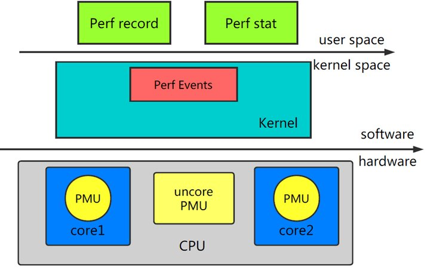

公众号名称：嵌入式与Linux那些事

作者名称：仲一Linux

发布时间：2026-07-31 12:02

点击上方**“嵌入式与Linux那些事”**

选择**“置顶/星标公众号”**

福利干货，第一时间送达

Linux 内核自带了一个性能分析工具叫 perf。它能做函数级和指令级的热点采样，也能配合 tracepoint 采集系统调用、网络事件、文件系统操作等内核事件。因为代码就在内核源码树里，算得上是 Linux 平台上最顺手的性能工具了。

## 原理

perf 基于内核的性能计数器子系统，硬件层面利用 CPU 的 PMU（Performance Monitoring Unit），软件层面依赖内核的 tracepoint 和软件计数器。

大致原理是：每隔一个固定时间，CPU 产生一个中断，记下当前跑的是哪个进程、哪个函数，累加对应的计数。多采几次就知道 CPU 时间主要花在了哪里。

整体架构分两层：

-   **Perf Tools** — 用户态工具集，收集和分析性能数据
    
-   **Perf Event Subsystem** — 内核事件子系统，和数据采集协同工作（Linux Hard Lockup Detector 也依赖它）
    



## 安装

```
sudo apt install linux-tools-common linux-tools-generic linux-tools-`uname -r`
```

## 常用命令

```
perf --help

 usage: perf [--version] [--help] [OPTIONS] COMMAND [ARGS]

 The most commonly used perf commands are:
   annotate        Read perf.data and display annotated code
   archive         Create archive with object files with build-ids
   bench           General framework for benchmark suites
   buildid-cache   Manage build-id cache.
   buildid-list    List the buildids in a perf.data file
   c2c             Shared Data C2C/HITM Analyzer.
   config          Get and set variables in a configuration file.
   data            Data file related processing
   diff            Read perf.data files and display the differential profile
   evlist          List the event names in a perf.data file
   ftrace          simple wrapper for kernel's ftrace functionality
   inject          Filter to augment the events stream with additional information
   kallsyms        Searches running kernel for symbols
   kmem            Tool to trace/measure kernel memory properties
   kvm             Tool to trace/measure kvm guest os
   list            List all symbolic event types
   lock            Analyze lock events
   mem             Profile memory accesses
   record          Run a command and record its profile into perf.data
   report          Read perf.data (created by perf record) and display the profile
   sched           Tool to trace/measure scheduler properties (latencies)
   script          Read perf.data and display trace output
   stat            Run a command and gather performance counter statistics
   test            Runs sanity tests.
   timechart       Tool to visualize total system behavior during a workload
   top             System profiling tool.
   version         display the version of perf binary
   probe           Define new dynamic tracepoints
   trace           strace inspired tool
```

几个常用命令的简要说明：

| 命令 | 作用 |
| --- | --- |
| annotate | 解析 perf.data，显示带注释的代码 |
| archive | 按 build-id 打包被采样的 ELF，方便异地分析 |
| bench | 内置的调度器和内存管理 benchmark |
| diff | 对比两个 perf.data 的热点差异 |
| evlist | 列出 perf.data 中记录的性能事件 |
| kmem | 追踪内核 slab 内存 |
| kvm | 追踪 KVM 客户机 |
| list | 列出当前系统支持的所有性能事件 |
| lock | 分析内核锁争用 |
| mem | 分析内存访问 |
| record | 采集采样数据并写入文件 |
| report | 读取 perf.data 显示热点分析结果 |
| sched | 分析调度器延迟 |
| script | 读取 perf.data 并输出 trace |
| stat | 运行命令并收集性能概况（CPI、Cache miss 等） |
| timechart | 可视化系统行为 |
| top | 实时分析（类似 top） |
| trace | 跟踪系统调用 |
| probe | 定义动态探测点 |

## 常用例子

### 列出事件

```
perf list
perf list 'sched:*'
```

### 计数

```
perf stat command                     # 统计命令的 CPU 计数器
perf stat -d command                  # 详细统计
perf stat -p PID                      # 统计指定进程
perf stat -a sleep 5                  # 全系统 5 秒
perf stat -e cycles,instructions,cache-references,cache-misses,bus-cycles -a sleep 10
perf stat -e L1-dcache-loads,L1-dcache-load-misses,L1-dcache-stores command
perf stat -e LLC-loads,LLC-load-misses,LLC-stores,LLC-prefetches command
perf stat -e raw_syscalls:sys_enter -I 1000 -a          # 每秒系统调用数
```

### 采样

```
perf record -F 99 command               # 99Hz 采样命令
perf record -F 99 -p PID -g -- sleep 10 # 采样 + 调用栈
perf record -F 99 -ag -- sleep 10       # 全系统 99Hz，10 秒
perf record -e L1-dcache-load-misses -c 10000 -ag -- sleep 5  # 按 Cache Miss 采样
perf record -e cycles:k -a -- sleep 5   # 只采内核态
perf record -e cycles:u -a -- sleep 5   # 只采用户态
```

### 实时

```
perf top -F 49
perf top -F 49 -ns comm,dso
```

### 静态跟踪

```
perf record -e sched:sched_process_exec -a
perf record -e context-switches -a
perf record -e 'ext4:*' -o /tmp/perf.data -a
perf record -e vmscan:mm_vmscan_wakeup_kswapd -ag
```

### 动态跟踪

```
perf probe --add tcp_sendmsg                      # 添加探测点
perf probe -d tcp_sendmsg                          # 删除
perf probe 'tcp_sendmsg%return'                    # 探测返回值
perf probe -V tcp_sendmsg                          # 查看可用变量
perf probe -L tcp_sendmsg                          # 查看可用行号
perf probe -x /lib64/libc.so.6 malloc              # 用户态探测
perf probe -l                                       # 列出当前探测点
```

### 报告

```
perf report                         # TUI 模式
perf report -n                      # 显示采样计数
perf report --stdio                 # 文本输出
perf script                         # 列出所有事件
perf script --header -F comm,pid,tid,cpu,time,event,ip,sym,dso
perf annotate --stdio               # 反汇编注解
```

## 参考

-   https://zhuanlan.zhihu.com/p/186208907
    
-   https://zhuanlan.zhihu.com/p/54276509
    
-   https://www.brendangregg.com/perf.html#OneLiners
    

end

> 往期推荐
> 
> [嵌入式Linux必读经典书籍](http://mp.weixin.qq.com/s?__biz=Mzg5ODUxNDMxMA==&mid=2247487714&idx=1&sn=a7a0821b6105a5970fae7d19dcff6ddb&chksm=c0603c0bf717b51d2a9a2784d8fe2f5f83fa1515f74fd24e69bff962ced8f46e8fb9a983e8d7&scene=21#wechat_redirect)
> 
> [嵌入式学习路线推荐](http://mp.weixin.qq.com/s?__biz=Mzg5ODUxNDMxMA==&mid=2247487792&idx=1&sn=ecbf3a3d4846d1e59b77674c1445fc11&chksm=c0603dd9f717b4cf40e055f9ab066766901050f4d4fc75e5a808d013a9177cb308dd3952f6bb&scene=21#wechat_redirect)
> 
> [一位读者逻辑清晰的提问](https://mp.weixin.qq.com/s?__biz=Mzg5ODUxNDMxMA==&mid=2247493471&idx=1&sn=f25e3ea6f6f6a8e143d798e13b0b2e7d&chksm=c063cbb6f71442a0fc74601e51eb73f7f2f2313381f857804734964eb4a19dc90328836a25d3&scene=21#wechat_redirect)
> 
> [机械转行嵌入式成功上岸](https://mp.weixin.qq.com/s?__biz=Mzg5ODUxNDMxMA==&mid=2247491200&idx=1&sn=961829c53ff44b772562a7d65a91c8be&chksm=c0603269f717bb7f9031046c58c55c7e32f548a161b2a67429fe270bf6be8c7ae9a3355f8011&scene=21#wechat_redirect)
> 
> [一位音视频方向读者秋招上岸的经历](https://mp.weixin.qq.com/s?__biz=Mzg5ODUxNDMxMA==&mid=2247491143&idx=1&sn=d6d9c58b601272e62d9ed0a49c17f4fd&chksm=c06032aef717bbb8ec01029246e110c2fea9035f32a1a7ea13148cd532f7f973889ff8f3cefa&scene=21#wechat_redirect)


扫码加我微信  

进技术交流群


分享


收藏


点赞


在看

  

---

内容效果不满意？[点此反馈](https://feedback.notebooksyncer.com/feedback/13959893_1785478855336?u=https%3A%2F%2Fmp.weixin.qq.com%2Fs%3F__biz%3DMzg5ODUxNDMxMA%3D%3D%26mid%3D2247503648%26idx%3D1%26sn%3D5e8906cbb64a128478e829583eead6c6%26chksm%3Dc10a0070c6576a26ea5b31d28f65cec32c0773e27df5647e3182fb06b1bc85f93f785cb63499%26mpshare%3D1%26scene%3D1%26srcid%3D073123elsCGGMPo7kpWRVTpk%26sharer_shareinfo%3Dcf1f48513a184f5b95f8164a8bfc13b9%26sharer_shareinfo_first%3Dcf1f48513a184f5b95f8164a8bfc13b9%23rd&s=obsidian)