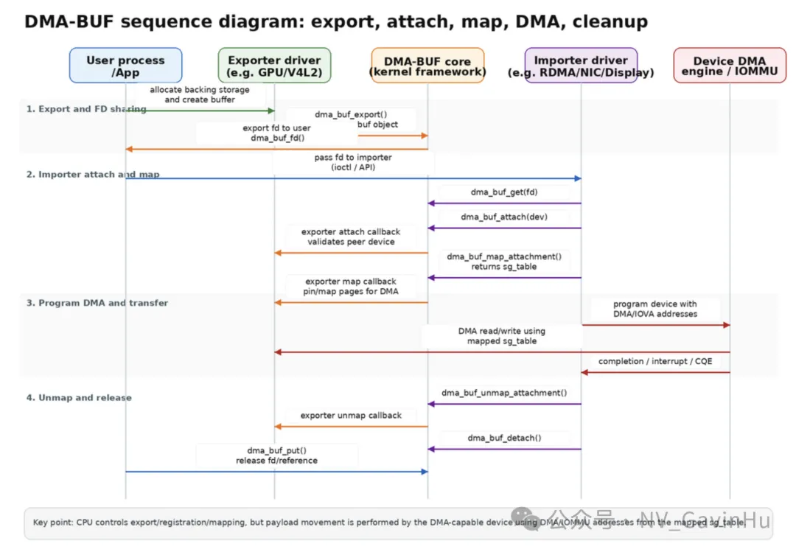

NVIDIA 实现 GDR（GPUDirect RDMA）的两种机制：legacy nvidia-peermem与Linux upstream dma-buf。GPUDirect RDMA 的共同目标，是让 RDMA 设备通过 PCIe 直接访问 GPU 显存，绕过 host bounce buffer，从而降低 CPU 参与、减少拷贝并降低延迟。

## 背景

GPUDirect RDMA 最早在 Kepler GPU 和 CUDA 5.0 中引入，核心思想是利用 PCIe 的标准 peer-to-peer 能力，让第三方设备如 NIC、采集卡、存储适配器直接对 GPU 暴露出的 BAR 空间发起读写。 但操作系统并没有天然提供一套足够通用的“跨驱动交换设备内存映射”的机制，因此 NVIDIA 先走了一条私有 peer-memory 路径，后来又逐步转向 Linux 通用的 dma-buf 共享机制。

GPUDirect RDMA 的 kernel-mode 支持现在明确有两条路：Linux kernel 的 DMA-BUF，或 legacynvidia-peermem模块；并且 NVIDIA 已明确建议优先使用 DMA-BUF。 

## nvidia-peermem

nvidia-peermem 是 NVIDIA 驱动包提供的内核模块，它的作用是把 NVIDIA GPU 显存注册为 RDMA 子系统可识别的 peer memory，使 Mellanox/NVIDIA 的 HCA 能直接对 GPU video memory 做 peer-to-peer 读写。 这条路径依赖 NVIDIA OFED/MLNX\_OFED 提供的 peer memory API，nvidia-peermem 通过 NVIDIA GPU driver 导出的 peer-to-peer API 把 GPU 接到 InfiniBand 子系统中。

其实现核心是 NVIDIA 的NV-P2P API。在普通 DMA 模式下，设备驱动会对用户缓冲区调用 get\_user\_pages() 来 pin CPU 内存；而在 GPU memory 场景里，pin/unpin 不再由 Linux 内建页框接口完成，而要由 NVIDIA kernel driver 提供的函数完成，比如 nvidia\_p2p\_get\_pages() 和 nvidia\_p2p\_put\_pages()。 成功 pin 后，驱动获得 nvidia\_p2p\_page\_table，再由 NIC 或相关 I/O 驱动使用这些条目编程 DMA，必要时通过 nvidia\_p2p\_dma\_map\_pages() 将 GPU BAR 页映射进本设备的 I/O 地址空间。

这套机制是“NVIDIA GPU导出 + RDMA peer-memory client 注册”。优点是方案成熟、在 NVIDIA + Mellanox 生态里长期可用。

## DMA-BUF

DMA-BUF 是 Linux 内核提供的通用缓冲区共享框架，核心模型是一个驱动作为 exporter 导出 buffer，另一个驱动作为 importer 消费它，用户态通过文件描述符在不同子系统之间传递这块共享内存。 在 GDR 场景里，GPU 驱动扮演 exporter，把 GPU 显存导出为 dma-buf fd；RDMA 驱动扮演 importer，把这个 fd 注册为自己可 DMA 访问的 memory region。

NVIDIA 的 GPU Operator 文档已经把 DMA-BUF 列为 GPUDirect RDMA 的推荐方案，并给出明确前提：需要 Open Kernel Module driver、CUDA 11.7+、Linux 5.12+；网络驱动可以使用 Linux inbox driver，MLNX\_OFED/DOCA-OFED 变成可选项，而不是 legacy 路径那样的硬依赖。 这意味着 DMA-BUF 路径把很多原本绑在 Mellanox 私有生态里的能力，转移到了 Linux 主线共享内存接口之上。

从架构上看，DMA-BUF 的关键变化是：不再让 RDMA core 认识一个“特殊的 NVIDIA peer-memory client”，而是让 RDMA 设备像处理其他共享 buffer 一样 import 一个标准 dma-buf 对象。这使得 GPU 内存共享和生命周期控制更接近 Linux 内核通用范式，也更容易和其它子系统，例如 DRM、媒体、VFIO、P2P DMA 路径，形成一致的接口模型。

## peermem 工作流

下面用简化流程描述 nvidia-peermem 路径：

用户态应用分配 GPU 显存，通信库识别这个地址是 GPU pointer 而不是 CPU pointer。

I/O 驱动不走 get\_user\_pages()，而是通过 NVIDIA NV-P2P API 请求 pin 这段 GPU 显存，比如 nvidia\_p2p\_get\_pages()。

NVIDIA 驱动返回 page table / BAR 映射信息；HCA 驱动基于这些信息建立 DMA 映射，直接对 GPU memory 发起 PCIe P2P 事务。

User App

│

│ cudaMalloc()

▼

CUDA / NVIDIA Driver

│

│ GPU VA allocated

▼

User App

│

│ ibv\_reg\_mr(gpu\_ptr)

▼

libibverbs

│

│ ioctl

▼

ib\_uverbs / RDMA core

│

▼

mlx5\_ib

│

│ peer-memory registration

▼

nvidia-peermem

│

│ validate + pin GPU pages

▼

NVIDIA GPU kernel driver

│

│ BAR1 / peer mapping info

▼

nvidia-peermem

│

│ DMA address list

▼

mlx5\_ib

│

│ program NIC MTT/MKEY

▼

mlx5 NIC

│

│ PCIe DMA

▼

GPU memory

## dma-buf 路径工作流

DMA-BUF 路径的核心流程是：

1.  用户态分配 GPU 显存，并通过 CUDA / 驱动支持将该内存导出成 dma-buf fd。
    
2.  用户态把 dma-buf fd 交给 RDMA 栈；RDMA 驱动作为 importer 注册这块共享 buffer，并将其映射成可用于 verbs / MR 的对象。
    
3.  NIC 之后可直接对这块 GPU-backed buffer 发起 DMA / RDMA 访问，而无需额外依赖 nvidia-peermem 模块。
    

DMA-BUF 模式的 perftest 例子直接使用 ib\_write\_bw --use\_cuda\_dmabuf，而 legacy 路径则是通过 driver.rdma.enabled=true 启动 nvidia-peermem-ctr 去加载 nvidia-peermem 模块。 所以DMA-BUF运维更友好。

## 二者的关键差异

## 1) 接口归属

nvidia-peermem 的接口核心是 NVIDIA 私有的 NV-P2P API 加 RDMA peer-memory client 机制。 DMA-BUF 的接口核心则是 Linux upstream 的 exporter/importer 模型和 fd 传递语义。

## 2) 生态依赖

legacy 路径依赖 MLNX\_OFED 或 DOCA-OFED，并要求 nvidia-peermem 模块配合 RDMA peer memory 支持工作。 DMA-BUF 路径下，MLNX\_OFED/DOCA-OFED 变成可选，网络驱动可使用 Linux package manager 自带驱动；这是它更主线化的一大标志。

## 3) 驱动前提

GPU Operator 文档给出的前提很明确：DMA-BUF 需要 Open Kernel Module driver、CUDA 11.7+、Linux kernel 5.12+；legacy nvidia-peermem 对驱动和内核版本要求宽松得多，但依赖的外部 RDMA 软件栈更多。

## 4) 生命周期管理

nvidia-peermem 通过 NV-P2P invalidation callback 管理 revoke，第三方驱动需要处理同步回调和 page table 清理。 DMA-BUF 则依赖 Linux dma-buf 的共享和同步语义，生命周期管理更贴近统一内核框架；近年的内核工作还在继续给 dma-buf 引入 revoke 机制，以便更好支持这类可撤销共享 buffer。

## 5) 战略方向

NVIDIA 当前官方建议是用 DMA-BUF 而不是 nvidia-peermem。 CUDA文档也显示，NV-P2P API 在部分平台已经进入弃用路线，并鼓励迁移到 Linux upstream kernel API。

## 一个并排对照

| 
维度

 | `nvidia-peermem` | `dma-buf` |
| --- | --- | --- |
| 

实现方式

 | 

NVIDIA 私有 NV-P2P API + RDMA peer-memory client 

 | 

Linux 通用 dma-buf exporter/importer 

 |
| 

GPU 侧角色

 | 

通过 `nvidia_p2p_get_pages()` 导出 page table / BAR 映射 

 | 

导出 dma-buf fd 

 |
| 

RDMA 侧角色

 | 

依赖 peer-memory 回调接入 IB core 

 | 

作为 dma-buf importer 注册 buffer 

 |
| 

外部依赖

 | 

MLNX\_OFED/DOCA-OFED 必需 

 | 

可选，可用 Linux inbox 驱动 

 |
| 

典型运维动作

 | 

加载 `nvidia-peermem` 模块 

 | 

不需要 `nvidia-peermem` 

 |
| 

官方方向

 | 

legacy 

 | 

推荐方案 

 |

## 为什么行业在转向 DMA-BUF

最核心的原因不是“peermem 完全不能用”，而是 DMA-BUF 更符合 Linux 主线的长期演进方向。它把 GPU 内存共享从“厂商私有 peer-memory 插件”转成“标准共享 buffer 对象”，从而降低专用胶水层数量，提升跨厂商、跨子系统、跨驱动模型的一致性。

这并不意味着 DMA-BUF 一定在所有平台、所有组合下都立刻更快。实际性能仍取决于 PCIe 拓扑、BAR 可用空间、IOMMU 配置、NIC/GPU 驱动成熟度和缓存策略；CUDA 文档强调，GPUDirect RDMA 仍要求设备共享合适的 upstream PCIe root complex，且 IOMMU 必须是 1:1 或 passthrough，否则 GPUDirect RDMA 本身就可能失效。 但从软件架构角度看，DMA-BUF 的确更接近未来默认路径。

## 结语

nvidia-peermem是 NVIDIA 为 GDR 早期落地提供的私有 peer-memory 直通方案，而dma-buf是把同类能力迁移到 Linux 通用共享缓冲区框架上的新方案。前者强调“让 RDMA 栈认识 NVIDIA 的特殊内存”，后者强调“让 GPU 显存先变成标准共享对象，再由 RDMA 栈导入”。