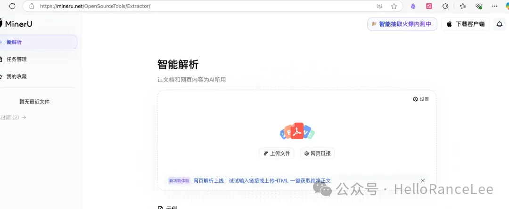
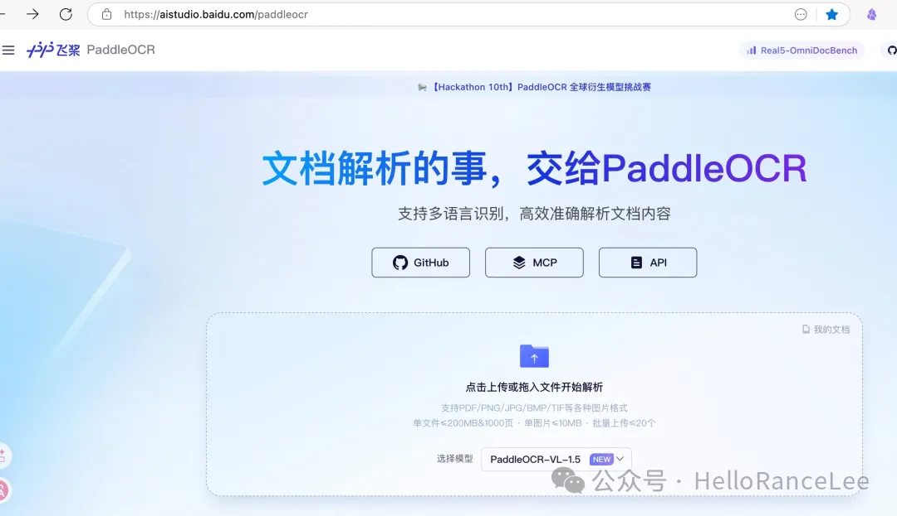
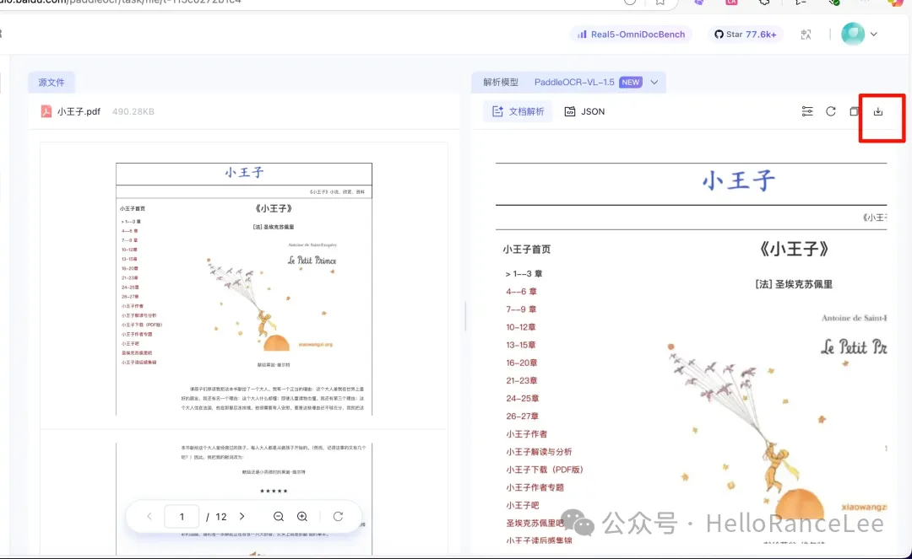
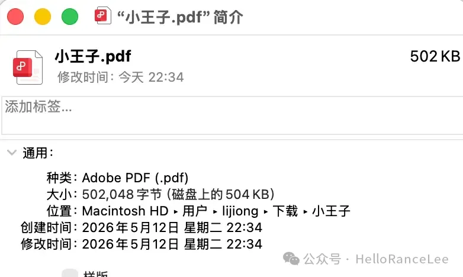
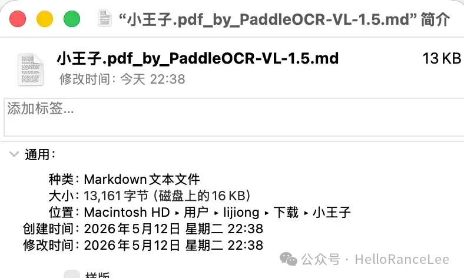
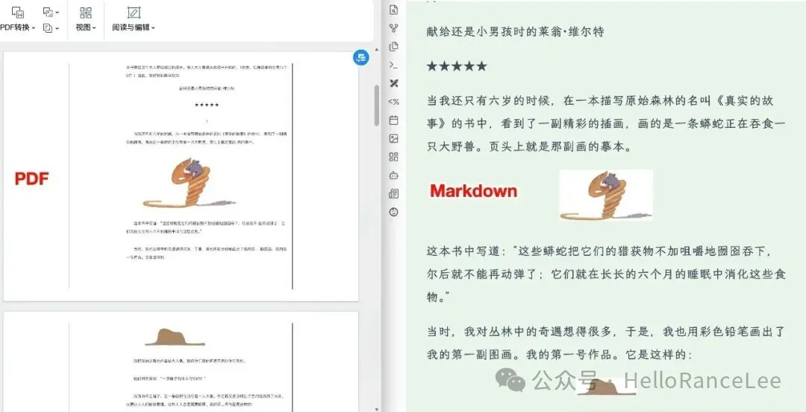
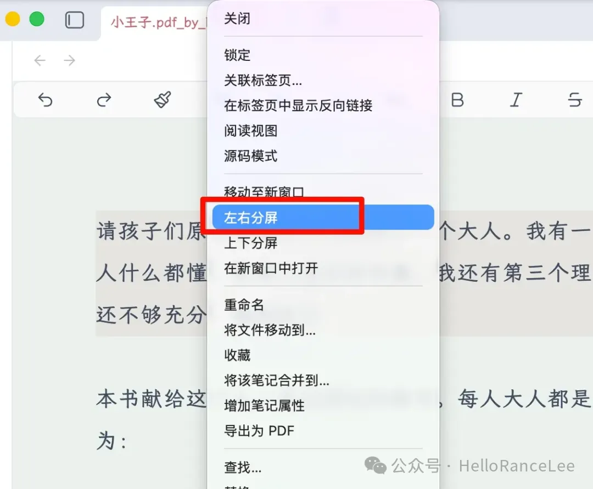
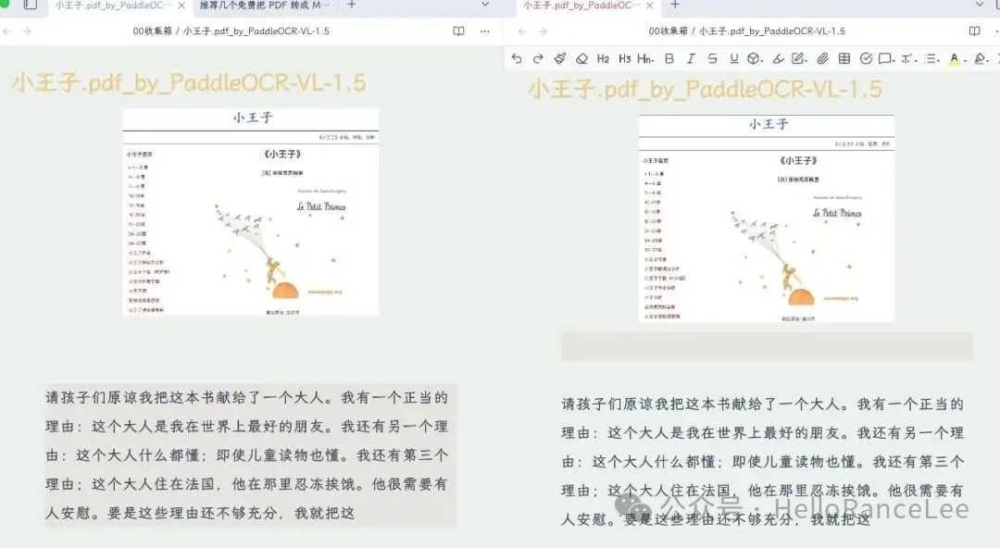

前两天给朋友们分享了一下怎么本地备份我们的 Obsidian 仓库。

但是这里有个问题：有很多朋友喜欢看 PDF，把 PDF 也放了进来。

这样的话备份起来压缩包就会变得很大。

其实就我自己来说，现在更喜欢用 Markdown 格式的文件，能把体积压缩得很小。

不过这时候可能又有朋友来问了：那这里面的图片呢？岂不是没有了？

没事的，现在的厂商都已经帮你想好办法了：它会以图床的形式给你插入进去。

我这里推荐两个网站，都是可以免费使用的，并且是国产的：

1.  https://mineru.net/OpenSourceTools/Extractor/
2.  https://aistudio.baidu.com/paddleocr

我们随便用一个，使用方法很简单，只要把 PDF 拖进来，就能开始转换了。

转换完后，左边就是原文，右边就是转换以后的格式。点击右边的下载，就能下载到本地。

可以看到原来的 PDF 有 502KB，转换以后只有 13KB。

下图我们可以看一下两者的区别，我感觉区别并不大。

需要注意的是，这种图片都是以网站自己的图床形式给你的，并不确定它们能真正保存多久。所以我的建议是，把它们转换成自己的图床。

还记得我之前写过一个图床的教程吗？你可以把它们都下载，然后让 AI 重新或者插件给你上传到你的图床。这样即使后期网站把他们的图床给删了，也不影响你的使用。

至于说怎么在这上面记笔记，我推荐的方式是用左右分屏，把同一篇文档在左边和右边各自打开，然后一边看一边写笔记，如果你有两个屏幕那就更方便了。

___

> 随手附个广告 📚
> 
> 我有《Obsidian 实战手册》¥29.9预设文件夹和插件的 OB 模板仓库 ¥49.9（PDF+仓库）以及《AI 实战手册》¥29.9微信 `en297171205`
> 
> 